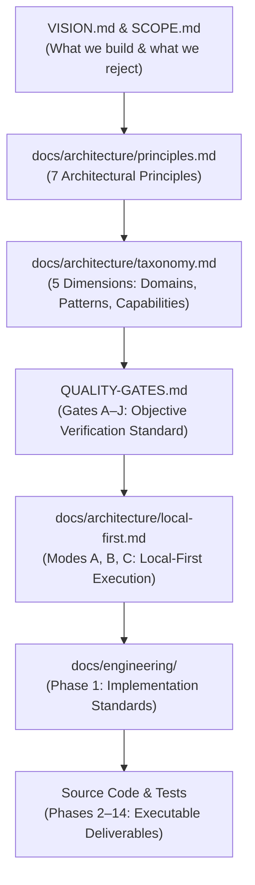

# Phase 00: Architecture Governance — Learning Guide

```text
Phase:                  00 — Vision, Scope & Architecture Governance
Status:                 Frozen & Accepted
Learning Guide Status:  Complete
Primary Audience:       Enterprise Architects, Solution Architects, AI Platform Engineers
Implementation:         Architecture Governance Specifications & Operational Directives
```

---

## 1. Phase Overview

### What Did This Phase Build?
Phase 0 established the authoritative architectural foundation for the entire repository. It defined the long-term vision, operational scope, architectural taxonomy, core design principles, the ten enterprise Quality Gates (Gates A–J), the Three-Mode Local-First AI Policy, and the Thirteen Non-Negotiable Operational Directives governing all human and AI contributors.

### Why Was It Needed?
Without rigorous upfront governance, open-source and enterprise AI repositories inevitably descend into an unstructured collection of disjointed tutorial scripts, vendor-locked SDK demos, fragile prompt strings, and fake sleep loops (`time.sleep(2)`) masquerading as intelligence.

### What Problem Would Exist Without It?
* **Architecture Drift**: Incompatible abstractions emerging across different components without shared vocabulary.
* **Vendor Lock-In**: Deep coupling to specific commercial cloud providers (e.g. OpenAI SDK) polluting domain business logic.
* **Fake AI & Unverifiable Claims**: Commitments claiming "enterprise readiness" or "tested accuracy" without reproducible automated evidence.
* **Scope Creep**: Early implementation of speculative future features (e.g. distributed multi-agent swarms) before solid runtime foundations exist.

---

## 2. Learning Objectives

After completing this guide, you will be able to:
* **Explain** the purpose and structure of the Ten Enterprise Quality Gates (Gates A through J).
* **Locate** the authoritative definition for any AI pattern within the repository taxonomy.
* **Distinguish** between the Three Local-First Execution Modes (Mode A, Mode B, and Mode C).
* **Identify** the Seven Core Architectural Principles that govern all subsequent implementation phases.
* **Critique** enterprise AI proposals for common anti-patterns like "Fake AI", vendor leakage, and speculative framework abstraction.
* **Navigate** the repository governance hierarchy to resolve potential conflicts between specifications.

---

## 3. Prerequisites

### Knowledge Prerequisites
* Basic understanding of Enterprise Software Architecture (Clean Architecture, Separation of Concerns).
* Familiarity with non-functional requirements (NFRs) such as portability, latency, auditability, and safety.

### Environment Prerequisites
* None. Phase 0 is purely normative architecture specification. A standard Git clone and Markdown reader are all that is required.

---

## 4. Mental Model

The repository operates on a strict normative hierarchy. Lower layers must always conform to the layers above them:



### Key Conceptual Pillars:
1. **Authoritative Sources**: There is exactly one authoritative source per topic. `QUALITY-GATES.md` owns gate definitions; `docs/architecture/taxonomy.md` owns pattern vocabulary.
2. **Untrusted Model Output Principle**: Generative model output is probabilistic data, not executable instructions or trusted types. It must always cross a validation boundary.
3. **Evidence-Based Verification**: No claim of compliance, readiness, or test success may be made without automated or documented manual evidence.

---

## 5. What This Phase Added

| Governance Area | Authoritative Artifact | Core Concepts Introduced |
| :--- | :--- | :--- |
| **Mission & Boundaries** | [`VISION.md`](../../VISION.md), [`SCOPE.md`](../../SCOPE.md) | Enterprise reference standards vs toy demos; in-scope vs out-of-scope boundaries. |
| **Lifecycle Roadmap** | [`ROADMAP.md`](../../ROADMAP.md) | 15 linear roadmap phases (Phase 0 through 14); phase freezing rules. |
| **Agent Constitution** | [`AGENTS.md`](../../AGENTS.md) | Thirteen Non-Negotiable Directives; mandatory agent workflow protocol. |
| **Verification Gates** | [`QUALITY-GATES.md`](../../QUALITY-GATES.md) | Gates A through J; evidence classification (Automated, Manual, Not Verified). |
| **Design Principles** | [`docs/architecture/principles.md`](../architecture/principles.md) | 7 Principles: Untrusted Output, Local-First, Provider Neutrality, Observability, etc. |
| **System Taxonomy** | [`docs/architecture/taxonomy.md`](../architecture/taxonomy.md) | 5 Dimensions: Domains, Intelligence Patterns, Architecture, Production, Governance. |
| **Execution Policy** | [`docs/architecture/local-first.md`](../architecture/local-first.md) | Three-Mode Policy: Mode A (Offline), Mode B (Local-First), Mode C (Cloud-Comparable). |
| **Anti-Patterns** | [`docs/architecture/anti-patterns.md`](../architecture/anti-patterns.md) | 12 Explicit AI anti-patterns: Fake AI, Vendor Leakage, Speculative Hierarchy, etc. |

---

## 6. Repository Map

```text
ai-application-architecture/
├── README.md                      # Repository overview & quick start
├── VISION.md                      # Long-term vision & engineering philosophy
├── SCOPE.md                       # Explicit inclusions & exclusions
├── ROADMAP.md                     # Phased implementation roadmap (Phases 0–14)
├── AGENTS.md                      # Contributor & coding agent operational constitution
├── QUALITY-GATES.md               # Objective verification standards (Gates A–J)
└── docs/
    └── architecture/
        ├── principles.md          # 7 Core architecture design principles
        ├── taxonomy.md            # 5-dimensional classification system
        ├── local-first.md         # Three-mode local-first execution policy
        ├── reference-standard.md  # 4 Reference implementation tiers
        ├── language-strategy.md   # Polyglot roles: Python, TypeScript, .NET, Java
        ├── repository-structure.md# Monorepo directory conventions
        ├── technology-governance.md# Approved vs prohibited libraries and frameworks
        └── anti-patterns.md       # Prohibited architecture patterns
```

---

## 7. Recommended Reading Order

Follow this exact sequence to build an end-to-end understanding of repository governance:

### Step 1: Establish the Philosophy
* **File**: [`VISION.md`](../../VISION.md) & [`SCOPE.md`](../../SCOPE.md)
* **Why Read**: Understand why this repository exists, who it is for, and what it deliberately refuses to build (no toy demos, no vendor playgrounds).
* **What to Look For**: The emphasis on production-grade architectural benchmarks over rapid prototyping.

### Step 2: The Core Invariants
* **File**: [`docs/architecture/principles.md`](../architecture/principles.md)
* **Why Read**: Learn the seven non-negotiable architectural rules that govern all code.
* **What to Look For**: The *Untrusted Model Output Principle* and *Decoupled Intelligence Principle*.

### Step 3: The Common Vocabulary
* **File**: [`docs/architecture/taxonomy.md`](../architecture/taxonomy.md)
* **Why Read**: Understand how AI applications, intelligence patterns, and governance capabilities are classified.
* **What to Look For**: The 5-dimensional taxonomy matrix. All future reference implementations must declare their taxonomy coordinates.

### Step 4: Objective Quality Standards
* **File**: [`QUALITY-GATES.md`](../../QUALITY-GATES.md)
* **Why Read**: This is the single most important document for quality assurance.
* **What to Look For**: The exact criteria for Gates A through J, especially Gate A (Structural Boundaries), Gate C (Software Testing), Gate D (AI Evaluation), and Gate G (Local-First).

### Step 5: The Execution Policy
* **File**: [`docs/architecture/local-first.md`](../architecture/local-first.md)
* **Why Read**: Understand how the repository reconciles offline developer productivity with cloud deployment.
* **What to Look For**: The definitions of Mode A, Mode B, and Mode C. Notice that Ollama is a developer tool, not the architecture itself.

### Step 6: Contributor Operational Rules
* **File**: [`AGENTS.md`](../../AGENTS.md)
* **Why Read**: Review the 13 operational directives that govern all engineering contributions.
* **What to Look For**: Directives 8, 10, 11, 12, and 13 forbidding fake data, unverified claims, and unexecuted test assertions.

### Step 7: Anti-Patterns
* **File**: [`docs/architecture/anti-patterns.md`](../architecture/anti-patterns.md)
* **Why Read**: Learn what NOT to do before writing or evaluating code.
* **What to Look For**: Anti-pattern 1 (Fake AI), Anti-pattern 3 (Vendor Leakage), and Anti-pattern 6 (Speculative Abstraction).

---

## 8. Commands to Run

To verify that the documentation repository maintains complete structural integrity with zero broken links:

```bash
# Validate all internal markdown links and cross-references
python3 scripts/validate-docs.py
```

* **What it tests**: Recursively scans all `.md` files, verifies relative link targets, anchors, and heading syntax.
* **Expected Output**: `RESULT: PASS — All documentation checks succeeded cleanly.` (Exit code `0`).

---

## 9. Architecture Decisions & Trade-Offs

### Decision 1: Upfront Architectural Governance Before Implementation
* **Decision**: Complete and freeze Phases 0 and 1 before writing any AI or monorepo code.
* **Rationale**: Software architectures deteriorate when built without shared quality gates. Establishing standards first prevents rework and architectural drift.
* **Alternative Considered**: "Agile" organic evolution—writing prototype code first and documenting afterwards.
* **Rejected Because**: Led to fragmentation, fake data demos, and vendor lock-in in benchmark projects.

### Decision 2: The Three-Mode Local-First Policy
* **Decision**: Adopt Mode A (Offline Local), Mode B (Local-First), and Mode C (Cloud-Comparable) instead of pure offline dogma or cloud-only reliance.
* **Rationale**: Mandating 100% offline execution prohibits realistic enterprise capabilities like telephony (Twilio) or live web search. Mandating cloud-only requires paid API keys and creates security/privacy hurdles for developers.
* **Trade-Off**: Requires writing provider-neutral ports and adapters to allow seamless switching between local Ollama and cloud LLMs.

---

## 10. "Why Not?" Section

* **Why not build a quick LangChain demo first?**  
  Frameworks like LangChain, AutoGen, and CrewAI introduce rapid churn, opaque abstractions, and deep dependency coupling. This repository exists to teach *foundational architecture*, not third-party framework APIs.
* **Why not mandate that every capability run 100% offline?**  
  Real enterprise systems integrate with external SaaS, webhooks, and live data sources. Mode B permits selected external dependencies while keeping core AI execution local and cost-free.
* **Why are hardcoded `time.sleep()` calls strictly forbidden?**  
  Simulating AI latency with fake delays hides actual token latency distributions, hides failure modes, and undermines the repository's credibility as an enterprise benchmark.

---

## 11. Architectural Boundaries

Phase 0 is intentionally bounded:
* **No Executable Code**: No Python modules, TypeScript classes, or bash launchers were introduced.
* **No Premature Component Layouts**: Monorepo directories (`building-blocks/`, `platform/`, `apps/`) were specified on paper, but physical directories were deferred to Phase 2.
* **No Speculative Interfaces**: No `IAgent` or `IMemoryStore` interfaces were created before concrete applications required them.

---

## 12. Concept Map

```text
Governance System
├── Core Intent
│   ├── VISION.md (Why we build)
│   └── SCOPE.md (What we include/exclude)
├── Quality Measurement
│   └── QUALITY-GATES.md
│       ├── Gate A: Architecture & Structural Boundaries
│       ├── Gate B: Code Quality & Type Safety
│       ├── Gate C: Software Testing (>=85% statement)
│       ├── Gate D: AI Evaluation (>=98% schema, >=30 cases)
│       ├── Gate E: Security & Safety (Zero secrets)
│       ├── Gate F: Observability & Telemetry
│       ├── Gate G: Performance & Sizing (Local benchmarks)
│       ├── Gate H: Documentation & Integrity
│       ├── Gate I: Demo & Operational Verification
│       └── Gate J: Production Readiness & Resilience
└── Architectural Invariants
    ├── Untrusted Model Output Principle
    ├── Three-Mode Local-First Execution
    ├── 5-Dimensional Taxonomy
    └── Anti-Pattern catalog
```

---

## 13. Common Misunderstandings

* *Misunderstanding*: "Quality Gates are just a checklist to fill out at the end."  
  *Correction*: Quality Gates are architectural design constraints applied *before* and *during* implementation. Every gate requires objective automated or documented manual evidence.
* *Misunderstanding*: "Local-first means we can never use OpenAI or Claude."  
  *Correction*: Local-first means applications are designed using ports and adapters so they *can* run locally (Mode A/B) during development and testing without paid keys, while supporting cloud providers (Mode C) via configuration.
* *Misunderstanding*: "AGENTS.md is only for LLMs, not human engineers."  
  *Correction*: `AGENTS.md` defines the operational constitution for all contributors—human and AI alike. Directives against fake data and overclaiming apply universally.

---

## 14. Architect Interview Checkpoints

### Questions

1. **Why does Gate A prohibit importing external AI provider SDKs in domain logic?**
2. **What is the Untrusted Model Output Principle and where is it enforced?**
3. **What is the difference between Mode A (Offline Local) and Mode B (Local-First)?**
4. **Why does Gate D require both a schema adherence metric and an adversarial scenario subset?**
5. **How does the repository define the boundary between architecture governance and engineering execution?**
6. **Why is Ollama treated as a developer convenience rather than an architectural component?**
7. **What constitutes "Automated Evidence" vs "Manual Evidence" under the repository's verification policy?**
8. **Why are speculative abstractions like `IAgentLoop` rejected during early phases?**

### Self-Check Answers

1. *Answer*: Direct SDK imports couple business domain logic to a specific vendor's API types and lifecycle. Inverting dependencies via ports ensures provider portability and enables hermetic in-memory testing.
2. *Answer*: It states that all probabilistic model generations must be treated as untrusted, unvalidated input. It is enforced at the application boundary via schema parsers, range validators, and sanitizers before data reaches domain entities.
3. *Answer*: Mode A is 100% disconnected with zero network egress. Mode B runs the core AI model and application logic locally but permits selected external APIs (e.g. web search, enterprise webhooks).
4. *Answer*: High schema adherence alone does not prove robustness. Adversarial cases verify that the model safely abstains, flags unanswerable queries, or handles malicious prompt injection without hallucinating valid structures.
5. *Answer*: Architecture governance (Phase 0) defines *what* the system must satisfy (principles, taxonomy, quality gates); engineering execution (Phase 1+) defines *how* engineers implement it (coding standards, testing frameworks, CI).
6. *Answer*: Applications depend on generic interfaces (`TextGenerationPort`). Ollama is merely an infrastructure adapter implementing that port; the application can be repointed to vLLM, llama.cpp, or cloud endpoints without code changes.
7. *Answer*: Automated Evidence is reproducible command output with exit codes (test runners, linters, validators). Manual Evidence is documented qualitative review (ADRs, threat model sign-offs). Claims without evidence are marked `NOT VERIFIED`.
8. *Answer*: Early abstractions created without concrete implementations produce speculative hierarchies that rarely fit real operational requirements. Contracts must be derived from proven implementation experience.

---

## 15. Teach It Back

Spend 3 minutes explaining Phase 0 to a peer without looking at this document. Ensure you cover:
1. Why an enterprise AI repository requires governance before code.
2. The 10 Quality Gates and how they prevent unverified claims.
3. The Three-Mode Local-First policy and why it avoids cloud dependency.

---

## 16. You Are Ready to Move On When...

- [ ] You can name all ten Quality Gates (Gates A–J) and describe what Gate A, C, and D mandate.
- [ ] You understand the difference between Mode A, Mode B, and Mode C.
- [ ] You can explain why model outputs must be validated as untrusted data.
- [ ] You have run `python3 scripts/validate-docs.py` and verified clean exit code 0.
- [ ] You can defend the decision to delay framework adoption in favor of clean ports and adapters.

---

## 17. Connection to Next Phase

> **We have established the rules, vision, and quality gates for the repository.**  
> But how do polyglot engineers actually write code, structure tests, configure environments, design secure APIs, and run AI evaluations consistently across multiple languages?  
>  
> → **Proceed to [Phase 01: Engineering Standards](phase-01-engineering-standards.md)**
