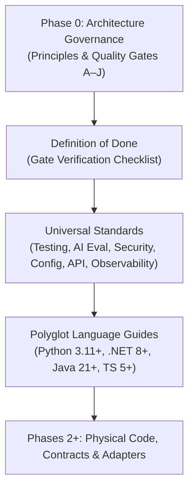

# Phase 01: Engineering Standards & Governance — Learning Guide

```text
Phase:                  01 — Engineering Standards & Governance
Status:                 Frozen & Accepted
Learning Guide Status:  Complete
Primary Audience:       Senior Software Engineers, AI Platform Engineers, Quality Architects
Implementation:         18 Comprehensive Engineering Standards & Language Guides
```

---

## 1. Phase Overview

### What Did This Phase Build?
Phase 1 translated the high-level architecture principles of Phase 0 into an executable **Engineering Governance System**. It produced 18 authoritative engineering standards covering the Definition of Done (DoD), deterministic software testing, continuous AI evaluation, application security, configuration management, data integrity, API design, telemetry/observability, system reliability, dependency hygiene, Git workflow, documentation, and specific guidelines for Python, .NET, Java, and TypeScript.

### Why Was It Needed?
Architecture governance alone cannot ensure quality if engineers lack concrete implementation rules. Without unified engineering standards, polyglot teams build conflicting exception hierarchies, commit credentials to source control, introduce heavy external dependencies for trivial tasks, and lack shared criteria for what "done" actually means.

### What Problem Would Exist Without It?
* **Inconsistent Quality**: One component having 90% unit test coverage while another relies on manual testing.
* **Security Vulnerabilities**: Plaintext API keys in `.env` files committed to Git, unmitigated prompt injection, and vulnerable transitive dependencies.
* **Testing Ambiguity**: Conflating deterministic unit tests with probabilistic model evaluations.
* **Language Drift**: Python services using unpinned libraries, .NET projects ignoring cancellation tokens, and TypeScript apps disabling strict typing.

---

## 2. Learning Objectives

After completing this guide, you will be able to:
* **Apply** the repository Definition of Done (DoD) to any software deliverable.
* **Distinguish** between deterministic software testing (Gate C) and probabilistic AI evaluation (Gate D).
* **Enforce** the strict security boundary that treats all generative model outputs as untrusted input.
* **Design** API boundaries using language-appropriate ports, immutable data structures, and typed errors.
* **Explain** the polyglot language strategy that positions Python for AI-native services, .NET and Java for enterprise backends, and TypeScript for web and API interfaces.
* **Implement** OpenTelemetry GenAI semantic conventions for tracking latency, token usage, and trace spans.

---

## 3. Prerequisites

### Knowledge Prerequisites
* Software engineering fundamentals across at least one supported language (Python, C#, Java, or TypeScript).
* Familiarity with unit testing frameworks (`pytest`, `dotnet test`, `JUnit`, `vitest`).
* Understanding of OWASP Top 10 security vulnerabilities and basic threat modeling.

### Environment Prerequisites
* None. Phase 1 is normative engineering specification. A standard text editor or Markdown viewer is sufficient.

---

## 4. Mental Model

Engineering standards bridge the gap between architecture governance and concrete source code:



### The Three Operational Invariants:
1. **The Separation of Determinism**: Deterministic business logic must be tested with hermetic unit tests ($< 1$s execution). Probabilistic model behavior must be evaluated with versioned benchmark datasets (`eval_dataset.jsonl`).
2. **Untrusted Model Outputs as Attack Surfaces**: Model output must be parsed, schema-validated, and range-checked before being assigned to domain entities or passed to database queries.
3. **No Hidden Tooling Expansion**: Tooling standards mandate `strict` mode for compilers and linters without allowing speculative infrastructure to leak in prematurely.

---

## 5. What This Phase Added

| Document Area | File Path | Core Architectural Invariant |
| :--- | :--- | :--- |
| **Engineering Index** | [`docs/engineering/README.md`](../engineering/README.md) | Central hub organizing all 18 engineering standards. |
| **Definition of Done** | [`docs/engineering/definition-of-done.md`](../engineering/definition-of-done.md) | Checklists mapping deliverables to Gates A through J. |
| **Software Testing** | [`docs/engineering/testing.md`](../engineering/testing.md) | $\ge 85\%$ statement coverage for domain logic; hermetic unit test doubles. |
| **AI Evaluation** | [`docs/engineering/ai-evaluation.md`](../engineering/ai-evaluation.md) | $\ge 30$ scenarios; Faithfulness $\ge 0.85$, Context Relevance $\ge 0.80$, Schema $\ge 0.98$. |
| **Security & Safety** | [`docs/engineering/security.md`](../engineering/security.md) | Zero secrets committed; OWASP Top 10 for LLMs; input sanitization. |
| **Configuration** | [`docs/engineering/configuration.md`](../engineering/configuration.md) | Strict separation of code, configuration, secrets, and prompts. |
| **Data Architecture** | [`docs/engineering/data.md`](../engineering/data.md) | Immutability; provenance tracking; human vs AI data segregation. |
| **API Design** | [`docs/engineering/api-design.md`](../engineering/api-design.md) | Hexagonal ports and adapters; contract-first interfaces; typed errors. |
| **Observability** | [`docs/engineering/observability.md`](../engineering/observability.md) | OpenTelemetry GenAI semantic conventions; token usage; latency. |
| **Reliability** | [`docs/engineering/reliability.md`](../engineering/reliability.md) | Bounded timeouts; exponential backoff retries; circuit breaking. |
| **Dependencies** | [`docs/engineering/dependencies.md`](../engineering/dependencies.md) | Zero vendor SDKs in core contracts; standard library preference. |
| **Git Workflow** | [`docs/engineering/git-workflow.md`](../engineering/git-workflow.md) | Conventional Commits; evidence-based PR bodies; post-freeze learning rule. |
| **Documentation** | [`docs/engineering/documentation.md`](../engineering/documentation.md) | Executable documentation; zero broken links; Mermaid diagrams. |
| **Language Standards** | [`docs/engineering/python.md`](../engineering/python.md), [`dotnet.md`](../engineering/dotnet.md), [`java.md`](../engineering/java.md), [`typescript.md`](../engineering/typescript.md) | Python 3.11+, .NET 8+, Java 21+, TypeScript 5+ baseline rules. |

---

## 6. Repository Map

```text
docs/engineering/
├── README.md              # Engineering governance master index
├── definition-of-done.md  # Tier-aware Definition of Done
├── general.md             # Core software craftsmanship principles
├── testing.md             # Gate C software testing standards
├── ai-evaluation.md       # Gate D continuous AI evaluation standards
├── security.md            # Gate E security & safety standards
├── configuration.md       # Configuration, secrets & prompt management
├── data.md                # Data integrity, schemas & provenance
├── api-design.md          # Boundary design, ports & error contracts
├── observability.md       # Gate F OpenTelemetry & metrics standards
├── reliability.md         # Gate J resilience, timeouts & retry policies
├── dependencies.md        # Third-party dependency hygiene rules
├── git-workflow.md        # Branching, commits & review standards
├── documentation.md       # Gate H documentation standards
├── python.md              # Python engineering standard (primary AI runtime)
├── dotnet.md              # .NET engineering standard
├── java.md                # Java engineering standard
└── typescript.md          # TypeScript engineering standard
```

---

## 7. Recommended Reading Order

### Step 1: Understand the Quality Baseline
* **File**: [`docs/engineering/README.md`](../engineering/README.md) & [`docs/engineering/definition-of-done.md`](../engineering/definition-of-done.md)
* **Why Read**: Learn how work is accepted. Every PR must satisfy the tier-aware Definition of Done.
* **What to Look For**: The explicit mapping of DoD items to Quality Gates A through J.

### Step 2: The Two Testing Disciplines
* **Files**: [`docs/engineering/testing.md`](../engineering/testing.md) and [`docs/engineering/ai-evaluation.md`](../engineering/ai-evaluation.md)
* **Why Read**: Understand the fundamental split between deterministic testing and AI evaluation.
* **What to Look For**: The statement coverage requirements ($\ge 85\%$ for domain logic) vs evaluation metrics (Schema Adherence $\ge 0.98$, Faithfulness $\ge 0.85$).

### Step 3: Hardening the System
* **File**: [`docs/engineering/security.md`](../engineering/security.md)
* **Why Read**: Learn how enterprise AI systems prevent data leaks, mitigate prompt injection, and sandbox tool execution.
* **What to Look For**: The OWASP Top 10 for LLM Applications mitigation matrix and the prohibition against plain-text API keys.

### Step 4: System Boundaries & Contracts
* **Files**: [`docs/engineering/api-design.md`](../engineering/api-design.md), [`docs/engineering/configuration.md`](../engineering/configuration.md), and [`docs/engineering/dependencies.md`](../engineering/dependencies.md)
* **Why Read**: Learn how to design clean interfaces that isolate external dependencies.
* **What to Look For**: Inward dependency rule (domain logic depends on nothing), standard library preference, and prompt externalization.

### Step 5: Resilience & Telemetry
* **Files**: [`docs/engineering/reliability.md`](../engineering/reliability.md) and [`docs/engineering/observability.md`](../engineering/observability.md)
* **Why Read**: Learn how to operate AI in production where latency is high and models can fail.
* **What to Look For**: Bounded timeout rules, exponential backoff retries without jitter on transient errors, and OpenTelemetry `gen_ai.*` attributes.

### Step 6: Language-Specific Standards
* **Files**: [`docs/engineering/python.md`](../engineering/python.md) (and your language of choice: `.NET`, `Java`, `TypeScript`)
* **Why Read**: Understand the concrete idioms and baseline toolchains approved for each runtime.
* **What to Look For**: In Python: Python 3.11+, strict `mypy`, standard library `dataclasses`, and `asyncio` for non-blocking I/O.

---

## 8. Commands to Run

Verify that all 18 engineering standards adhere to markdown quality rules and internal link resolution:

```bash
# Validate internal links across all engineering standards
python3 scripts/validate-docs.py
```

* **Expected Output**: Zero broken links, zero heading hierarchy skips, clean exit code `0`.

---

## 9. Architecture Decisions & Trade-Offs

### Decision 1: Separation of Deterministic Testing from AI Evaluation
* **Decision**: Establish two distinct testing standards: Gate C ([`testing.md`](../engineering/testing.md)) for deterministic software and Gate D ([`ai-evaluation.md`](../engineering/ai-evaluation.md)) for probabilistic AI output.
* **Rationale**: Unit test assertions (`assert result == expected`) fail when applied to probabilistic LLM outputs. Conversely, running an LLM during unit tests makes CI slow, non-deterministic, and costly.
* **Trade-Off**: Developers must maintain two test suites: in-memory mock unit tests for fast feedback and versioned evaluation datasets for model scoring.

### Decision 2: Standard Library First & Strict Dependency Governance
* **Decision**: Prohibit pulling in heavy external helper libraries (e.g. `requests`, `aiohttp`, `pydantic` in minimal contracts) when the language standard library (`urllib`, `dataclasses`, `json`) suffices.
* **Rationale**: Reduces supply-chain vulnerability attack surfaces, avoids transitive dependency conflicts across the monorepo, and guarantees longevity.
* **Trade-Off**: Writing direct HTTP requests requires slightly more boilerplate than using high-level client SDKs.

---

## 10. "Why Not?" Section

* **Why not test AI prompts in standard unit tests with a live model?**  
  Live model calls are non-deterministic, slow (1–5 seconds per call), require running infrastructure or paid API keys, and fail randomly under model updates. Unit tests must run hermetically in $< 0.1$s using test doubles.
* **Why not use Pydantic v2 everywhere from Phase 1?**  
  Pydantic is a powerful library, but placing it in the repository's core contracts forces an external runtime dependency onto every consumer. Core contracts use pure Python standard library (`dataclasses`, `typing.Protocol`). Higher-level applications may use Pydantic if justified.
* **Why is prompt injection treated as a boundary validation concern rather than a prompt-engineering trick?**  
  "Please ignore previous instructions" cannot be solved reliably with magical system prompts. Security requires defensive system boundaries: least-privilege tool access, strict schema parsing, and data/instruction separation.

---

## 11. Architectural Boundaries

Phase 1 established standards, not code:
* **No Premature Code Libraries**: Did not create Python packages, NuGet packages, or npm modules.
* **No Framework Lock-in**: Standards specify protocols and architectural ports, not concrete vendor integrations.
* **Normative, Not Executable**: Standards define acceptance criteria; executable contracts were deferred to Phase 2.

---

## 12. Concept Map

```text
Phase 1: Engineering Standards
├── Verification & Acceptance
│   ├── Definition of Done (DoD)
│   ├── Git Workflow (Conventional Commits, Evidence)
│   └── Documentation Standards (Zero broken links)
├── Quality Disciplines
│   ├── Deterministic Testing (Gate C, >=85% statement coverage)
│   └── Continuous AI Evaluation (Gate D, >=30 scenarios, >=98% schema)
├── System Protection
│   ├── Security (Zero secrets, Untrusted output validation)
│   ├── Reliability (Bounded timeouts, Selective retries)
│   └── Observability (OpenTelemetry gen_ai semantic conventions)
└── Technical Execution
    ├── Configuration & Secrets (Strict separation)
    ├── Dependency Governance (Standard library first)
    └── Language Baselines (Python 3.11+, .NET 8+, Java 21+, TS 5+)
```

---

## 13. Common Misunderstandings

* *Misunderstanding*: "A high test coverage percentage means our AI application is reliable."  
  *Correction*: 100% statement coverage in unit tests only proves that the deterministic code execution paths work. It provides zero evidence regarding whether the underlying LLM hallucinations, adheres to output schemas, or abstains on adversarial inputs. Gate D AI evaluation is required.
* *Misunderstanding*: "We can secure prompts by adding 'System: You are an honest assistant'."  
  *Correction*: Prompt engineering is not a security control. True security relies on the *Untrusted Model Output Principle*—strictly validating and sanitizing every model generation before it is consumed.
* *Misunderstanding*: "Engineering standards restrict developer velocity."  
  *Correction*: Clear engineering standards prevent rework, eliminate circular dependencies, and prevent architectural debt. They enable high-velocity polyglot collaboration.

---

## 14. Architect Interview Checkpoints

### Questions

1. **How does the repository distinguish between Gate C (Software Testing) and Gate D (AI Evaluation)?**
2. **What are the four mandatory metrics evaluated in a Gate D evaluation harness?**
3. **What is the repository policy regarding third-party vendor SDKs in core architectural contracts?**
4. **How must secrets and configuration be separated in reference applications?**
5. **What OpenTelemetry attributes must be emitted when calling an external foundation model?**
6. **Why are retries applied only to transient errors and prohibited on client/validation errors?**
7. **What is the minimum statement coverage mandated for deterministic domain logic?**
8. **Why does the repository prefer the standard library over external utility packages in foundational layers?**

### Self-Check Answers

1. *Answer*: Gate C measures deterministic code execution via hermetic unit tests using in-memory doubles ($\ge 85\%$ statement coverage). Gate D evaluates probabilistic model output quality against a versioned benchmark dataset ($\ge 30$ scenarios).
2. *Answer*: Groundedness/Faithfulness ($\ge 0.85$), Context Relevance ($\ge 0.80$), Schema Adherence ($\ge 0.98$), and Adversarial Query Handling.
3. *Answer*: Core contracts must have zero direct compile-time or runtime dependencies on external AI provider SDKs (`openai`, `anthropic`, `google-genai`). All interactions must pass through architectural ports.
4. *Answer*: Reference applications must strictly separate code, configuration, secrets, and prompts. Secrets are injected via environment variables; prompts are versioned template files; code remains immutable.
5. *Answer*: `gen_ai.system` (provider), `gen_ai.request.model`, latency duration, token usage (`usage.input_tokens`, `usage.output_tokens`), and finish state.
6. *Answer*: Retrying non-transient errors (HTTP 400, 404, schema invalidity) produces identical failures while wasting tokens and inflating latency. Only transient errors (HTTP 429, 503, connection drops) warrant backoff retry.
7. *Answer*: $\ge 85\%$ statement coverage for domain logic, workflow state machines, and data mappers.
8. *Answer*: Minimizes supply-chain vulnerabilities, avoids version conflicts across the monorepo, and keeps core interfaces lean and long-lived.

---

## 15. Teach It Back

Spend 3 minutes explaining Phase 1 to a teammate:
1. Explain the difference between testing deterministic Python code and evaluating an LLM.
2. Describe what happens when an LLM returns unexpected JSON and why the security standard rejects it.
3. Explain why core contracts cannot import vendor SDKs.

---

## 16. You Are Ready to Move On When...

- [ ] You can explain the difference between Gate C unit tests and Gate D evaluation harnesses.
- [ ] You know the authoritative Gate D schema adherence threshold ($\ge 0.98$).
- [ ] You understand why configuration, prompts, and secrets must be separated.
- [ ] You can define what OpenTelemetry GenAI spans require.
- [ ] You have validated the documentation with `python3 scripts/validate-docs.py`.

---

## 17. Connection to Next Phase

> **We have defined the rules of architecture (Phase 0) and the engineering standards for building it (Phase 1).**  
> Now we must construct the smallest possible physical monorepo foundation, establish the shared core contracts, and wire up automated repository validation.  
>  
> → **Proceed to [Phase 02: Repository Foundation](phase-02-repository-foundation.md)**
