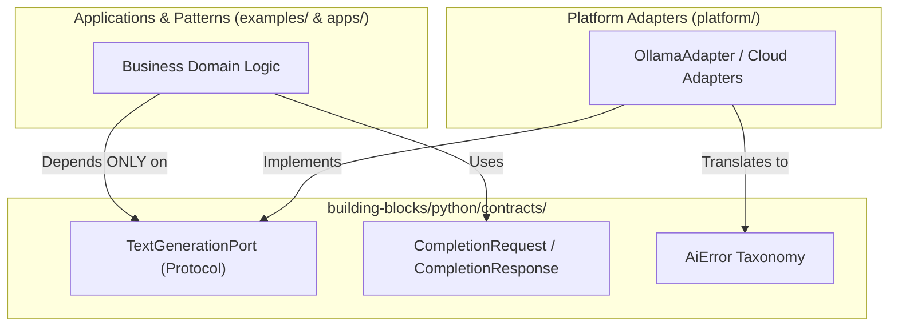

# Phase 02: Repository Foundation & Minimum Core Contracts — Learning Guide

```text
Phase:                  02 — Repository Foundation & Minimum Core Contracts
Status:                 Frozen & Accepted
Learning Guide Status:  Complete
Primary Audience:       Software Engineers, Platform Engineers, Systems Architects
Implementation:         building-blocks/python/, scripts/validate.py, CI Workflow, ADR-0001
```

---

## 1. Phase Overview

### What Did This Phase Build?
Phase 2 created the executable engineering foundation for the monorepo. It established the physical directory structure (`building-blocks/`, `platform/`, `examples/`, `apps/`), implemented the minimum provider-neutral AI contracts in Python standard library (`models.py`, `ports.py`, `errors.py`), created automated AST-based import boundary tests, authored the unified repository validation engine ([`scripts/validate.py`](../../scripts/validate.py)), and configured the GitHub Actions CI pipeline.

### Why Was It Needed?
Before writing concrete AI model adapters or applications, a monorepo must have shared, immutable contracts and automated boundary governance. Without a minimal foundation, every developer invents their own request/response structures, imports vendor SDKs into shared libraries, and produces circular dependencies.

### What Problem Would Exist Without It?
* **Speculative Interface Clutter**: Creating massive interface hierarchies (`IAgent`, `ITool`, `IMemoryStore`, `IWorkflowEngine`) that fail to match actual operational requirements.
* **Contract Coupling**: Polluting shared contracts with vendor-specific schemas (e.g. OpenAI function call formats).
* **Missing Automated Guardrails**: Relying on manual code review to catch architectural rule violations rather than automated linters and AST scanners.

---

## 2. Learning Objectives

After completing this guide, you will be able to:
* **Explain** how the Ports and Adapters (Hexagonal Architecture) pattern decouples application logic from LLM runtimes.
* **Inspect** and implement the canonical `TextGenerationPort` protocol using standard Python.
* **Navigate** the domain error taxonomy (`AiError`) and distinguish transient from non-transient errors.
* **Execute** the unified monorepo validator (`scripts/validate.py`) and explain each of its validation stages.
* **Explain** how automated AST inspection (`scripts/validate.py` via `check_contract_import_boundaries()`) prevents vendor SDK leakage into shared contracts.
* **Defend** the architectural decision to deliberately defer speculative abstractions (`IAgent`, `ITool`, `IEmbeddingClient`).

---

## 3. Prerequisites

### Knowledge Prerequisites
* Python 3.11+ type hints (`typing.Protocol`, `dataclasses`, `runtime_checkable`).
* Concept of abstract interfaces and structural subtyping (duck typing with static checking).
* Familiarity with Python's Abstract Syntax Tree (`ast`) module for static analysis.

### Environment Prerequisites
* Python 3.11 or higher installed on your workstation.
* Git repository cloned. No external AI tools or cloud keys required.

---

## 4. Mental Model

The repository foundation decouples the system into strict concentric layers:



### Key Architectural Invariants:
1. **Zero External Runtime Dependencies**: The `contracts` package uses pure Python standard library. It requires zero third-party packages to install or run.
2. **Inward Dependency Rule**: Contracts never import from `platform/`, `examples/`, or `apps/`.
3. **Justified Contracts Only**: Contracts are created only when an immediate, verified use case requires them.

---

## 5. What This Phase Added

| Area | File Path | Architectural Responsibility |
| :--- | :--- | :--- |
| **ADR** | [`adr/0001-minimum-core-contracts-and-repository-foundation.md`](../../adr/0001-minimum-core-contracts-and-repository-foundation.md) | Architectural Decision Record formalizing the foundation decisions. |
| **Contracts Config** | [`building-blocks/python/pyproject.toml`](../../building-blocks/python/pyproject.toml) | Python packaging metadata with zero external dependencies. |
| **Data Models** | [`building-blocks/python/contracts/models.py`](../../building-blocks/python/contracts/models.py) | `CompletionRequest`, `CompletionResponse`, `UsageMetrics`, `AiOperationContext`. |
| **Ports** | [`building-blocks/python/contracts/ports.py`](../../building-blocks/python/contracts/ports.py) | `TextGenerationPort` protocol definition. |
| **Error Taxonomy** | [`building-blocks/python/contracts/errors.py`](../../building-blocks/python/contracts/errors.py) | `AiError`, `AiModelNotFoundError`, `AiTimeoutError`, `AiProviderUnavailableError`, `AiRateLimitError`, `AiInvalidRequestError`, `AiOutputValidationError`. |
| **Unit Tests** | [`building-blocks/python/tests/`](../../building-blocks/python/tests/) | Hermetic tests verifying models, ports, errors, validation, and evaluation. |
| **Boundary Enforcement** | [`scripts/validate.py`](../../scripts/validate.py) | AST inspection in `check_contract_import_boundaries()` proving zero vendor SDK imports. |
| **Repo Validator** | [`scripts/validate.py`](../../scripts/validate.py) | Monorepo validation engine orchestrating all quality checks. |
| **CI Workflow** | [`.github/workflows/ci.yml`](../../.github/workflows/ci.yml) | Read-only GitHub Actions pipeline executing `validate.py`. |

---

## 6. Repository Map

```text
building-blocks/python/
├── pyproject.toml
├── contracts/
│   ├── __init__.py          # Public symbol exports
│   ├── models.py            # Strongly typed immutable data classes
│   ├── ports.py             # Structural protocols (TextGenerationPort)
│   ├── errors.py            # Provider-neutral error taxonomy
│   ├── validation.py        # Schema validation contracts
│   ├── evaluation.py        # Evaluation metrics contracts
│   └── telemetry.py         # Telemetry & context contracts
└── tests/
    ├── test_models.py       # Model serialization & immutability (10 tests)
    ├── test_ports.py        # Protocol conformance (4 tests)
    ├── test_errors.py       # Error hierarchy & transient classification (5 tests)
    ├── test_validation.py   # Schema validation contracts (4 tests)
    └── test_evaluation.py   # Evaluation metrics contracts (3 tests)
scripts/
└── validate.py              # Monorepo unified validation runner & AST boundary scanner
```

---

## 7. Recommended Reading Order

### Step 1: Read the Architectural Decision
* **File**: [`adr/0001-minimum-core-contracts-and-repository-foundation.md`](../../adr/0001-minimum-core-contracts-and-repository-foundation.md)
* **Why Read**: Understand why Phase 2 built only what was strictly necessary and deliberately rejected speculative abstractions.
* **What to Look For**: The list of rejected interfaces (`IAgent`, `ITool`, `IMemoryStore`).

### Step 2: Inspect the Port Protocol
* **File**: [`building-blocks/python/contracts/ports.py`](../../building-blocks/python/contracts/ports.py)
* **Why Read**: Learn the foundational interface between applications and foundation models.
* **What to Look For**: `TextGenerationPort`. Notice `@runtime_checkable` and `async def generate(...)`.

### Step 3: Inspect Data Models
* **File**: [`building-blocks/python/contracts/models.py`](../../building-blocks/python/contracts/models.py)
* **Why Read**: See how request parameters, model outputs, token metrics, and trace contexts are represented.
* **What to Look For**: `CompletionRequest` immutability (`frozen=True`), `UsageMetrics`, and `AiOperationContext`.

### Step 4: Inspect Error Taxonomy
* **File**: [`building-blocks/python/contracts/errors.py`](../../building-blocks/python/contracts/errors.py)
* **Why Read**: Understand how infrastructure failures are translated into domain-safe exceptions.
* **What to Look For**: The base class `AiError` and its `is_transient` property distinguishing retryable errors.

### Step 5: Study Automated Boundary Enforcement
* **File**: [`scripts/validate.py`](../../scripts/validate.py)
* **Why Read**: Discover how the repository mechanically enforces Gate A without external static analysis tools.
* **What to Look For**: The Python `ast.walk` implementation in `check_contract_import_boundaries()` scanning contract files for prohibited vendor AI SDK imports (`openai`, `anthropic`, `ollama`, `langchain`, `llamaindex`, `google.generativeai`, `cohere`) and inward imports from `apps`.

### Step 6: Study the Monorepo Validator
* **File**: [`scripts/validate.py`](../../scripts/validate.py)
* **Why Read**: Learn how all repository governance checks are automated in a single command.
* **What to Look For**: Dynamic test discovery (`discover_all_test_suites`) scanning all artifact roots.

---

## 8. Source-Code Reading Order

To understand how contracts execute in code:

1. Open [`contracts/ports.py`](../../building-blocks/python/contracts/ports.py). Find `class TextGenerationPort(Protocol)`. Notice its signature:
   ```python
   async def generate(
       self,
       request: CompletionRequest,
       context: Optional[AiOperationContext] = None,
   ) -> CompletionResponse: ...
   ```
2. Open [`contracts/models.py`](../../building-blocks/python/contracts/models.py). Find `CompletionRequest`. Inspect its validation in `__post_init__` (validating prompt presence and temperature bounds $0.0 \le t \le 2.0$).
3. Find `CompletionResponse`. Inspect its fields: `text: str`, `model: str`, `latency_ms: float`, `usage: Optional[UsageMetrics]`, `metadata: Dict[str, Any]`.
4. Open [`contracts/errors.py`](../../building-blocks/python/contracts/errors.py). Find `AiTimeoutError` and `AiRateLimitError`. Notice `is_transient == True`. Find `AiInvalidRequestError` and `AiModelNotFoundError`. Notice `is_transient == False`.
5. Open [`building-blocks/python/tests/test_ports.py`](../../building-blocks/python/tests/test_ports.py). Look at `test_fake_llm_client_satisfies_protocol()`. Notice how a simple 5-line class satisfies `TextGenerationPort` without inheritance.

---

## 9. Commands to Run

Execute the Phase 2 contract test suites:

```bash
# 1. Run all 29 hermetic contract unit tests
python3 -m unittest discover -s building-blocks/python/tests -t building-blocks/python -v

# 2. Run the unified monorepo validation script (including AST boundary checks)
python3 scripts/validate.py
```

* **What it tests**:
  - Unit tests in `building-blocks/python/tests/`: Verifies model construction, defaults, immutability, error properties, and protocol conformance.
  - `scripts/validate.py`: Verifies structure, boundaries (via AST), docs, templates, and all monorepo test suites.
* **Expected Output**: Exit code `0`, 29 tests passed in $< 0.01$s.

---

## 10. Distinguish Test Types

| Test Category | Purpose | Dependencies | Execution Time | Gate Satisfied |
| :--- | :--- | :--- | :---: | :---: |
| **Contract Unit Tests** (`building-blocks/python/tests/`) | Verifies domain dataclasses, default values, error codes, and serialization. | Pure standard library; in-memory. | 0.002s | Gate B, Gate C |
| **AST Boundary Enforcement** (`scripts/validate.py`) | Scans contract source files via AST to detect prohibited vendor AI SDKs and inward app imports. | Python `ast` module; no external tools. | 0.003s | Gate A |

---

## 11. Hands-On Experiments

### Experiment 1: Induce an Import Boundary Violation
1. Open [`building-blocks/python/contracts/ports.py`](../../building-blocks/python/contracts/ports.py).
2. Add a line at the top: `import openai  # type: ignore`
3. Run repository validation:
   ```bash
   python3 scripts/validate.py
   ```
4. **Observe**: Step 2 fails with `Prohibited vendor import 'openai' in contract definition.` (exit code 1).
5. **Revert** the change immediately.

### Experiment 2: Verify Protocol Polymorphism
Create a quick inline Python test in your terminal:
```python
from contracts.ports import TextGenerationPort
from contracts.models import CompletionRequest, CompletionResponse

class CustomStub:
    async def generate(self, request: CompletionRequest, context=None) -> CompletionResponse:
        return CompletionResponse(text="Hello", model="stub", latency_ms=1.0)

# Verify structural subtyping without inheritance
assert isinstance(CustomStub(), TextGenerationPort)
print("CustomStub cleanly satisfies TextGenerationPort!")
```

---

## 12. Intentional Failure Learning

### Exercise: Test Request Parameter Validation
Try instantiating `CompletionRequest` with invalid parameters:
```python
from contracts.models import CompletionRequest

# Attempt negative temperature
try:
    req = CompletionRequest(prompt="Test", temperature=-0.5)
except ValueError as ex:
    print(f"Caught expected validation error: {ex}")

# Attempt empty prompt
try:
    req = CompletionRequest(prompt="")
except ValueError as ex:
    print(f"Caught expected validation error: {ex}")
```
*Key Takeaway*: Core contracts protect applications by preventing invalid parameters before network calls occur.

---

## 13. Architecture Decisions & Trade-Offs (ADR-0001)

### Decision 1: Python Standard Library Only for Core Contracts
* **Rationale**: Eliminates dependency conflicts across monorepo packages and provides long-term stability.
* **Trade-Off**: Manual validation in `__post_init__` instead of relying on Pydantic decorators.

### Decision 2: Python `typing.Protocol` over Abstract Base Classes (ABCs)
* **Rationale**: Structural subtyping allows platform adapters to satisfy `TextGenerationPort` without creating a hard compile-time dependency on the contracts package.
* **Trade-Off**: Static type checkers must be used to ensure protocol conformance at compile time.

### Decision 3: Deliberate Deferral of Speculative Interfaces
* **Rationale**: Avoided creating `IAgent`, `ITool`, `IMemoryStore`, or `IWorkflowEngine`. These belong to Phases 5, 6, and 7.
* **Trade-Off**: Developers wanting to build agent loops in Phase 2 must wait for appropriate roadmap phases.

---

## 14. "Why Not?" Section

* **Why didn't Phase 2 include an `IEmbeddingClient`?**  
  Embeddings are used for vector retrieval and RAG. RAG is the explicit mission of Phase 5. Introducing embedding contracts in Phase 2 violates Roadmap Directive 5 (Respect Phase Boundaries).
* **Why not use Pydantic v2 in `contracts/models.py`?**  
  Pydantic is a heavy third-party dependency. Placing it in `contracts` would force every consumer, microservice, and CLI tool in the repository to depend on Pydantic. Standard library `dataclasses` provide sufficient typing and validation.
* **Why use an AST boundary test instead of an external linter like Import-Linter?**  
  The Python `ast` module is built into standard library Python. It runs hermetically in 0.003s without requiring external pip packages or configuration files.

---

## 15. Architectural Boundaries

Phase 2 deliberately restricted scope:
* **No AI Model Runtimes**: Did not implement Ollama, OpenAI, or Anthropic clients (deferred to Phase 4).
* **No Vector Databases**: Did not introduce pgvector, Chroma, or Qdrant.
* **No Web Frameworks**: Did not introduce FastAPI, Flask, or web servers.

---

## 16. Concept Map

```text
Phase 2: Repository Foundation
├── Physical Layout
│   ├── building-blocks/ (Reusable shared libraries)
│   ├── platform/ (Infrastructure adapters)
│   ├── examples/ (Pattern reference examples)
│   └── apps/ (Full reference applications)
├── Core Contracts (building-blocks/python/contracts/)
│   ├── Ports: TextGenerationPort (Protocol)
│   ├── Models: CompletionRequest, CompletionResponse, UsageMetrics, AiOperationContext
│   └── Errors: AiError (transient vs non-transient taxonomy)
├── Automated Verification
│   ├── building-blocks/python/tests/ (Contract & protocol tests)
│   └── scripts/validate.py (AST boundary scan & monorepo validation)
└── CI Pipeline
    └── .github/workflows/ci.yml (Deterministic, read-only, secrets-free)
```

---

## 17. Common Misunderstandings

* *Misunderstanding*: "Protocols are just like Java interfaces."  
  *Correction*: Java interfaces require explicit `implements` declaration (nominal typing). Python protocols use *structural typing*—a class satisfies `TextGenerationPort` simply by having a matching `generate()` signature, without any import dependency.
* *Misunderstanding*: "We should define all future interfaces now so the architecture is complete."  
  *Correction*: This is the *Speculative Abstraction* anti-pattern. Interfaces designed without concrete implementations almost always have wrong signatures, missing parameters, and incorrect error semantics.

---

## 18. Architect Interview Checkpoints

### Questions

1. **Why is structural subtyping (`typing.Protocol`) preferred over nominal inheritance (`abc.ABC`) for foundational ports?**
2. **How does `AiError.is_transient` simplify retry logic in upstream callers?**
3. **What prevents a developer from importing `openai` into `building-blocks/python/contracts/`?**
4. **Why is `CompletionRequest` designed as an immutable (`frozen=True`) dataclass?**
5. **What is the purpose of `AiOperationContext` and what fields does it capture?**
6. **Why was `IEmbeddingClient` excluded from Phase 2?**
7. **How does `scripts/validate.py` discover test suites dynamically across the monorepo?**
8. **Why is the CI workflow configured with `permissions: contents: read`?**

### Self-Check Answers

1. *Answer*: Structural subtyping decouples the adapter from the contracts package. An adapter can be written and tested independently without importing or subclassing the port class.
2. *Answer*: Upstream callers do not need to know provider-specific error codes (e.g. Ollama 503 vs OpenAI 429). They check `error.is_transient` to determine whether a retry with backoff is appropriate.
3. *Answer*: The automated AST boundary check in [`scripts/validate.py`](../../scripts/validate.py) parses contract code during validation and fails CI if any prohibited vendor package is imported.
4. *Answer*: Immutability prevents concurrent threads or asynchronous tasks from mutating request parameters (e.g. prompt or temperature) during execution or retries.
5. *Answer*: It carries distributed tracing context (`trace_id`, `span_id`, `parent_span_id`, `operation_name`, `user_id`) across asynchronous port boundaries without coupling to a specific telemetry SDK.
6. *Answer*: Embeddings belong to Phase 5 (Knowledge Intelligence & RAG). Phase 2 only introduces contracts justified by immediate foundation requirements.
7. *Answer*: It scans approved artifact roots (`building-blocks/`, `platform/`, `examples/`, `apps/`) for `tests` directories and executes `unittest discover` in isolated sub-processes.
8. *Answer*: Principles of least privilege: CI only needs to read repository files to run tests and linters. It has zero write permissions, zero secrets, and zero deployment authority.

---

## 19. Teach It Back

In 3 minutes, explain to an engineer:
1. What `TextGenerationPort` does and why it has no dependencies.
2. How the AST boundary test prevents architecture drift.
3. Why `AiTimeoutError` is transient while `AiInvalidRequestError` is not.

---

## 20. You Are Ready to Move On When...

- [ ] You have run `python3 scripts/validate.py` and inspected the 5 passing steps.
- [ ] You can write an in-memory stub that satisfies `TextGenerationPort`.
- [ ] You understand why `is_transient` is crucial for resilience engineering.
- [ ] You understand why speculative agent interfaces were rejected.

---

## 21. Connection to Next Phase

> **We have our physical monorepo foundation and minimum contracts.**  
> But how should future reference applications, pattern examples, platform components, and templates be structured, documented, validated, and classified across the repository?  
>  
> → **Proceed to [Phase 03: Reference Implementation Templates](phase-03-reference-templates.md)**
