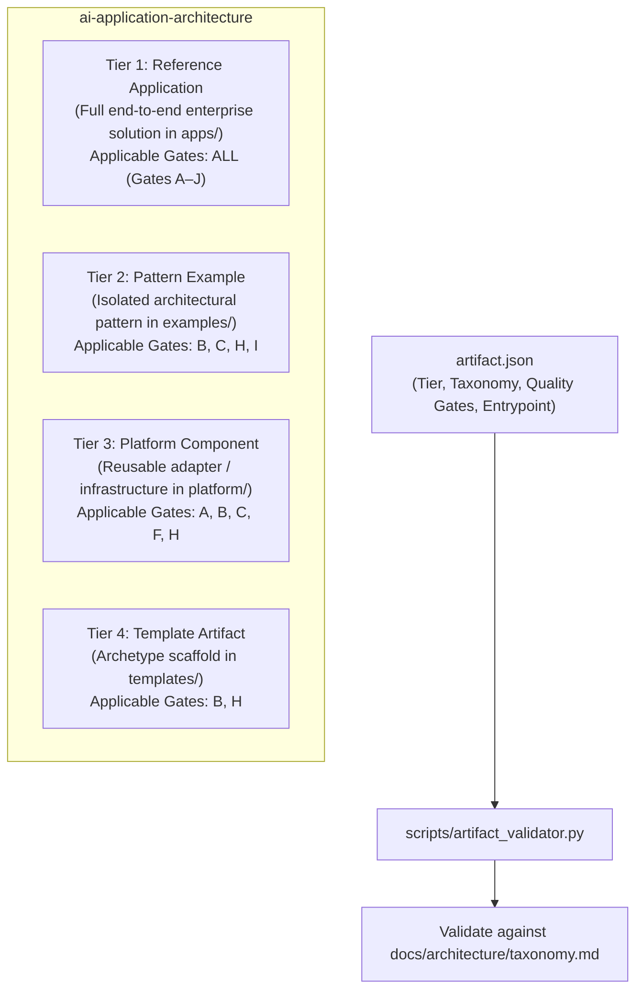

# Phase 03: Tiered Reference Implementation Templates — Learning Guide

```text
Phase:                  03 — Tiered Reference Implementation Templates
Status:                 Frozen & Accepted
Learning Guide Status:  Complete
Primary Audience:       Software Architects, Platform Engineers, Open Source Contributors
Implementation:         templates/, scripts/artifact_validator.py, ADR-0002
```

---

## 1. Phase Overview

### What Did This Phase Build?
Phase 3 established the standardized system for creating, classifying, documenting, and validating reference implementations across the repository. It defined four distinct **Reference Implementation Tiers** (Tier 1: Reference Application, Tier 2: Pattern Example, Tier 3: Platform Component, Tier 4: Template Artifact), authored canonical template scaffolds in [`templates/`](../../templates/), established the machine-readable [`artifact.json`](../../templates/pattern-example/artifact.json) schema, and created the automated manifest and taxonomy validator ([`scripts/artifact_validator.py`](../../scripts/artifact_validator.py)).

### Why Was It Needed?
As an enterprise AI architecture repository expands to dozens of implementations, examples easily become inconsistent. Some lack documentation, others omit test suites, and others claim taxonomy categories that do not exist. Phase 3 provides the structural guardrails to scale the repository consistently without bureaucratic overhead.

### What Problem Would Exist Without It?
* **Structural Chaos**: Every new reference implementation using a different directory structure, different manifest keys, and ad-hoc documentation formats.
* **Tier Confusion**: Developers assuming that small focused pattern examples must implement the same heavy infrastructure (e.g. distributed circuit breakers) as complete enterprise reference applications.
* **Taxonomy Drift**: Implementations claiming arbitrary, unstandardized category names that disconnect from `docs/architecture/taxonomy.md`.

---

## 2. Learning Objectives

After completing this guide, you will be able to:
* **Differentiate** among the four Reference Implementation Tiers (Tier 1, Tier 2, Tier 3, and Tier 4).
* **Defend** the fundamental architectural axiom: **Tier is NOT Maturity**.
* **Inspect** and author a valid `artifact.json` file.
* **Run** the automated artifact validator (`scripts/artifact_validator.py`) and explain how it verifies taxonomy coordinates.
* **Explain** how Quality Gate applicability scales proportionally across tiers without weakening core standards.

---

## 3. Prerequisites

### Knowledge Prerequisites
* Understanding of the 10 Quality Gates from Phase 0 (`QUALITY-GATES.md`).
* Familiarity with the 5-dimensional taxonomy from Phase 0 (`docs/architecture/taxonomy.md`).
* Basic JSON syntax and validation concepts.

### Environment Prerequisites
* Python 3.11+ installed to run the artifact validator script.

---

## 4. Mental Model

The repository organizes deliverables into four explicit tiers based on architectural scope and depth:



### The Critical Axiom: Tier vs Maturity
```text
┌────────────────────────────────────────────────────────────────────────┐
│ TIER ≠ MATURITY                                                        │
│ - TIER defines the structural SCOPE and DEPTH of an artifact.          │
│ - MATURITY defines the verified PRODUCTION READINESS of an artifact.   │
│                                                                        │
│ A Tier 1 Reference Application is NOT automatically production-ready.  │
│ A Tier 2 Pattern Example can be 100% production-ready for its pattern. │
└────────────────────────────────────────────────────────────────────────┘
```

---

## 5. What This Phase Added

| Area | File Path | Purpose |
| :--- | :--- | :--- |
| **ADR** | [`adr/0002-tiered-reference-implementation-templates.md`](../../adr/0002-tiered-reference-implementation-templates.md) | Architectural decision formalizing the four tiers and manifest governance. |
| **Template Hub** | [`templates/README.md`](../../templates/README.md) | Overview of templates and the Quality Gate applicability matrix. |
| **Tier 1 Template** | [`templates/reference-application/`](../../templates/reference-application/) | Full enterprise archetype (`artifact.json`, `docs/`, `README.md`). |
| **Tier 2 Template** | [`templates/pattern-example/`](../../templates/pattern-example/) | Focused pattern archetype (`artifact.json`, `README.md`). |
| **Tier 3 Template** | [`templates/platform-component/`](../../templates/platform-component/) | Platform adapter archetype (`artifact.json`, `README.md`). |
| **Tier 4 Template** | [`templates/template-artifact/`](../../templates/template-artifact/) | Scaffolding archetype with prominent non-production notices (`artifact.json`, `README.md`). |
| **Artifact Validator** | [`scripts/artifact_validator.py`](../../scripts/artifact_validator.py) | Automated validator enforcing manifest schemas and taxonomy membership. |

---

## 6. Repository Map

```text
templates/
├── README.md                      # Template catalog & tier applicability matrix
├── reference-application/         # Tier 1: Full reference application scaffold
│   ├── artifact.json
│   ├── README.md
│   └── docs/ (requirements.md, architecture.md, quality.md)
├── pattern-example/               # Tier 2: Isolated pattern example scaffold
│   ├── artifact.json
│   └── README.md
├── platform-component/            # Tier 3: Reusable adapter scaffold
│   ├── artifact.json
│   └── README.md
└── template-artifact/             # Tier 4: Minimal template archetype
    ├── artifact.json
    └── README.md
scripts/
└── artifact_validator.py          # Automated manifest & taxonomy validator
```

---

## 7. Recommended Reading Order

### Step 1: Read the Architectural Decision
* **File**: [`adr/0002-tiered-reference-implementation-templates.md`](../../adr/0002-tiered-reference-implementation-templates.md)
* **Why Read**: Learn why four tiers were created and why "Tier is not Maturity".
* **What to Look For**: The Quality Gate scaling matrix and the rejection of a single monolithic template.

### Step 2: Review the Template Catalog
* **File**: [`templates/README.md`](../../templates/README.md)
* **Why Read**: Understand the tier applicability table and how gates apply to each artifact type.
* **What to Look For**: The Quality Gate Applicability Matrix (e.g. why Gate J applies to Tier 1 but is scaled for Tier 2).

### Step 3: Inspect the Manifest Schema
* **Files**: [`templates/pattern-example/artifact.json`](../../templates/pattern-example/artifact.json) and [`templates/platform-component/artifact.json`](../../templates/platform-component/artifact.json)
* **Why Read**: Understand the required metadata keys for any repository deliverable.
* **What to Look For**: `schema_version`, `name`, `tier`, `status`, `taxonomy` (with dimensions), and `quality_gates`.

### Step 4: Study the Manifest Validator
* **File**: [`scripts/artifact_validator.py`](../../scripts/artifact_validator.py)
* **Why Read**: Learn how manifest correctness and taxonomy compliance are automated.
* **What to Look For**: The taxonomy validation logic reading `docs/architecture/taxonomy.md` to ensure declared categories exist.

---

## 8. Source-Code Reading Order

To understand how manifest validation works:

1. Open [`scripts/artifact_validator.py`](../../scripts/artifact_validator.py).
2. Find `extract_taxonomy_vocabularies()`. Notice how it parses Markdown headings from [`docs/architecture/taxonomy.md`](../architecture/taxonomy.md) to extract approved taxonomy terms dynamically.
3. Find `validate_manifest()`. Inspect the checks:
   - Valid JSON syntax.
   - Required root keys: `schema_version`, `name`, `tier`, `status`, `taxonomy`.
   - Tier validation: must be `tier-1`, `tier-2`, `tier-3`, or `tier-4`.
   - Taxonomy validation: checks `application_domains`, `intelligence_patterns`, `architectural_patterns`.
4. Run the validator from terminal.

---

## 9. Commands to Run

```bash
# Run standalone manifest and taxonomy validation
python3 scripts/artifact_validator.py
```

* **What it tests**: Discovers all `artifact.json` files in `templates/`, `platform/`, `examples/`, and `apps/`; validates structure, tier names, and taxonomy membership against `docs/architecture/taxonomy.md`.
* **Expected Output**: `PASS: Canonical templates validated successfully.` (Exit code `0`).

---

## 10. Quality Gate Scaling Across Tiers

| Quality Gate | Tier 1 (Ref App) | Tier 2 (Pattern Example) | Tier 3 (Platform Component) | Tier 4 (Template) |
| :--- | :---: | :---: | :---: | :---: |
| **Gate A — Architecture Boundaries** | **Mandatory** | Scaled | **Mandatory** | Structure |
| **Gate B — Code Quality & Type Safety**| **Mandatory** | **Mandatory** | **Mandatory** | **Mandatory** |
| **Gate C — Software Testing** | **Mandatory** ($\ge 85\%$) | **Mandatory** (Hermetic) | **Mandatory** ($\ge 85\%$) | Baseline |
| **Gate D — AI Evaluation** | **Mandatory** (if AI) | Scaled (if AI) | Recommended | N/A |
| **Gate E — Security & Safety** | **Mandatory** | Scaled | **Mandatory** | Zero Secrets |
| **Gate F — Observability & Telemetry** | **Mandatory** | Scaled | **Mandatory** (if runtime) | N/A |
| **Gate G — Performance & Sizing** | **Mandatory** | Scaled | Recommended | N/A |
| **Gate H — Documentation & Integrity** | **Mandatory** | **Mandatory** | **Mandatory** | **Mandatory** |
| **Gate I — Demo & Verification** | **Mandatory** ($< 5$m) | **Mandatory** ($< 1$m) | Recommended | N/A |
| **Gate J — Production Resilience** | **Mandatory** | Scaled | Recommended | N/A |

---

## 11. Hands-On Experiments

### Experiment 1: Induce an Invalid Tier Error
1. Open [`templates/pattern-example/artifact.json`](../../templates/pattern-example/artifact.json).
2. Change `"tier": "tier-2"` to `"tier": "tier-99"`.
3. Run the validator:
   ```bash
   python3 scripts/artifact_validator.py
   ```
4. **Observe**: The validator fails with `Invalid tier: 'tier-99'`.
5. **Revert** the change.

### Experiment 2: Induce a Taxonomy Membership Error
1. Open [`templates/pattern-example/artifact.json`](../../templates/pattern-example/artifact.json).
2. Under `"taxonomy" -> "intelligence_patterns"`, add `"quantum-neural-mind-reading"`.
3. Run the validator:
   ```bash
   python3 scripts/artifact_validator.py
   ```
4. **Observe**: The validator catches the unapproved term and lists the valid intelligence patterns from `docs/architecture/taxonomy.md`.
5. **Revert** the change.

---

## 12. Architecture Decisions & Trade-Offs (ADR-0002)

### Decision 1: Manifest-Driven Governance
* **Rationale**: Machine-readable metadata allows automated tools (`validate.py`, CI) to verify compliance without parsing unstructured prose.
* **Trade-Off**: Contributors must maintain an `artifact.json` file alongside their code and documentation.

### Decision 2: Four Explicit Tiers Rather than One Generic Template
* **Rationale**: A platform adapter (Tier 3) has fundamentally different responsibilities, interfaces, and test requirements than an end-to-end enterprise reference application (Tier 1). One template cannot fit both without severe boilerplate.
* **Trade-Off**: Four templates must be maintained in the `templates/` directory.

---

## 13. "Why Not?" Section

* **Why not use an external scaffolding generator like Cookiecutter?**  
  Cookiecutter requires external dependencies and generates detached files. The repository uses canonical in-repo templates that are directly validated by the monorepo test suite.
* **Why isn't a Tier 1 application automatically considered production-ready?**  
  "Tier" describes the structural scope (it has an API, domain model, database, and telemetry). "Production readiness" (Maturity) requires objectively satisfying all ten Quality Gates (resilience, security scan, performance SLAs, fault injection). An application can have Tier 1 structure while still being in a development or unverified state.

---

## 14. Architectural Boundaries

Phase 3 established templates, not implementations:
* **No Premature Feature Code**: Templates contain archetypes, stub files, and doc templates—not working AI algorithms.
* **No Fake Model Execution**: The templates do not execute inference; real execution was deferred to Phase 4.

---

## 15. Concept Map

```text
Phase 3: Reference Implementation Templates
├── Four Tiers
│   ├── Tier 1: Reference Application (apps/, Gates A–J)
│   ├── Tier 2: Pattern Example (examples/, Gates B, C, H, I)
│   ├── Tier 3: Platform Component (platform/, Gates A, B, C, F, H)
│   └── Tier 4: Template Artifact (templates/, Gates B, H)
├── Governance Tooling
│   ├── artifact.json (Standard metadata schema)
│   └── scripts/artifact_validator.py (Schema & taxonomy validation)
└── Architectural Principle
    └── TIER ≠ MATURITY (Scope does not equal verified readiness)
```

---

## 16. Common Misunderstandings

* *Misunderstanding*: "Tier 1 is better than Tier 2."  
  *Correction*: Tiers represent *scope*, not superiority. Tier 2 pattern examples are often the best starting point for understanding an isolated AI concept because they omit the complexity of full-scale enterprise backends.
* *Misunderstanding*: "If my manifest passes validation, my application is done."  
  *Correction*: Manifest validation only proves structural compliance and taxonomy membership. The implementation must still satisfy the applicable Quality Gates.

---

## 17. Architect Interview Checkpoints

### Questions

1. **Why does the repository establish four distinct reference implementation tiers?**
2. **What does the axiom "Tier is not Maturity" mean in an enterprise architecture context?**
3. **What are the required top-level keys in an `artifact.json` file?**
4. **How does `scripts/artifact_validator.py` prevent taxonomy drift?**
5. **Why does Gate J (Production Readiness & Resilience) apply fully to Tier 1 but only scaled to Tier 2?**
6. **What is the purpose of Tier 4 (Template Artifact)?**
7. **How does the repository ensure that templates themselves do not degrade over time?**
8. **Why are templates committed to the repository rather than generated by external CLI tools?**

### Self-Check Answers

1. *Answer*: Different deliverables have different architectural scopes. A platform adapter (Tier 3) needs OTel telemetry and ports, but does not need end-to-end user journeys or databases like a Tier 1 application.
2. *Answer*: Tier defines architectural breadth (number of components, layers). Maturity defines verified quality (test coverage, security audits, resilience testing). A Tier 1 application with failing tests has lower maturity than a fully verified Tier 2 pattern example.
3. *Answer*: `schema_version`, `name`, `tier`, `status`, `taxonomy` (with `application_domains`, `intelligence_patterns`, `architectural_patterns`), and `quality_gates`.
4. *Answer*: It dynamically extracts approved terms from `docs/architecture/taxonomy.md` and fails validation if a manifest claims an unapproved pattern or domain.
5. *Answer*: Tier 1 applications simulate full enterprise systems requiring circuit breakers, timeouts, and fallbacks under provider failure. Tier 2 pattern examples focus on isolating an architectural pattern (e.g. structured generation) and only require basic error handling.
6. *Answer*: It provides a verified, pre-scaffolded starting point for developers creating new implementations, ensuring consistency from day one.
7. *Answer*: Canonical templates are validated by `scripts/artifact_validator.py` as part of `scripts/validate.py` on every CI run.
8. *Answer*: In-repo templates can be version-controlled, tested, and updated atomically as architecture standards evolve.

---

## 18. Teach It Back

Spend 3 minutes explaining to a colleague:
1. The difference between Tier 1, Tier 2, and Tier 3.
2. Why a Tier 1 application is not automatically production-ready.
3. How `artifact.json` connects code to repository governance.

---

## 19. You Are Ready to Move On When...

- [ ] You can explain the difference between the 4 Tiers.
- [ ] You have run `python3 scripts/artifact_validator.py` with clean exit code 0.
- [ ] You understand why `artifact.json` enforces taxonomy membership.
- [ ] You can defend the distinction between Tier and Maturity.

---

## 20. Connection to Next Phase

> **We have our governance (Phase 0), engineering standards (Phase 1), monorepo foundation (Phase 2), and reference templates (Phase 3).**  
> Now we are ready to implement the first real AI runtime capabilities: provider-neutral model adapters, structured generation, and quantitative Gate D evaluation.  
>  
> → **Proceed to [Phase 04: AI Foundations](phase-04-ai-foundations.md)**
