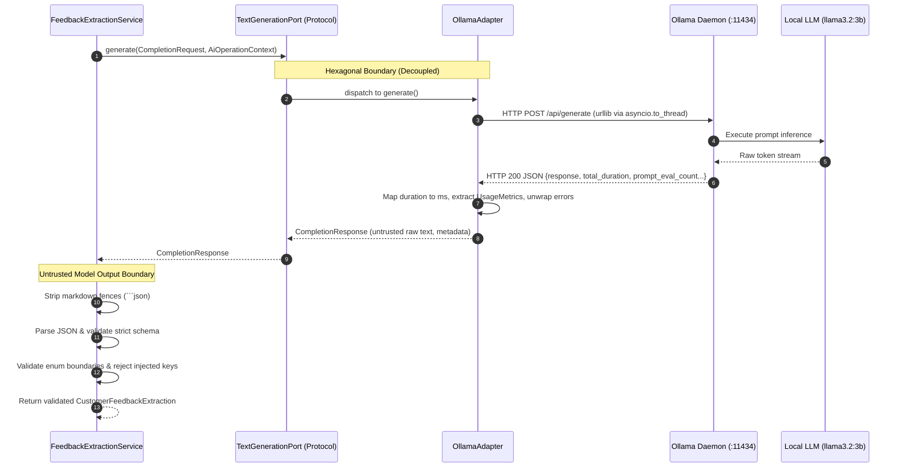

# Phase 04: AI Foundations — Learning Guide

```text
Phase:                  04 — AI Foundations
Status:                 Frozen & Accepted
Learning Guide Status:  Complete
Primary Audience:       AI Systems Architects, Senior Backend Engineers, Platform Engineers
Implementation:         platform/ollama-adapter/, examples/structured-generation/, examples/ai-evaluation/, ADR-0003
```

---

## 1. Phase Overview

### What Did This Phase Build?
Phase 4 is the first operational AI implementation phase in the repository. It established a **small, production-conscious, provider-neutral AI foundation** consisting of:
1. A **Platform Adapter** ([`platform/ollama-adapter/`](../../platform/ollama-adapter/)) implementing `TextGenerationPort` against the local Ollama runtime using pure Python standard library.
2. A **Pattern Example** ([`examples/structured-generation/`](../../examples/structured-generation/)) demonstrating extraction of unstructured text into strongly typed, validated domain models with corrective retries.
3. An **Evaluation Harness** ([`examples/ai-evaluation/`](../../examples/ai-evaluation/)) implementing an evidence-based Gate D evaluation framework with a 30-scenario golden dataset.
4. **ADR-0003** ([`adr/0003-provider-neutral-model-adapter-and-ai-foundations.md`](../../adr/0003-provider-neutral-model-adapter-and-ai-foundations.md)) formalizing direct HTTP integration, zero third-party AI runtime dependencies, and the Untrusted Model Output Principle.

### Why Was It Needed?
Every AI system requires a mechanism to communicate with a foundation model. In tutorial code, developers typically hardcode `import openai` or `import ollama` directly inside application business logic, trust the model's raw JSON output implicitly, and assume that if an LLM responds once, the system is production-ready. Phase 4 provides the architectural blueprint for safe, decoupled, observable, and measurable model integration.

### What Problem Would Exist Without It?
* **Vendor Lock-In**: Business logic coupled to proprietary provider APIs.
* **Security & Reliability Vulnerabilities**: Parsing raw model strings without strict schema boundaries, leading to injection attacks or crashes on malformed outputs.
* **Testing False Equivalencies**: Mistaking deterministic unit tests for proof of probabilistic model accuracy.
* **Unobserved Latency & Token Spend**: Failing to capture duration, prompt tokens, and completion tokens at the infrastructure boundary.

---

## 2. Learning Objectives

After completing this guide, you will be able to:
* **Trace** an AI generation request from domain use case through the provider-neutral port to the infrastructure adapter and local HTTP daemon.
* **Explain** the Untrusted Model Output Principle and implement strict schema validation that rejects hallucinated fields and type corruptions.
* **Differentiate** among unit tests, integration tests, deterministic fake runs, real provider verification, and quantitative AI evaluation.
* **Execute** the live 30-scenario Gate D AI evaluation runner against a local model (`llama3.2:3b`) and interpret schema adherence vs task accuracy.
* **Implement** selective exponential backoff retries on transient network errors while preventing retries on non-transient schema failures.
* **Operate** local-first AI runtimes using Ollama without cloud egress or commercial API keys.

---

## 3. Prerequisites

### Knowledge Prerequisites
* Asynchronous Python programming (`asyncio`, `asyncio.to_thread`).
* Standard library `urllib.request`, `json`, and `dataclasses`.
* The concept of Ports and Adapters from Phase 2.
* Gate D evaluation criteria from Phase 0 ([`QUALITY-GATES.md`](../../QUALITY-GATES.md)).

### Environment Prerequisites
* **For Deterministic Work**: Python 3.11+. All unit tests run in $< 0.1$s without Ollama.
* **For Live Mode A Execution**: Local Ollama daemon running at `http://localhost:11434` with model `llama3.2:3b` pulled. Follow [`docs/setup/local-ai-environment.md`](../setup/local-ai-environment.md).

---

## 4. Mental Model



### Core Architecture Pillars:
1. **Direct HTTP Standard Library Adapter**: Zero third-party SDKs (`requests`, `aiohttp`, `ollama`). Uses `urllib.request` wrapped in `asyncio.to_thread` for non-blocking I/O.
2. **Defensive Boundary Validation**: Generative output is untrusted input. The application strips code fences, parses JSON, rejects boolean confidences, rejects unknown fields, and converts valid data into immutable domain objects.
3. **Corrective Retry Loop**: If the LLM generates invalid JSON or schema errors, the application feeds the specific validation error back to the model in a second prompt for bounded self-correction.

---

## 5. What This Phase Added

| Component | Path | Tier | Responsibilities |
| :--- | :--- | :---: | :--- |
| **ADR-0003** | [`adr/0003-provider-neutral-model-adapter-and-ai-foundations.md`](../../adr/0003-provider-neutral-model-adapter-and-ai-foundations.md) | Governance | Architectural decision record for provider-neutral model foundations. |
| **Ollama Adapter** | [`platform/ollama-adapter/`](../../platform/ollama-adapter/) | Tier 3 | Pure Python standard library adapter implementing `TextGenerationPort`. |
| **Standalone Verification** | [`platform/ollama-adapter/verify.py`](../../platform/ollama-adapter/verify.py) | Tooling | CLI health check & smoke test; strict exit code 1 if unavailable. |
| **Structured Generation** | [`examples/structured-generation/`](../../examples/structured-generation/) | Tier 2 | Domain extraction service, schema validation, and corrective retry logic. |
| **CLI Demonstration** | [`examples/structured-generation/demo.py`](../../examples/structured-generation/demo.py) | Tooling | Runnable demo supporting `--mode fake` and `--mode live`. |
| **AI Evaluation Harness** | [`examples/ai-evaluation/`](../../examples/ai-evaluation/) | Tier 2 | 30-scenario golden dataset, quantitative scoring, and Gate D pass/fail verification. |
| **Evaluation Dataset** | [`examples/ai-evaluation/eval_dataset.jsonl`](../../examples/ai-evaluation/eval_dataset.jsonl) | Data | 30 curated scenarios: 10 normal, 5 boundary, 7 ambiguous, 8 adversarial. |
| **Live Eval Evidence** | [`examples/ai-evaluation/results/live_eval_llama3.2.json`](../../examples/ai-evaluation/results/live_eval_llama3.2.json) | Evidence | Timestamped live execution results on `llama3.2:3b`. |

---

## 6. Repository Map

```text
platform/
└── ollama-adapter/
    ├── artifact.json
    ├── README.md
    ├── verify.py                       # Standalone live verification CLI
    ├── ollama_adapter/
    │   ├── __init__.py
    │   ├── adapter.py                  # OllamaAdapter (TextGenerationPort implementation)
    │   └── client.py                   # Low-level HTTP communication & error mapping
    └── tests/
        └── test_adapter.py             # 15 hermetic unit tests (test doubles)

examples/
├── structured-generation/
│   ├── artifact.json
│   ├── README.md
│   ├── demo.py                         # Interactive demo (--mode fake / live)
│   ├── structured_generation/
│   │   ├── __init__.py
│   │   ├── models.py                   # CustomerFeedbackExtraction & enums
│   │   └── service.py                  # FeedbackExtractionService & validation
│   └── tests/
│       └── test_service.py             # 10 hermetic unit tests

└── ai-evaluation/
    ├── artifact.json
    ├── README.md
    ├── runner.py                       # Gate D evaluation runner
    ├── eval_dataset.jsonl              # 30 versioned benchmark scenarios
    ├── results/
    │   └── live_eval_llama3.2.json     # Genuine live evaluation output
    └── tests/
        └── test_runner.py              # 9 hermetic unit tests
```

---

## 7. Recommended Reading Order

Follow this 10-step sequence to thoroughly master Phase 4:

### Step 1: Review Architectural Decision
* **File**: [`adr/0003-provider-neutral-model-adapter-and-ai-foundations.md`](../../adr/0003-provider-neutral-model-adapter-and-ai-foundations.md)
* **Why Read**: Understand why direct HTTP was chosen over SDKs and how Phase 5 capabilities were deferred.

### Step 2: Recall the Port Protocol
* **File**: [`building-blocks/python/contracts/ports.py`](../../building-blocks/python/contracts/ports.py)
* **Why Read**: Refresh the contract interface that `OllamaAdapter` must satisfy.

### Step 3: Study the Platform Adapter
* **Files**: [`platform/ollama-adapter/ollama_adapter/adapter.py`](../../platform/ollama-adapter/ollama_adapter/adapter.py) and [`client.py`](../../platform/ollama-adapter/ollama_adapter/client.py)
* **Why Read**: Learn how raw HTTP calls are wrapped with timeouts, error mapping, and token extraction.
* **What to Look For**: `urllib.request` in `asyncio.to_thread`, wrapped `URLError` unwrapping, and selective retry logic.

### Step 4: Inspect Standalone Verification
* **File**: [`platform/ollama-adapter/verify.py`](../../platform/ollama-adapter/verify.py)
* **Why Read**: See how live runtime availability is checked with strict exit codes.

### Step 5: Study Structured Generation Domain Models
* **File**: [`examples/structured-generation/structured_generation/models.py`](../../examples/structured-generation/structured_generation/models.py)
* **Why Read**: Inspect the strongly typed domain entities: `FeedbackCategory`, `FeedbackSentiment`, `FeedbackUrgency`, and `CustomerFeedbackExtraction`.

### Step 6: Study the Boundary Validation Service
* **File**: [`examples/structured-generation/structured_generation/service.py`](../../examples/structured-generation/structured_generation/service.py)
* **Why Read**: This is the heart of the *Untrusted Model Output Principle*.
* **What to Look For**: Code fence stripping, `isinstance(confidence, bool)` rejection, unexpected field rejection (`set(payload.keys()) - allowed_fields`), and corrective retry loop.

### Step 7: Inspect Structured Generation Unit Tests
* **File**: [`examples/structured-generation/tests/test_service.py`](../../examples/structured-generation/tests/test_service.py)
* **Why Read**: See how malformed JSON, boundary ranges, and corrective retries are tested deterministically without calling an LLM.

### Step 8: Study the Evaluation Runner
* **File**: [`examples/ai-evaluation/runner.py`](../../examples/ai-evaluation/runner.py)
* **Why Read**: Learn how Gate D evaluation is automated.
* **What to Look For**: The strict separation between `--mode fake` (harness verification) and `--mode live` (probabilistic evaluation).

### Step 9: Inspect the Evaluation Golden Dataset
* **File**: [`examples/ai-evaluation/eval_dataset.jsonl`](../../examples/ai-evaluation/eval_dataset.jsonl)
* **Why Read**: See real-world benchmark design: normal cases, ambiguous inputs, boundary lengths, and adversarial injection attempts.

### Step 10: Review Monorepo Validation Integration
* **File**: [`scripts/validate.py`](../../scripts/validate.py)
* **Why Read**: Observe how `discover_all_test_suites()` automatically includes Phase 4 test suites.

---

## 8. Source-Code Reading Order

To trace the code symbols step-by-step:

1. Open [`platform/ollama-adapter/ollama_adapter/adapter.py`](../../platform/ollama-adapter/ollama_adapter/adapter.py):
   - Find `class OllamaAdapter(TextGenerationPort)`.
   - Inspect `__init__()`: notice `endpoint`, `default_model`, `timeout_seconds`, `max_retries`.
   - Inspect `generate()`: observe how `AiOperationContext` is passed and wired into `CompletionResponse.metadata`.
2. Open [`platform/ollama-adapter/ollama_adapter/client.py`](../../platform/ollama-adapter/ollama_adapter/client.py):
   - Find `execute_request()`: notice the retry loop checking `error.is_transient`.
   - Find `_map_urllib_error()`: notice how `socket.timeout` and `TimeoutError` inside `URLError.reason` are mapped to `AiTimeoutError`.
3. Open [`examples/structured-generation/structured_generation/service.py`](../../examples/structured-generation/structured_generation/service.py):
   - Find `class FeedbackExtractionService`.
   - Find `extract()`: trace the prompt construction, model invocation, and call to `_parse_and_validate()`.
   - Find `_parse_and_validate()`: notice markdown fence stripping, JSON parsing, explicit `isinstance(confidence, bool)` check, and unexpected-field check.
   - Find `_extract_with_retry()`: see how validation error messages are sent back to the model.
4. Open [`examples/ai-evaluation/runner.py`](../../examples/ai-evaluation/runner.py):
   - Find `evaluate_scenario()`: observe metric collection per scenario.
   - Find `compute_summary()`: notice Gate D criteria checking `total >= 30`, `schema_rate >= 98.0`, and presence of adversarial scenarios.

---

## 9. Commands to Run

### 9.1 Deterministic Offline Commands (No Ollama Required)

```bash
# 1. Run all 63 monorepo unit tests across all 4 suites
python3 scripts/validate.py

# 2. Run structured generation demo in hermetic fake mode
python3 examples/structured-generation/demo.py --mode fake

# 3. Run AI evaluation harness in hermetic fake mode
python3 examples/ai-evaluation/runner.py --mode fake
```
*Expected Output*: All commands exit with code `0`. Notice the fake runner outputs:  
`EVALUATION HARNESS VALIDATION: [PASS]` and `Gate D Real-Model Evaluation: [NOT VERIFIED]`.

### 9.2 Live Runtime Commands (Requires Local Ollama + Model)

```bash
# 1. Verify Ollama runtime and model execution
python3 platform/ollama-adapter/verify.py

# 2. Run live structured generation extraction
python3 examples/structured-generation/demo.py --mode live

# 3. Run live 30-scenario Gate D evaluation against local model
python3 examples/ai-evaluation/runner.py --mode live
```
*Expected Output*: Exit code `0`. Standalone verification reports `PONG` response; live demo extracts typed entities; live evaluation reports Schema Adherence ($100\%$) and Category Accuracy ($73.33\%$).

---

## 10. Distinguish Test Types

Understanding the difference between these five verification disciplines is an essential architectural competency:

```
┌────────────────────────────────────────────────────────────────────────────┐
│ 1. UNIT TEST (`test_service.py`, `test_adapter.py`)                        │
│    - Deterministic, runs in memory in < 0.01s.                            │
│    - Uses test doubles (`FakeLlmClient`).                                 │
│    - Verifies code logic, error mapping, and parser branches.              │
├────────────────────────────────────────────────────────────────────────────┤
│ 2. DETERMINISTIC FAKE DEMO (`demo.py --mode fake`)                         │
│    - Runs interactive sample flow using canned model responses.            │
│    - Verifies UI/CLI output formatting and end-to-end service wiring.      │
├────────────────────────────────────────────────────────────────────────────┤
│ 3. REAL PROVIDER VERIFICATION (`verify.py`)                                │
│    - Smoke test against real local daemon (`http://localhost:11434`).      │
│    - Verifies endpoint connectivity, model availability, and HTTP protocol.│
│    - Strictly exits with code 1 if daemon is down.                         │
├────────────────────────────────────────────────────────────────────────────┤
│ 4. DETERMINISTIC EVALUATION TEST (`test_runner.py`)                        │
│    - Tests the evaluation scoring algorithm itself using fixed mocks.      │
│    - Proves the scorer correctly fails on < 98% schema adherence.          │
├────────────────────────────────────────────────────────────────────────────┤
│ 5. GATE D AI EVALUATION (`runner.py --mode live`)                          │
│    - Evaluates the PROBABILISTIC MODEL against 30 golden test cases.       │
│    - Measures Schema Adherence, Task Accuracy, and Latency Distribution.   │
│    - The ONLY command that can satisfy Gate D.                             │
└────────────────────────────────────────────────────────────────────────────┘
```

> [!CRITICAL]
> **A unit test pass proves your Python code works.**  
> **Only a Gate D evaluation pass proves your AI model behaves.**

---

## 11. Hands-On Experiments

### Experiment 1: Inspect Provider Telemetry
Run standalone verification and observe the token metrics and latency:
```bash
python3 platform/ollama-adapter/verify.py
```
Notice the terminal outputs:
```text
Model Response: 'PONG'
Latency: 1559.6ms
Tokens: prompt=38, completion=3
```
*Architectural takeaway*: Observability is captured at the network boundary, tracking both duration and token economics.

### Experiment 2: Observe Malformed Output Recovery
Run the fake demo and observe Scenario 3:
```bash
python3 examples/structured-generation/demo.py --mode fake
```
*Observe*: On the first attempt, the mock model outputs an invalid category (`enhancement`). The service catches the validation error, issues a corrective retry containing the error message, and the model self-corrects to `feature_request`.

### Experiment 3: Strict Field Rejection
Test the boundary defense by inspecting [`test_unexpected_fields_rejected`](../../examples/structured-generation/tests/test_service.py):
The LLM hallucinates an extra field: `{"injected_admin_flag": True}`. The validation logic detects `set(payload.keys()) - allowed_fields` and immediately raises `AiOutputValidationError`.

---

## 12. Intentional Failure Learning

### Exercise 1: Stop the Ollama Daemon & Run Live Verification
1. Terminate your local Ollama daemon (or specify an invalid port: `--endpoint http://localhost:59999`).
2. Run live verification:
   ```bash
   python3 platform/ollama-adapter/verify.py --endpoint http://localhost:59999
   ```
3. **Observe**:
   - The CLI outputs: `Status: NOT VERIFIED — Reason: Ollama daemon is unreachable`.
   - The command exits with **exit code `1`**.
   - It does NOT hang, does NOT crash with an unhandled exception, and does NOT fake success.

### Exercise 2: Request an Unpulled Model Tag
1. Run verification with a non-existent model:
   ```bash
   python3 platform/ollama-adapter/verify.py --model nonexistent-model-xyz
   ```
2. **Observe**:
   - Ollama returns HTTP 404.
   - `OllamaAdapter` translates this into `AiModelNotFoundError`.
   - The CLI informs the developer to run `ollama pull nonexistent-model-xyz`.

---

## 13. Architecture Decisions & Trade-Offs (ADR-0003)

### Decision 1: Pure Python Standard Library HTTP Adapter
* **Rationale**: Eliminates external dependency drift (`ollama`, `requests`, `aiohttp`). Standard library `urllib.request` with `asyncio.to_thread` is stable, secure, and zero-dependency.
* **Trade-Off**: Requires manual JSON encoding/decoding and error stream parsing.

### Decision 2: Exponential Backoff Without Jitter for Phase 4
* **Rationale**: Bounded exponential backoff (`1.0s`, `2.0s`) handles transient local socket saturation without unnecessary mathematical complexity.
* **Trade-Off**: In massive concurrent production environments, jitter is required to prevent thundering herds. Jitter was intentionally deferred to Phase 9.

### Decision 3: Gate D Mandatory Schema Adherence $\ge 98.0\%$
* **Rationale**: Enterprise AI extraction pipelines require deterministic reliability. Model outputs failing schema parsing disrupt automated downstream business workflows.
* **Trade-Off**: Requires corrective retry loops when using smaller open-weights models (3B).

---

## 14. "Why Not?" Section

* **Why not use the official `ollama-python` library?**  
  Vendor SDKs introduce third-party dependencies, change interfaces between versions, and encourage calling proprietary vendor methods directly. Direct HTTP via ports guarantees long-term architecture independence.
* **Why not introduce a Model Gateway (LiteLLM, Portkey) now?**  
  Introducing a proxy gateway before establishing direct foundation adapters adds unnecessary network hops, configuration complexity, and architectural indirection. Model routing gateways belong to Phase 10.
* **Why not trust the LLM's `format="json"` output mode?**  
  While `format="json"` forces valid JSON syntax, it provides **zero guarantees** about semantic schema compliance. The model can output valid JSON containing invalid enums, missing keys, hallucinated fields, or inverted confidence values.
* **Why isn't a fake evaluation run sufficient for Gate D?**  
  A fake evaluation uses a hardcoded test double returning static text. It validates the *evaluation harness logic*, but provides zero evidence regarding the *probabilistic model's actual intelligence*.

---

## 15. Architectural Boundaries

Phase 4 strictly respects phase boundaries:
* **No Embeddings or Vector Databases**: Deferred to Phase 5.
* **No Retrieval-Augmented Generation (RAG)**: Deferred to Phase 5.
* **No Tool Calling or ReAct Loops**: Deferred to Phase 6.
* **No Stateful Agent Memory**: Deferred to Phase 6.
* **No Distributed Trace Collector**: Structural trace metadata is captured, but external OTel collectors are deferred to Phase 9.

---

## 16. Concept Map

```text
Phase 4: AI Foundations
├── Direct Provider Integration
│   ├── OllamaAdapter (implements TextGenerationPort)
│   ├── Pure Python standard library (urllib.request + asyncio.to_thread)
│   ├── Error Taxonomy Mapping (AiTimeoutError, AiModelNotFoundError, etc.)
│   └── Telemetry Extraction (Latency ms, UsageMetrics, Context metadata)
├── Untrusted Output Boundary
│   ├── Markdown code fence stripping
│   ├── JSON parsing & syntax validation
│   ├── Strict schema policy (rejects unexpected keys)
│   ├── Boundary validation (rejects boolean confidence)
│   └── Corrective retry loop with error reflection
└── Quantitative Quality Verification
    ├── Deterministic unit tests (63 tests across monorepo)
    ├── Standalone verification CLI (strict exit code 1)
    ├── Versioned evaluation dataset (30 golden scenarios)
    └── Gate D runner (Schema >= 98%, Adversarial evaluated)
```

---

## 17. Common Misunderstandings

* *Misunderstanding*: "Ollama is the architecture of this repository."  
  *Correction*: Ollama is merely an infrastructure adapter implementing `TextGenerationPort`. The application knows nothing about Ollama and can be repointed to any local or cloud runtime without modifying domain code.
* *Misunderstanding*: "If the LLM returns JSON, we don't need schema validation."  
  *Correction*: The LLM is an untrusted remote system. Treating model JSON as trusted data is a critical security vulnerability that leads to remote code injection, database corruption, or application crashes.
* *Misunderstanding*: "My evaluation passed in fake mode, so Gate D is satisfied."  
  *Correction*: Fake mode only proves the evaluation runner script works. Gate D requires genuine execution against a real local or cloud foundation model.

---

## 18. Architect Interview Checkpoints

### Questions

1. **How does `OllamaAdapter` implement non-blocking asynchronous I/O while using Python's synchronous `urllib.request`?**
2. **Why does `FeedbackExtractionService` explicitly reject `isinstance(confidence, bool)` before validating numeric ranges?**
3. **What is the difference between an unrecoverable client error and a transient provider error in `contracts/errors.py`?**
4. **How does the corrective retry mechanism in structured generation work?**
5. **Why does Gate D require evaluating adversarial scenarios alongside normal scenarios?**
6. **Why do `verify.py`, `demo.py --mode live`, and `runner.py --mode live` strictly exit with code `1` when Ollama is unreachable?**
7. **What is the difference between Model Portability and Provider Portability?**
8. **Why is OpenTelemetry GenAI semantic context captured in domain objects before an external wire collector is introduced?**

### Self-Check Answers

1. *Answer*: It delegates blocking HTTP socket operations to Python's asynchronous thread pool using `asyncio.to_thread(self._client.execute_request, ...)`, ensuring the event loop remains unblocked.
2. *Answer*: In Python, `bool` is a subclass of `int` (`isinstance(True, int) == True`). Without an explicit boolean check, `True` passes `0.0 <= confidence <= 1.0` as `1.0`, corrupting numerical domain validation.
3. *Answer*: Non-transient errors (`AiInvalidRequestError`, `AiModelNotFoundError`) indicate programming bugs, malformed schemas, or missing models; retrying will produce identical errors. Transient errors (`AiTimeoutError`, `AiRateLimitError`) indicate temporary socket saturation or provider load; retrying with backoff allows recovery.
4. *Answer*: When the parser catches malformed JSON or schema invalidity, it captures the exact validation exception message, appends it to an error-correction prompt, and requests a regenerated output from the model.
5. *Answer*: High schema adherence on standard inputs does not prove safety. Adversarial scenarios verify that the system abstains on malicious instructions, resists prompt injections, and handles boundary inputs without crashing.
6. *Answer*: To prevent automation and CI pipelines from misinterpreting missing infrastructure as successful passes. A failure or missing runtime must exit non-zero.
7. *Answer*: Provider Portability is the ability to swap runtime vendors (Ollama, vLLM, Azure OpenAI) without changing application code. Model Portability is the ability of prompt templates and schemas to operate across different model families (Llama, Mistral, Claude) without prompt redesign.
8. *Answer*: Decouples telemetry data collection from external observability infrastructure. Domain objects carry `trace_id` and `span_id` headers natively; exporting to Datadog, Prometheus, or Jaeger is an infrastructure detail wired later.

---

## 19. Teach It Back

In 4 minutes, explain to an engineering lead:
1. How an AI prompt flows from application code to Ollama and back.
2. Why model outputs are treated as untrusted user inputs.
3. How Gate D AI evaluation proves model quality while unit tests prove software quality.

---

## 20. Optional Mini-Assignment

Run the Gate D AI evaluation runner against two different model tags if available on your local machine (e.g. `llama3.2:3b` vs `llama3.2:1b` or `qwen2.5:3b`):
```bash
python3 examples/ai-evaluation/runner.py --mode live --model <model-tag-1>
python3 examples/ai-evaluation/runner.py --mode live --model <model-tag-2>
```
Compare the resulting **Schema Adherence Rate**, **Category Accuracy**, and **Average Latency**. Observe how parameter size impacts token latency and schema compliance.

---

## 21. You Are Ready to Move On When...

- [ ] You can trace a request through `TextGenerationPort` and `OllamaAdapter`.
- [ ] You have executed `python3 scripts/validate.py` and observed all 63 unit tests passing.
- [ ] You have executed `python3 platform/ollama-adapter/verify.py` against local Ollama.
- [ ] You have executed `python3 examples/ai-evaluation/runner.py --mode live` and achieved $\ge 98.0\%$ schema adherence.
- [ ] You can explain why RAG and vector databases were excluded from Phase 4.

---

## 22. Connection to Next Phase

> **We have mastered safe, decoupled, observable communication with foundation models.**  
> But foundation models only know what they were trained on. They do not know our enterprise policies, proprietary product documentation, customer agreements, or internal databases.  
>  
> How do we ground model generation in private enterprise knowledge without retraining weights?  
>  
> → **Proceed to [Phase 05: Knowledge Intelligence & RAG](README.md#2-curriculum-roadmap--progression)** *(Planned)*
