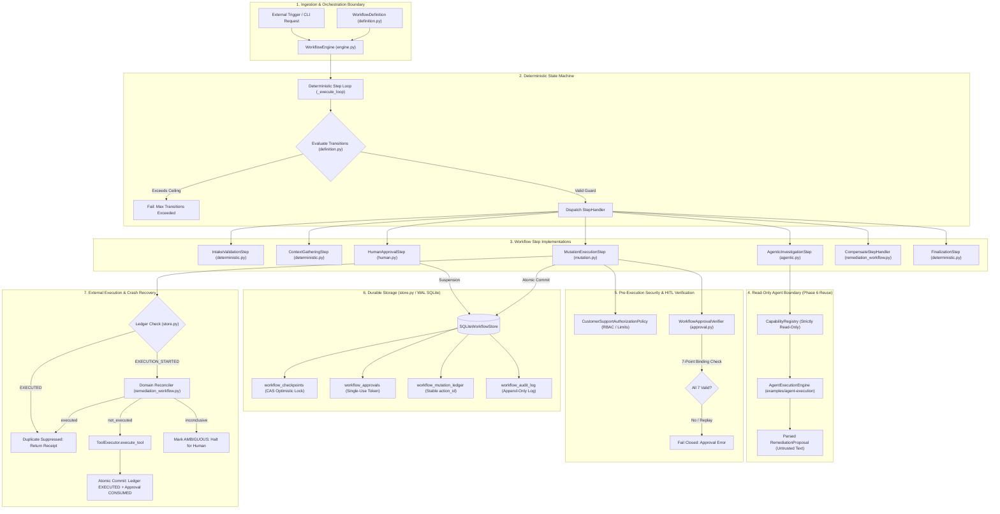
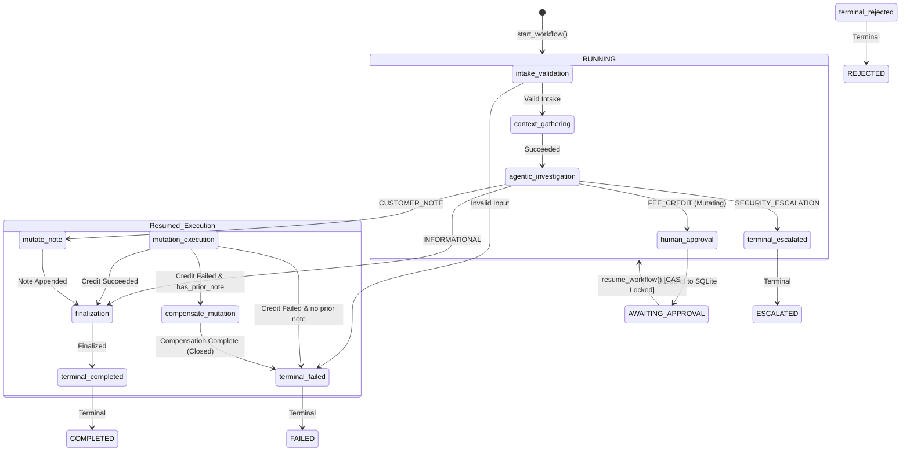
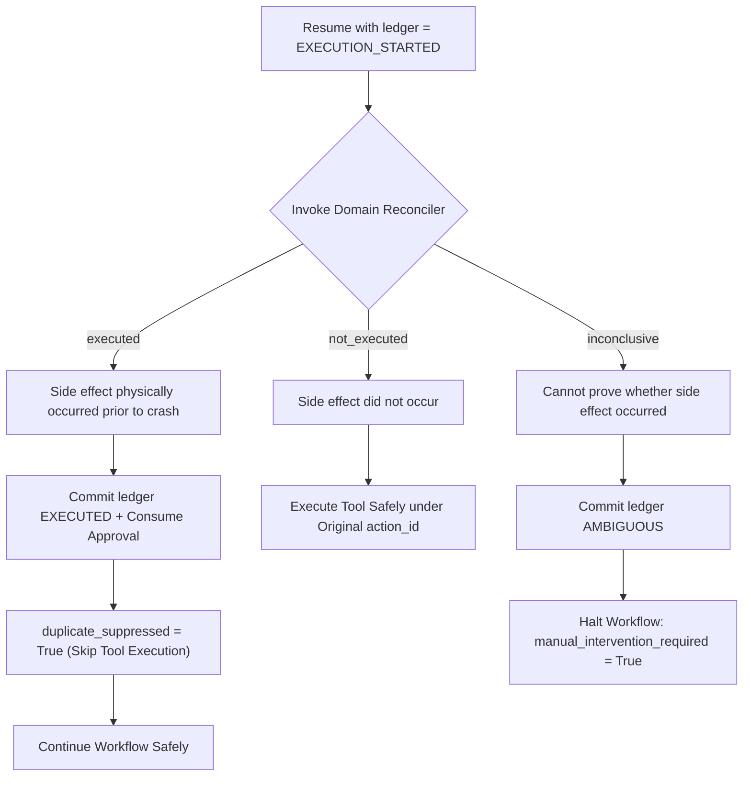

# Phase 07: Agentic Workflow Orchestration — Learning Guide

```text
Phase:                  07 — Agentic Workflow Orchestration
Status:                 Accepted & Frozen (Post-Remediation Baseline: 0ac0ada)
Tier:                   Tier 2 Reference Pattern Example
Primary Audience:       Enterprise Architects, Distributed Systems Engineers, Application Security Architects
Implementation:         examples/agentic-workflow/, building-blocks/python/contracts/workflow.py, ADR-0009, ADR-0010, ADR-0011
```

---

## 1. Phase Overview

### What Did This Phase Build?
Phase 7 establishes a **production-rigorous Tier 2 reference pattern** for coordinating long-running, asynchronous, human-governed enterprise business processes that embed artificial intelligence.

While Phase 6 delivered bounded single-turn agentic task execution within an active Python process, Phase 7 solves the challenge of **resilient orchestration across process restarts, multi-day human approval latencies, external service crashes, and non-idempotent side effects**.

The reference pattern consists of:
1. **The Core Workflow Contracts** ([`building-blocks/python/contracts/workflow.py`](../../building-blocks/python/contracts/workflow.py)): Pure, provider-neutral domain models and protocols: `WorkflowStatus`, `StepExecutionStatus`, `ApprovalStatus`, `MutationStatus`, `WorkflowDefinitionRef`, and `CheckpointStorePort`.
2. **Deterministic State Machine & Directed Graph Engine** ([`examples/agentic-workflow/workflow/definition.py`](../../examples/agentic-workflow/workflow/definition.py), [`engine.py`](../../examples/agentic-workflow/workflow/engine.py)): Code-defined directed graphs enforcing transition guards, maximum transition ceilings (`max_transitions = 15`), and cycle loop protection.
3. **Durable SQLite Checkpoint Store & Atomic Compare-and-Swap (CAS)** ([`examples/agentic-workflow/workflow/store.py`](../../examples/agentic-workflow/workflow/store.py)): Write-Ahead Logging (WAL) single-node persistence with single-statement optimistic concurrency control preventing split-brain resumptions.
4. **Authority-Bearing Workflow State Model** ([`examples/agentic-workflow/workflow/state.py`](../../examples/agentic-workflow/workflow/state.py)): Strongly typed state capturing checkpoint versions, step retries, execution history, domain context, and a canonical SHA-256 integrity checksum detecting accidental storage tampering.
5. **Durable Human-in-the-Loop (HITL) Suspension & 7-Point Binding Verification** ([`examples/agentic-workflow/workflow/steps/human.py`](../../examples/agentic-workflow/workflow/steps/human.py), [`approval.py`](../../examples/agentic-workflow/workflow/approval.py)): Asynchronous pause-to-disk lifecycle featuring cryptographically signed approval tokens, strict 7-point binding validation, and single-use token consumption.
6. **Durable Mutation Ledger & Stable Action Identity** ([`examples/agentic-workflow/workflow/ledger.py`](../../examples/agentic-workflow/workflow/ledger.py)): Deterministic SHA-256 action identifier derivation (`act-{wf_id}-{step}-{digest}`) and lifecycle tracking (`PLANNED`, `EXECUTION_STARTED`, `EXECUTED`, `FAILED`, `AMBIGUOUS`).
7. **Crash-Consistent In-Flight Domain Reconciliation** ([`examples/agentic-workflow/workflow/steps/mutation.py`](../../examples/agentic-workflow/workflow/steps/mutation.py), [`remediation_workflow.py`](../../examples/agentic-workflow/workflow/remediation_workflow.py)): A 3-outcome reconciliation protocol (`EXECUTED`, `NOT_EXECUTED`, `INCONCLUSIVE`) preventing double-mutation when processes crash mid-flight.
8. **Local Saga Backward Compensation** ([`examples/agentic-workflow/workflow/saga.py`](../../examples/agentic-workflow/workflow/saga.py), [`remediation_workflow.py`](../../examples/agentic-workflow/workflow/remediation_workflow.py)): Forward recovery and backward compensating steps governed by authorization policies, ledger tracking, domain reconciliation, and fail-closed manual intervention signalling.
9. **Sovereign Step Retry Policy** ([`examples/agentic-workflow/workflow/retry.py`](../../examples/agentic-workflow/workflow/retry.py)): Strict isolation ensuring read-only lookups tolerate exponential backoff retries while state-mutating actions are **never** blindly retried.
10. **Persistent Best-Effort Audit Logging** ([`examples/agentic-workflow/workflow/audit.py`](../../examples/agentic-workflow/workflow/audit.py), [`store.py`](../../examples/agentic-workflow/workflow/store.py)): SQLite table `workflow_audit_log` capturing structured transition, recovery, mutation, and compensation telemetry.
11. **Deterministic Evaluation Harness & Fault-Injection Engine** ([`examples/agentic-workflow/eval_runner.py`](../../examples/agentic-workflow/eval_runner.py)): 30 versioned scenarios ([`eval_dataset.jsonl`](../../examples/agentic-workflow/eval_dataset.jsonl)) asserting 6 zero-tolerance safety invariants derived directly from runtime evidence, paired with self-tests verifying that injected corruptions are caught.
12. **Three Architectural Decision Records**:
    - [`ADR-0009`](../../adr/0009-agentic-workflow-orchestration-and-roadmap-reconciliation.md): Agentic Workflow Orchestration & Roadmap Reconciliation.
    - [`ADR-0010`](../../adr/0010-durable-state-machine-persistence-and-asynchronous-resumability.md): Durable State Machine Persistence and Asynchronous Resumability.
    - [`ADR-0011`](../../adr/0011-workflow-versus-agent-control-and-hitl-harmonization.md): Workflow versus Agent Control and Human-in-the-Loop Harmonization.

---

## 2. The Central Problem: Why Agent Loops Are Not Workflows

A simple AI agent loop performs a tight, synchronous cycle:

```text
Reason ──► Choose Tool ──► Execute Tool ──► Observe Result
```

This model is sufficient for ephemeral tasks that run to completion within a single process lifespan (seconds or minutes). However, real-world enterprise business processes (e.g., billing concessions, credit underwriting, dispute resolution, IT remediation) look fundamentally different:

```text
[Start Request]
       │
       ▼
[Investigate & Reason] ── (AI analyzes domain context and customer history)
       │
       ▼
[Request Concession]   ── (AI recommends $20 credit; policy requires human sign-off)
       │
       ▼
[SUSPEND TO DISK]      ── (Process exits cleanly; 0 CPU / 0 memory consumed)
       │
   (14 hours pass)
       │
       ▼
[Human Approves]       ── (Manager reviews ticket and approves in independent system)
       │
       ▼
[RESUME PROCESS]       ── (Fresh OS process loads checkpoint, verifies tokens)
       │
       ▼
[Initiate Ledger]      ── (Records intent in mutation ledger: EXECUTION_STARTED)
       │
       ▼
[External Mutation]    ── (Call core banking API to disburse funds)
       │
   [CRASH / POWER LOSS] ── (Host crashes before durable EXECUTED commit!)
       │
       ▼
[RESTART RECOVERY]     ── (How does the engine know if the credit was disbursed?)
       │
       ▼
[Subsequent Step Fails]── (Downstream notification fails permanently)
       │
       ▼
[COMPENSATION]         ── (Rollback is impossible; must issue compensating action)
       │
       ▼
[Terminal Conclusion]  ── (Conclude in FAILED or COMPLETED with audit evidence)
```

The central architectural challenge Phase 7 solves is:

> **How do we combine probabilistic AI reasoning with deterministic, durable, auditable, and crash-consistent workflow execution without granting language models unmediated control over business processes?**

Putting multiple API calls inside an LLM `while` loop fails completely when the process crashes, when a human takes three days to approve a ticket, when concurrent processes resume the same job, or when a network timeout leaves an external payment in an unknown state.

---

## 3. Agentic Task Execution vs. Agentic Workflow Orchestration

A critical architectural distinction established in this repository is the separation between **Agentic Task Execution** (Phase 6) and **Agentic Workflow Orchestration** (Phase 7):

| Architectural Dimension | Phase 6: Agentic Task Execution | Phase 7: Agentic Workflow Orchestration |
| :--- | :--- | :--- |
| **Primary Scope** | Local, bounded problem-solving within a single task. | End-to-end, multi-step business process coordination. |
| **Control Authority** | The **Agent Loop** controls turn-by-turn execution. | The **Workflow Engine** controls the state graph and transitions. |
| **Role of LLM** | Active decision-maker choosing capabilities. | Bounded diagnostician contained within read-only steps. |
| **Execution Lifespan** | Ephemeral, in-memory, single OS process. | Durable, multi-process, asynchronous, surviving restarts. |
| **Persistence Model** | In-memory execution receipts and run summaries. | SQLite WAL checkpoints, mutation ledger, and audit log. |
| **Human-in-the-Loop** | Synchronous callback during active agent loop. | Asynchronous pause-to-disk; process exits and resumes later. |
| **Concurrency Control**| In-memory tool idempotency cache. | Optimistic Compare-and-Swap (CAS) on checkpoint version. |
| **Failure Recovery** | Retry within iteration limit or abort run. | In-flight domain reconciliation and local saga compensation. |

### Two Non-Negotiable Governance Principles

> [!IMPORTANT]
> **Principle A: The Separation of Authority**  
> The language model may reason about what *should* happen, but the deterministic workflow runtime decides what is *allowed* to happen. The model is strictly prohibited from emitting workflow transition names, altering graph routing, or bypassing policies.

> [!IMPORTANT]
> **Principle B: Execution Durability**  
> Conversation memory helps an AI remember context. Workflow state determines what the system is legally and operationally allowed to do next. Conversation history is **never** a substitute for durable workflow state.

---

## 4. System Architecture: The Accepted Phase 7 Runtime

The architecture of [`examples/agentic-workflow/`](../../examples/agentic-workflow/) reconstructs directly from the accepted repository code:



---

## 5. Workflow State vs. AI Conversation Memory

A common failure mode in naive AI implementations is treating LLM chat history as application state. In Phase 7, state is strictly modeled as an authority-bearing, immutable dataclass:

```python
# Defined in examples/agentic-workflow/workflow/state.py
@dataclass(frozen=True)
class WorkflowState:
    workflow_id: str
    definition: WorkflowDefinitionRef
    status: WorkflowStatus
    current_step: str
    initiator_actor: WorkflowActorSnapshot
    history: Sequence[StepExecutionRecord] = field(default_factory=tuple)
    pending_approval_id: Optional[str] = None
    step_retries: Mapping[str, int] = field(default_factory=dict)
    domain_context: Mapping[str, Any] = field(default_factory=dict)
    checkpoint_version: int = 1
    checksum: str = ""
    created_at: float = field(default_factory=time.time)
    updated_at: float = field(default_factory=time.time)
```

### Why Chat History Is Not Workflow State

```text
┌──────────────────────────────────────┐       ┌──────────────────────────────────────┐
│        AI Conversation Memory        │       │       Durable Workflow State         │
├──────────────────────────────────────┤       ├──────────────────────────────────────┤
│ • Unstructured sequence of messages  │       │ • Strongly typed schema              │
│ • Probabilistic meaning              │       │ • Exact operational status           │
│ • Prone to hallucination & context   │       │ • Cryptographic/integrity checksums  │
│   window overflow                    │       │ • Monotonic checkpoint versions      │
│ • Cannot enforce security boundaries │       │ • Durable approval & ledger pointers │
│ • Answers: "What did we talk about?" │       │ • Answers: "What can we legally do?" │
└──────────────────────────────────────┘       └──────────────────────────────────────┘
```

When an engine pauses or crashes, it does not prompt an LLM to ask "What should we do next?". It serializes `WorkflowState` to disk. Upon resumption, the engine loads the exact checkpoint and queries code-defined transition rules.

---

## 6. The Deterministic State Machine

The workflow state machine is defined by [`WorkflowDefinition`](../../examples/agentic-workflow/workflow/definition.py). It models a directed graph of steps and declared transition rules:



### Transition Rule Enforcement
Transitions between steps are guarded by deterministic `TransitionRule` callbacks:

```python
# Defined in examples/agentic-workflow/workflow/definition.py
@dataclass(frozen=True)
class TransitionRule:
    target_step: str
    condition_fn: Callable[[WorkflowState, StepOutcome], bool]
    description: str = ""
```

### Defense Against Cycles & Infinite Loops
A common failure mode in agentic frameworks is the infinite reasoning loop. Phase 7 implements a deterministic ceiling:
* Every workflow instance tracks transitions.
* If `len(state.history) >= workflow_def.max_transitions` (default: 15), the engine forcibly aborts the workflow, marks status `FAILED`, and records an audit event.
* This is verified in `test_max_transitions_ceiling_cycle_protection` in [`test_engine.py`](../../examples/agentic-workflow/tests/test_engine.py).

---

## 7. Checkpointing, Durability & Multi-Process Resume

### What Is a Checkpoint?
A checkpoint is a durable, point-in-time representation of workflow state stored in persistent media from which execution can safely continue after process termination.

```text
Checkpointing != Logging (Logs are observational; checkpoints are executable state)
Checkpointing != Caching (Caches are discardable; checkpoints are authoritative)
Checkpointing != Conversation Memory (Memory is prompt text; checkpoints are state machines)
```

### Multi-Process Execution Across OS Boundaries
In naive demos, "pausing and resuming" is simulated by keeping Python objects in memory. The accepted Phase 7 implementation proves true OS multi-process durability via [`demo.py`](../../examples/agentic-workflow/demo.py):

```bash
# PROCESS 1: Start workflow and pause at human approval
$ python3 examples/agentic-workflow/demo.py start --customer cust-001 --inquiry "Outage credit" --db-path ./prod.db
# [Process 1 EXITS with exit code 0; Python interpreter terminates; RAM is freed]

# PROCESS 2: Independent process inspects status
$ python3 examples/agentic-workflow/demo.py status --workflow-id wf-demo-001 --db-path ./prod.db
# Status: AWAITING_APPROVAL, Pending Approval: app-wf-demo-001-...

# PROCESS 3: Separate operator resumes workflow hours later
$ python3 examples/agentic-workflow/demo.py approve --workflow-id wf-demo-001 --decision approved --approver manager_jane --db-path ./prod.db
# Status: COMPLETED, Mutation Executed: True, Final Balance: $160.00
```

This lifecycle is tested automatically across distinct operating system processes via `subprocess.run` in [`test_hitl_restart.py`](../../examples/agentic-workflow/tests/test_hitl_restart.py#L82).

---

## 8. Optimistic Concurrency Control (CAS)

When an asynchronous workflow awaits human approval, multiple processes or operators might attempt to resume it simultaneously. Without concurrency control, both processes could load the checkpoint, evaluate the proposal, and disburse duplicate financial credits.

### The Single-Statement Compare-and-Swap
Phase 7 implements optimistic locking directly in SQLite via [`SQLiteWorkflowStore.compare_and_swap_resume`](../../examples/agentic-workflow/workflow/store.py#L155):

```sql
UPDATE workflow_checkpoints
SET checkpoint_version = :next_version,
    status = 'RUNNING',
    state_json = :state_json,
    checksum = :checksum,
    updated_at = :now
WHERE workflow_id = :workflow_id
  AND checkpoint_version = :expected_version
  AND status = 'AWAITING_APPROVAL';
```

```text
Process A (Worker 1)                        Process B (Worker 2)
────────────────────                        ────────────────────
Reads version = 1                           Reads version = 1
Executes atomic UPDATE                      Executes atomic UPDATE
WHERE version = 1                           WHERE version = 1
Rows affected: 1 (SUCCESS!)                 Rows affected: 0 (STALE WRITER!)
State advances to RUNNING                   Raises ConcurrentResumeConflictError
Proceeds with execution                     Halts cleanly without side effects
```

### Architectural Limitation Disclosure
> [!NOTE]
> SQLite Compare-and-Swap proves the concurrency pattern under single-node deployments using Write-Ahead Logging (`PRAGMA journal_mode=WAL;`). It does not demonstrate distributed consensus (e.g., Raft, multi-region database leasing). In enterprise production tiers, the `CheckpointStorePort` protocol must be backed by PostgreSQL with row-level locks (`SELECT ... FOR UPDATE`) or distributed state stores.

---

## 9. Human-in-the-Loop: 7-Point Binding Verification

In Phase 7, Human-in-the-Loop is not a frontend UI widget; it is a **cryptographically and structurally bound security primitive** implemented in [`WorkflowApprovalVerifier`](../../examples/agentic-workflow/workflow/approval.py).

When an agent proposes a state mutation, the approval record binds seven distinct attributes:

```python
# Defined in examples/agentic-workflow/workflow/approval.py
class WorkflowApprovalVerifier:
    @staticmethod
    def verify(
        record: DurableApprovalRecord,
        expected_workflow_id: str,
        expected_action_id: str,
        capability: CapabilityMetadata,
        arguments: Mapping[str, Any],
        actor: AgentActor,
    ) -> bool:
```

### The 7-Point Binding Checklist

| # | Verification Check | Security Threat Prevented |
| :---: | :--- | :--- |
| **1** | `record.status == ApprovalStatus.APPROVED` | **State Bypass**: Rejects pending, rejected, or expired approvals. |
| **2** | `record.workflow_id == expected_workflow_id` | **Workflow Confusion**: Prevents reusing an approval across different tickets. |
| **3** | `record.action_id == expected_action_id` | **Action Substitution**: Prevents substituting an approved note for a credit. |
| **4** | `record.capability_name == capability.name` | **Capability Swapping**: Prevents pointing an approval at an unapproved tool. |
| **5** | `record.canonical_arguments_json == canonicalize(args)` | **Parameter Tampering**: Byte-for-byte check ensures amount is not altered. |
| **6** | `record.actor_id == actor.id and role == actor.role` | **Actor Impersonation**: Ensures caller has not been demoted or substituted. |
| **7** | `time.time() < record.expires_at` | **Token Stale Window**: Rejects expired approval decisions. |

### Single-Use Replay Protection
Once an approved capability executes, the approval record transitions to `ApprovalStatus.CONSUMED`. If an attacker attempts to replay the token, `WorkflowApprovalVerifier` raises `ApprovalReplayError`.

---

## 10. The Mutation Ledger & The Crash Window

### Why Workflow State Is Not Enough
Workflow state tracks **where the process is** in its state machine (e.g., `current_step = "mutation_execution"`).  
The mutation ledger tracks **what external side effects have physically occurred** in external databases, banking gateways, or notification systems.

```python
# Defined in examples/agentic-workflow/workflow/ledger.py
class MutationStatus(str, Enum):
    PLANNED = "planned"
    EXECUTION_STARTED = "execution_started"
    EXECUTED = "executed"
    FAILED = "failed"
    AMBIGUOUS = "ambiguous"
```

### The Crash Window Failure
Consider the critical sequence when executing a financial concession:

```text
Step 1: Record Intent in Ledger ──► status = EXECUTION_STARTED (Committed to disk)
Step 2: Physical Tool Execution ──► Core Banking API charges / credits ₹1,000 (SUCCESS!)
════════════════════════════════════════════════════════════════════════════════════════
💥 CRASH / POWER LOSS OCCURS HERE (Before Step 3 can commit!)
════════════════════════════════════════════════════════════════════════════════════════
Step 3: Durable Ledger Commit   ──► status = EXECUTED (NEVER HAPPENED!)
```

When the host reboots, the engine inspects the ledger and finds `status = EXECUTION_STARTED`.  
**The core dilemma**: *Did the bank physically disburse the money before the crash, or did it fail?*

### The Deadly Sin: Blind Retries
If the engine blindly executes the step again, it issues a **second credit of ₹1,000** to the customer. In high-throughput systems, restart storms with blind retries cause massive financial concessions and corrupted domain state.

---

## 11. Idempotency vs. Domain Reconciliation

To handle the crash window safely, Phase 7 distinguishes between two distinct architectural concepts:

```text
┌────────────────────────────────────────┐       ┌────────────────────────────────────────┐
│              Idempotency               │       │          Domain Reconciliation         │
├────────────────────────────────────────┤       ├────────────────────────────────────────┤
│ The external capability natively       │       │ The external system is queried to      │
│ supports stable request keys. Calling  │  VS   │ inspect domain evidence: "Did action   │
│ it twice with the same key produces    │       │ with stable action_id X take place?"   │
│ identical results without duplication. │       │                                        │
└────────────────────────────────────────┘       └────────────────────────────────────────┘
```

Because many enterprise legacy systems and third-party APIs lack native idempotency keys, Phase 7 implements **Domain Reconciliation** in [`remediation_workflow.py`](../../examples/agentic-workflow/workflow/remediation_workflow.py):

```python
# Defined in examples/agentic-workflow/workflow/remediation_workflow.py
def reconcile_credit_mutation(action_id: str, capability_name: str, args: Mapping[str, Any]) -> str:
    """Reconcile apply_fee_credit against customer account balance and activity log."""
    customer_id = args.get("customer_id")
    amount_cents = int(args.get("amount_cents", 0))
    reason = str(args.get("reason", ""))
    account = customer_store.get_account(customer_id)
    if not account:
        return "inconclusive"
    expected_log = f"Credit applied: +${amount_cents / 100:.2f} (Reason: {reason})"
    if expected_log in account.activity_log:
        return "executed"
    return "not_executed"
```

### The Three Reconciliation Outcomes



> [!CAUTION]
> **The Golden Rule of Mutation Safety**  
> Uncertainty about an external mutation must **never** silently become permission to execute it again. If the system cannot conclusively verify whether an action took place, it must fail closed and demand human intervention.

---

## 12. Why We Do Not Casually Claim "Exactly-Once" Execution

In enterprise marketing, vendors frequently claim "guaranteed exactly-once AI agent execution". In distributed systems and computer science, **true universal exactly-once execution across arbitrary external network endpoints is mathematically impossible** (The Two Generals' Problem).

Phase 7 maintains strict intellectual and architectural honesty:

1. **Local State Is Exactly-Once**: Inside the SQLite boundary, atomic transactions ensure that mutating the ledger to `EXECUTED` and consuming the approval record occur atomically.
2. **External Side Effects Are At-Least-Once or At-Most-Once**: The network call to an external API cannot be wrapped in a SQLite transaction.
3. **The Architecture Achieves "Effectively-Once" Side Effects**: By combining deterministic `action_id` derivation, pre-execution ledger checks, and post-crash domain reconciliation, the reference pattern suppresses duplicate external mutations under tested failure modes.

We describe this pattern as:
> **A crash-consistent, reconciliation-first Tier 2 reference pattern for duplicate mutation suppression.**

We do not describe it as "universal distributed exactly-once execution".

---

## 13. Local Saga Backward Compensation

In multi-step business transactions, traditional ACID database rollback (`ROLLBACK TRANSACTION`) is impossible once external APIs have been called. If Step 1 appends an operational customer note and Step 2 fails to disburse a financial credit, the customer note cannot be "rolled back" via SQL.

Phase 7 implements the **Local Saga Pattern** ([`workflow/saga.py`](../../examples/agentic-workflow/workflow/saga.py)):

```text
Forward Transaction:
[Intake] ──► [Gather Context] ──► [Append Concession Note] ──► [Disburse Credit (FAILS!)]
                                                                           │
Backward Compensation:                                                     ▼
[Conclude: FAILED] ◄── [Append Voiding Compensation Note] ◄──────── (Route to Saga)
```

### Critical Architecture Lesson: Compensation Is Also a Mutation!
A severe architectural mistake in naive workflows is assuming that compensation actions are harmless and do not require security or crash protection.

In Phase 7, compensation is treated with identical rigor to primary mutations:
1. **Authorization Verification**: The compensating step revalidates that the actor is authorized to perform the reversal.
2. **Deterministic Action ID**: Derives a stable action identity (`act-{wf_id}-compensate_mutation-{digest}`).
3. **Ledger Lifecycle**: Records `EXECUTION_STARTED`, `EXECUTED`, or `FAILED` in the durable mutation ledger.
4. **Crash-Recovery Reconciliation**: If a crash occurs while compensation is in `EXECUTION_STARTED`, the reconciler inspects `customer.notes`. If the voiding note exists, duplicate compensation is suppressed.
5. **Fail-Closed on Failure**: If the compensating capability itself fails, the ledger records `FAILED`, the workflow immediately halts, and `manual_intervention_required = True` is flagged.

This was verified during the Phase 7 audit in [`test_saga.py`](../../examples/agentic-workflow/tests/test_saga.py#L234).

---

## 14. Checkpoint Integrity: SHA-256 Digest

To detect accidental disk corruption, storage truncation, or out-of-band database tampering, `WorkflowState` computes a canonical SHA-256 digest:

```python
# Defined in examples/agentic-workflow/workflow/state.py
def compute_checksum(self) -> str:
    canon_domain = json.dumps(self.domain_context, sort_keys=True, default=str)
    canon_history = json.dumps([r.to_dict() for r in self.history], sort_keys=True, default=str)
    canon_retries = json.dumps(dict(self.step_retries), sort_keys=True)
    payload = (
        f"{self.workflow_id}|"
        f"{self.definition.definition_id}:{self.definition.version}|"
        f"{self.status.value}|"
        f"{self.current_step}|"
        f"{self.initiator_actor.actor_id}:{self.initiator_actor.role}|"
        f"{self.checkpoint_version}|"
        f"{self.pending_approval_id or ''}|"
        f"{canon_domain}|"
        f"{canon_history}|"
        f"{canon_retries}|"
        f"{self.created_at}|"
        f"{self.updated_at}"
    )
    return hashlib.sha256(payload.encode("utf-8")).hexdigest()
```

### Accidental Corruption vs. Cryptographic Authentication
> [!WARNING]
> The checksum uses an unkeyed SHA-256 hash. It reliably detects:
> * Partial disk writes and database truncation.
> * Accidental developer edits to SQLite tables.
> * Serialization version drift.
>
> It **does not** defend against an attacker with root database access who can modify the payload and recompute the hash. In high-assurance environments, checkpoints must be signed using HMAC with an external Hardware Security Module (HSM) or Key Management Service (KMS).

---

## 15. Retry Semantics: Pure vs. Mutating Operations

Retry policies must not be applied uniformly across an architecture. Phase 7 formalizes retryability by capability classification in [`StepRetryPolicy`](../../examples/agentic-workflow/workflow/retry.py):

| Operation Type | Examples | Ordinary Retry? | Architectural Rationale |
| :--- | :--- | :---: | :--- |
| **Pure Computation** | Schema validation, argument canonicalization | **YES** | Deterministic, zero external side effects. |
| **Read-Only Lookup** | `get_customer`, `search_policy` | **YES** | Idempotent, safe to retry with exponential backoff. |
| **Model Generation** | `AgenticInvestigationStep` | **YES** (Bounded) | Probabilistic text generation; retry on malformed JSON. |
| **State Mutation** | `apply_fee_credit`, `update_customer_note` | **NEVER BLINDLY** | High risk of duplicate financial charges or ledger corruption. |
| **Compensation** | `compensate_mutation` | **NEVER BLINDLY** | Reversals are mutations; blind retries duplicate notes. |

---

## 16. Comprehensive Failure Taxonomy

The Phase 7 reference pattern handles twelve distinct classes of enterprise failure:

| Failure Class | Detection Mechanism | Runtime Response | Persisted State | Operator Visibility |
| :--- | :--- | :--- | :--- | :--- |
| **AI Formatting Failure** | `RemediationProposal.from_text` | Fallback to `INFORMATIONAL` proposal | Recorded in `history` record | Warning log; safe routing |
| **Invalid Intake** | `IntakeValidationStep` | Immediate routing to `terminal_failed` | Status: `FAILED` | Clear validation error message |
| **Policy Denial** | `CustomerSupportAuthorizationPolicy` | Halt execution; skip human approval | Status: `FAILED` | Authorization denial reason |
| **Approval Rejection** | `HumanApprovalStep` | Route to `terminal_rejected` | Status: `REJECTED` | Reason recorded in approval table |
| **Approval Tampering** | `WorkflowApprovalVerifier` | Raise `ApprovalMismatchError` | Status: `FAILED` | Audit event: binding mismatch |
| **Approval Replay** | `WorkflowApprovalVerifier` | Raise `ApprovalReplayError` | Status: `FAILED` | Audit event: consumed token reuse |
| **Concurrent Resume** | Single-statement SQL CAS | Raise `ConcurrentResumeConflictError` | Unchanged (Stale writer blocked) | Exception raised to caller |
| **In-Flight Crash** | Ledger has `EXECUTION_STARTED` | Invoke domain reconciler upon resume | Status: `AMBIGUOUS` if unproven | Manual intervention flag set |
| **Mutation Failure** | `ToolExecutor` exception | Route to `compensate_mutation` | Status: `FAILED` | Execution receipt error captured |
| **Saga Failure** | Compensation tool error | Flag `manual_intervention_required` | Ledger: `FAILED`, Status: `FAILED` | Critical alert in audit log |
| **Infinite Cycle** | `max_transitions` ceiling | Abort loop immediately | Status: `FAILED` | Cycle detection audit record |
| **Checkpoint Tamper** | SHA-256 checksum mismatch | Raise `CorruptedCheckpointError` | Unchanged (Fail closed) | Tamper alert log emitted |

---

## 17. Persistent Audit Logging: Best-Effort Append-Only

Phase 7 records all high-consequence lifecycle events in the SQLite table `workflow_audit_log` via [`WorkflowEngine._record_audit`](../../examples/agentic-workflow/workflow/engine.py#L38) and [`SQLiteWorkflowStore.append_audit_event`](../../examples/agentic-workflow/workflow/store.py#L225):

```sql
CREATE TABLE IF NOT EXISTS workflow_audit_log (
    event_id TEXT PRIMARY KEY,
    workflow_id TEXT NOT NULL,
    event_type TEXT NOT NULL,
    payload_json TEXT NOT NULL,
    timestamp REAL NOT NULL
);
```

### Events Captured
* `state_transition`: Every hop across the directed graph.
* `approval_requested` / `approval_decided`: Full operator identity and reason.
* `mutation_started` / `mutation_executed`: Stable action ID and receipts.
* `compensation_started` / `compensation_executed` / `compensation_failed`.
* `in_flight_reconciliation`: Reconciler probe results and duplicate suppression.

### Terminology Precision: Why It Is Not "Immutable"
The accepted architecture documents this table as **best-effort append-only**. Standard SQLite table writes without Write-Once-Read-Many (WORM) storage, append-only file flags, or cryptographic Merkle tree chains are append-by-convention. Calling standard database tables "immutable" is an enterprise anti-pattern.

---

## 18. Deterministic Evaluation Harness & Fault Injection

### The 30-Scenario Evaluation Dataset
Evaluation quality in Phase 7 is validated through a versioned 30-scenario dataset ([`eval_dataset.jsonl`](../../examples/agentic-workflow/eval_dataset.jsonl)) executed by [`eval_runner.py`](../../examples/agentic-workflow/eval_runner.py).

The dataset spans 10 distinct operational categories:
1. `informational`: Read-only inquiries (zero mutations).
2. `customer_note`: Operational customer note updates (authorized, no human approval needed).
3. `approved_credit`: Financial fee credits within policy limits, approved by human operator.
4. `rejected_credit`: Financial fee credits declined by human operator (zero physical mutations).
5. `security_escalation`: High-risk frozen accounts routed to terminal escalation.
6. `toctou_revocation`: Operator demoted during approval wait; execution blocked upon resume.
7. `systemic_ceiling`: Financial concessions exceeding hard $50.00 ceiling rejected.
8. `prompt_injection`: Adversarial user prompts attempting state machine hijacks safely ignored.
9. `saga_compensation`: Multi-step failure triggering backward compensating note.
10. `restart_continuity`: Workflow serialized to SQLite, resumed in clean instance.

### The 6 Zero-Tolerance Safety Invariants
In [`eval_runner.py`](../../examples/agentic-workflow/eval_runner.py), metrics are not hardcoded static assertions. They are **derived dynamically from runtime traces, SQLite tables, and customer domain accounts**:

```text
1. unauthorized_transitions  == 0  (Step name not in graph definition)
2. unapproved_mutations      == 0  (Balance altered without CONSUMED approval record)
3. duplicate_mutations       == 0  (Duplicate entries in credit log or compensation notes)
4. post_terminal_executions  == 0  (Resuming a COMPLETED, FAILED, or REJECTED workflow)
5. approval_replays          == 0  (Re-verifying an already CONSUMED approval token)
6. max_transition_violations == 0  (Workflow traversing more than 15 transitions)
```

### Testing the Test Harness: Evaluator Self-Tests
An evaluation harness that always reports `0 violations` might simply have broken validation logic. To prevent false confidence, Phase 7 includes **Evaluator Self-Tests** (`python3 examples/agentic-workflow/eval_runner.py --self-test`):

```text
Deliberate Violation Injected                 Evaluator Response
─────────────────────────────                 ──────────────────
1. Undeclared step injected into history  ──► Caught under unauthorized_transitions (PASS)
2. Unapproved credit added to account     ──► Caught under unapproved_mutations (PASS)
3. Duplicate credit log & compensation    ──► Caught under duplicate_mutations (PASS)
4. Resume attempted on COMPLETED workflow ──► Caught under post_terminal_executions (PASS)
5. Replaying CONSUMED approval token      ──► Caught under approval_replays (PASS)
6. History populated beyond ceiling       ──► Caught under max_transition_violations (PASS)
```

---

## 19. The Live Local Ollama Path

Phase 7 maintains full compatibility with local models via Mode B ([`live_smoke.py`](../../examples/agentic-workflow/live_smoke.py)).

### What Ollama Is (and Is Not)
```text
Ollama IS:
• A local runtime daemon providing access to weights (e.g., llama3.2:latest).
• A provider implementation satisfying the frozen TextGenerationPort.

Ollama IS NOT:
• The workflow engine.
• The state machine.
• The persistence layer.
• The authorization authority.
```

In [`live_smoke.py`](../../examples/agentic-workflow/live_smoke.py), a live local model investigates an account and proposes a resolution. The workflow engine captures the proposal, parses it into typed domain models, and evaluates it against deterministic policies. Under no circumstances does Ollama execute SQL queries or disburse banking credits.

---

## 20. The Model Context Protocol (MCP) Boundary

Phase 6 introduced the Model Context Protocol (MCP) adapter ([`platform/mcp-adapter/`](../../platform/mcp-adapter/)). It is critical to understand where MCP fits within Phase 7 workflow orchestration:

```text
┌────────────────────────────────────────────────────────┐
│                   Workflow Engine                      │ (Phase 7 Orchestrator)
└──────────────────────────┬─────────────────────────────┘
                           │ Dispatches Step
                           ▼
┌────────────────────────────────────────────────────────┐
│              AgenticInvestigationStep                  │ (Phase 7 Workflow Step)
└──────────────────────────┬─────────────────────────────┘
                           │ Invokes Bounded Agent
                           ▼
┌────────────────────────────────────────────────────────┐
│                AgentExecutionEngine                    │ (Phase 6 Core Loop)
└──────────────────────────┬─────────────────────────────┘
                           │ Calls Allowed Capability
                           ▼
┌────────────────────────────────────────────────────────┐
│                 McpCapabilityAdapter                   │ (Phase 6 / Platform Adapter)
└──────────────────────────┬─────────────────────────────┘
                           │ JSON-RPC 2.0 over stdio
                           ▼
┌────────────────────────────────────────────────────────┐
│                   External MCP Server                  │ (Subprocess / Remote Tool)
└────────────────────────────────────────────────────────┘
```

> **MCP is an external tool communication protocol. It is NOT a workflow engine.**  
> Workflows orchestrate business processes; MCP exposes tools. A workflow step may invoke an agent that calls an MCP tool, but MCP never owns workflow state, checkpointing, or human approvals.

---

## 21. Evolution Across Phases 4 ➔ 5 ➔ 6 ➔ 7

```text
Phase 4: AI Foundations
  ├── Problem: Provider lock-in & untrusted strings.
  └── Solution: TextGenerationPort, OllamaAdapter, Structured Generation.
        │
        ▼
Phase 5: Knowledge Intelligence & RAG
  ├── Problem: Hallucinations on private enterprise knowledge.
  └── Solution: Chunking, Embeddings, In-Memory Vector Index, Grounding & Citations.
        │
        ▼
Phase 6: Agentic Task Execution
  ├── Problem: Transition from reading to stateful action.
  └── Solution: ReAct Loop, Capability Registry, Host RBAC, Mandatory HITL, MCP.
        │
        ▼
Phase 7: Agentic Workflow Orchestration
  ├── Problem: Multi-step processes, multi-day pauses, crashes, non-idempotent side effects.
  └── Solution: State Machine, SQLite Checkpoints, CAS Concurrency, Mutation Ledger,
                Crash Reconciliation, Saga Compensation, Audit Logs.
```

### What Phase 7 Does NOT Mean
Phase 7 is **Agentic Workflow Orchestration**. It is **not** a "multi-agent swarm". A workflow may contain deterministic steps, AI reasoning steps, human steps, and mutation steps without requiring multiple autonomous agents debating in a chatroom. Multi-agent collaboration is deferred to subsequent roadmap phases.

---

## 22. Architectural Trade-Off Analysis

| Architectural Decision | Chosen Alternative | Rejected Alternative | Core Trade-off Justification |
| :--- | :--- | :--- | :--- |
| **Persistence Engine** | Standard library `sqlite3` (WAL Mode) | PostgreSQL / Redis / Cloud Databases | **Zero-Dependency Local-First**: Enables 100% offline Mode A execution without running background database daemons, while proving CAS mechanics. |
| **Orchestration Model**| Explicit Code-Defined State Graph | Autonomous Multi-Agent Swarm / LangGraph | **Separation of Authority**: Business processes require auditable, deterministic state machines, not probabilistic model-directed routing. |
| **Mutation Safety** | Durable Mutation Ledger & Domain Reconciliation | Blind Retry / Global 2-Phase Commit (2PC) | **Real-World Legacy Resilience**: External APIs rarely participate in distributed XA transactions; reconciliation provides crash safety without 2PC. |
| **HITL Model** | Asynchronous SQLite Suspension + 7-Point Token | Synchronous In-Memory Blocking Prompts | **Operational Reality**: Enterprise approvals take hours or days; holding active memory or HTTP connections open is an anti-pattern. |
| **Compensation** | Local Linear Saga Compensation | Distributed Orchestrated Sagas (Temporal) | **Complexity Discipline**: Local backward compensation solves single-process recovery without heavyweight distributed infrastructure. |

---

## 23. What Phase 7 Deliberately Does NOT Solve

To prevent enterprise overclaiming and maintain strict scope discipline:
* **Universal Distributed Exactly-Once**: We do not claim universal exactly-once delivery across external networks.
* **Distributed Multi-Node Consensus**: SQLite provides single-node atomicity; it does not solve multi-region leader election or distributed transactions.
* **Multi-Agent Swarms**: Autonomous peer-to-peer negotiation is deferred to Phase 8+.
* **Distributed Microservice Sagas**: Cross-service asynchronous event-driven sagas via Kafka/RabbitMQ are deferred to Phase 14.
* **Enterprise IdP Federation**: Synthetic CLI credentials are used; OAuth2/OIDC/SAML integration is deferred.
* **Immutable WORM Compliance Audit**: The audit table is best-effort append-only; cryptographic hardware-enforced immutability is deferred.

---

## 24. Security Threat Model

The Phase 7 reference pattern defends against thirteen specific attack vectors ([`threat-model.md`](../../examples/agentic-workflow/threat-model.md)):

```text
1. Prompt Injection          ──► Read-only capabilities during investigation; untrusted proposal parsing.
2. State Machine Hijacking   ──► Model cannot emit graph transition names; deterministic rules govern routing.
3. Unauthorized Action       ──► Host RBAC policy enforced before approval issuance and before execution.
4. Approval Bypass           ──► MutationExecutionStep requires valid DurableApprovalRecord.
5. Approval Replay           ──► Single-use transition to CONSUMED status; replay raises ApprovalReplayError.
6. Approval Tampering        ──► 7-point cryptographic & structural binding verification.
7. TOCTOU Privilege Drift    ──► Authorization policy re-verified immediately prior to physical tool execution.
8. State Tampering           ──► Canonical SHA-256 checksum over state payload detects disk modifications.
9. Concurrent Resume Split   ──► Atomic Compare-and-Swap on version & status prevents race conditions.
10. Double Mutation Crash    ──► Durable mutation ledger + domain reconciliation suppresses duplicate execution.
11. Compensation Abuse       ──► Compensation steps enforce RBAC, stable action ID, and ledger tracking.
12. Infinite Transition Loop ──► Hard global ceiling (max_transitions = 15) halts runaway execution.
13. Unmonitored Action       ──► Structured audit events appended to persistent workflow_audit_log.
```

---

## 25. Source Code Tour & Recommended Reading Order

When studying the Phase 7 codebase, read the files in this deliberate sequence:

```text
1. building-blocks/python/contracts/workflow.py
   └── Read first: Core domain models (WorkflowStatus, MutationStatus, CheckpointStorePort).

2. examples/agentic-workflow/artifact.json
   └── Read second: Tier 2 reference pattern manifest and governance declarations.

3. examples/agentic-workflow/workflow/state.py
   └── Read third: WorkflowState, checksum calculation, and execution history models.

4. examples/agentic-workflow/workflow/definition.py
   └── Read fourth: Directed graph definitions, StepDefinition, and TransitionRule.

5. examples/agentic-workflow/workflow/store.py
   └── Read fifth: SQLite schema, WAL configuration, atomic CAS resume, and audit logging.

6. examples/agentic-workflow/workflow/engine.py
   └── Read sixth: Core execution loop (_execute_loop), step dispatch, and transition evaluation.

7. examples/agentic-workflow/workflow/approval.py
   └── Read seventh: Token generation, HMAC signing, and 7-point binding verification.

8. examples/agentic-workflow/workflow/ledger.py
   └── Read eighth: Stable action ID derivation and DurableMutationRecord models.

9. examples/agentic-workflow/workflow/steps/
   ├── deterministic.py (Intake, context gathering, finalization)
   ├── agentic.py       (Strictly read-only investigation step)
   ├── human.py         (Asynchronous suspension step)
   └── mutation.py      (Pre-verified execution & domain reconciliation)

10. examples/agentic-workflow/workflow/remediation_workflow.py
    └── Read tenth: Canonical customer remediation graph, reconcilers, and saga compensation.

11. examples/agentic-workflow/workflow/saga.py
    └── Read eleventh: SagaCompensationCoordinator and backward recovery logic.

12. examples/agentic-workflow/eval_runner.py
    └── Read twelfth: 30-scenario evaluation harness and fault-injection self-tests.

13. examples/agentic-workflow/demo.py
    └── Read thirteenth: True multi-process CLI workflow lifecycle.
```

---

## 26. End-to-End Execution Trace: Happy Path with HITL

Trace a complete run of the canonical **Customer Account Remediation Workflow**:

```text
1. Trigger: User contacts support regarding an unfair $20.00 service fee.
   │
2. Intake Validation (deterministic.py):
   │  - Confirms customer_id is present and customer exists in CustomerStore.
   │  - Outcome: SUCCEEDED -> Transitions to context_gathering.
   │
3. Context Gathering (deterministic.py):
   │  - Fetches account balance ($150.00) and recent activity log.
   │  - Context updated with account details -> Transitions to agentic_investigation.
   │
4. Agentic Investigation (agentic.py):
   │  - Reuses Phase 6 AgentExecutionEngine with strictly read-only capabilities.
   │  - Agent calls get_account_status and search_policy.
   │  - Agent emits JSON proposal:
   │    {"proposal_type": "fee_credit", "suggested_arguments": {"amount_cents": 2000, "reason": "Outage credit"}}
   │  - Parsed into typed RemediationProposal -> Transitions to human_approval.
   │
5. Human Approval (human.py):
   │  - Derives stable action ID: act-wf-001-mutation_execution-a1b2c3d4e5f67890.
   │  - Generates HMAC-signed approval token and saves DurableApprovalRecord (PENDING).
   │  - WorkflowState status updated to AWAITING_APPROVAL.
   │  - Checkpoint persisted to SQLite (version = 1).
   │  - PROCESS EXITS CLEANLY.
   │
6. External Approval Decision (demo.py approve):
   │  - Manager reviews ticket: approves proposal.
   │  - DurableApprovalRecord updated to APPROVED.
   │  - Process resumes: Compare-and-Swap atomically updates status to RUNNING (version = 2).
   │
7. Mutation Execution (mutation.py):
   │  - Re-validates CustomerSupportAuthorizationPolicy (senior agent limit: $50.00 -> ALLOWED).
   │  - WorkflowApprovalVerifier verifies all 7 bindings (status, IDs, args, actor, expiration).
   │  - Records intent in ledger: EXECUTION_STARTED.
   │  - ToolExecutor calls apply_fee_credit(customer_id="cust-001", amount_cents=2000).
   │  - Atomic Commit: ledger.status = EXECUTED, approval.status = CONSUMED.
   │  - Context updated: mutation_executed = True -> Transitions to finalization.
   │
8. Finalization (deterministic.py):
   │  - Formats summary ticket -> Transitions to terminal_completed.
   │
9. Terminal State:
      - WorkflowState status updated to COMPLETED.
      - Checkpoint committed (version = 3).
      - Audit event emitted: workflow_completed.
```

---

## 27. Execution Trace: Crash Recovery with In-Flight Reconciliation

Trace the adversarial failure mode tested in [`test_ledger.py`](../../examples/agentic-workflow/tests/test_ledger.py#L122):

```text
1. Workflow is in mutation_execution.
2. Ledger records status = EXECUTION_STARTED (Action ID: act-wf-probe-1).
3. ToolExecutor runs apply_fee_credit -> Customer balance changes from $150.00 to $170.00.
4. HOST CRASHES! Ledger remains EXECUTION_STARTED on disk.
5. New OS Process starts and resumes workflow:
   │
6. MutationExecutionStep queries mutation ledger:
   │  - Finds existing record with status = EXECUTION_STARTED.
   │  - INVARIANT: DO NOT BLINDLY RETRY!
   │  - Dispatches domain reconciler: reconcile_credit_mutation(...).
   │
7. Reconciler inspects customer account:
   │  - Checks account.activity_log for: "Credit applied: +$20.00 (Reason: Outage credit)".
   │  - MATCH FOUND! The credit was physically applied before the crash.
   │  - Returns reconciliation outcome: "executed".
   │
8. Recovery Action:
   │  - Ledger updated to EXECUTED with duplicate_suppressed = True.
   │  - Pending approval record consumed.
   │  - ToolExecutor is NOT invoked.
   │  - Account balance remains $170.00 (ZERO DOUBLE-CHARGE!).
   │
9. Workflow resumes clean execution and transitions to finalization.
```

---

## 28. Execution Trace: Ambiguous Failure & Fail-Closed Halt

Trace the inconclusive failure mode:

```text
1. Workflow is in mutation_execution; ledger has EXECUTION_STARTED.
2. Crash occurs.
3. Upon restart, reconciler queries external banking service:
   │  - Banking service returns 504 Gateway Timeout, or customer record is unreachable.
   │  - Reconciler returns: "inconclusive".
   │
4. Fail-Closed Response:
   │  - Engine DOES NOT retry the tool.
   │  - Engine DOES NOT proceed to finalization.
   │  - Ledger record updated to MutationStatus.AMBIGUOUS.
   │  - StepOutcome returned with status = FAILED.
   │  - Domain context updated: manual_intervention_required = True.
   │
5. State Machine transitions to terminal_failed.
6. Alert logged for operations engineering: ticket requires manual verification.
```

---

## 29. Execution Trace: Saga Backward Compensation

Trace the multi-step failure path tested in [`test_saga.py`](../../examples/agentic-workflow/tests/test_saga.py#L107):

```text
1. Context: Workflow is configured with has_prior_note = True (Operational note pre-logged).
2. Human approves $20.00 fee credit.
3. Mutation Execution step runs:
   │  - Core banking gateway suffers permanent hardware failure (RuntimeError).
   │  - MutationExecutionStep returns StepExecutionStatus.FAILED.
   │
4. Graph Transition:
   │  - TransitionRule evaluates:
   │    condition_fn = lambda s, o: o.status == FAILED and bool(s.domain_context.get("has_prior_note"))
   │  - MATCH! Routes to compensate_mutation instead of simple terminal failure.
   │
5. Compensate Step Handler (remediation_workflow.py):
   │  - Derives stable action ID: act-wf-001-compensate_mutation-f9e8d7c6b5a4.
   │  - Verifies actor authorization for update_customer_note.
   │  - Records EXECUTION_STARTED in mutation ledger.
   │  - Executes compensating tool: appends note:
   │    "COMPENSATION: Fee credit disbursement failed for workflow wf-001. Concession note voided."
   │  - Ledger committed to EXECUTED.
   │  - Returns StepOutcome(status=SUCCEEDED, outcome_type="compensation_completed").
   │
6. State Machine routes to terminal_failed:
   │  - Status set to FAILED.
   │  - Context updated: compensation_applied = True.
   │  - Concludes with complete auditable history of both the failure and the compensation.
```

---

## 30. Hands-On Lab: Running the System

Execute the verified Phase 7 commands from the repository root:

### 1. Run Complete Repository Validation
```bash
python3 scripts/validate.py
```
*Expected Output*: PASS across all governance rules, link integrity, import boundaries, and all 255 automated unit tests.

### 2. Run Standalone Phase 7 Verification
```bash
python3 examples/agentic-workflow/verify.py
```
*Expected Output*: AST compilation of 33 files, 56 hermetic unit tests passed, and 30/30 deterministic evaluation scenarios passed.

### 3. Run the 30-Scenario Evaluation Harness
```bash
python3 examples/agentic-workflow/eval_runner.py
```
*Expected Output*: 30 passed scenarios, duration $\sim 1.0\text{s}$, zero safety invariant violations.

### 4. Run Evaluator Self-Tests
```bash
python3 examples/agentic-workflow/eval_runner.py --self-test
```
*Expected Output*: 6 PASS lines proving the evaluator catches injected unauthorized transitions, unapproved mutations, duplicate mutations, post-terminal resumes, approval replays, and ceiling violations.

### 5. Run Multi-Process CLI Demonstration
```bash
# Clean previous test database
rm -f /tmp/lab_workflow.db

# Step A: Start workflow (pauses at approval and exits)
python3 examples/agentic-workflow/demo.py start \
  --customer cust-001 \
  --inquiry "Please credit my account $20 due to the outage" \
  --actor agent-001 \
  --db-path /tmp/lab_workflow.db

# Step B: Inspect status in a new process
python3 examples/agentic-workflow/demo.py status \
  --workflow-id wf-demo-cust-001 \
  --db-path /tmp/lab_workflow.db

# Step C: Approve in a new process
python3 examples/agentic-workflow/demo.py approve \
  --workflow-id wf-demo-cust-001 \
  --decision approved \
  --approver manager_jane \
  --db-path /tmp/lab_workflow.db

# Step D: View persistent audit log
python3 examples/agentic-workflow/demo.py audit \
  --workflow-id wf-demo-cust-001 \
  --db-path /tmp/lab_workflow.db
```

---

## 31. Break It Safely: Guided Failure Labs

To understand why safety controls exist, run these controlled failure experiments:

### Lab 1: Verify Checkpoint Tamper Detection
Create a scratch script in Python to tamper with SQLite domain context directly:

```python
import sqlite3, json

conn = sqlite3.connect("/tmp/lab_workflow.db")
cur = conn.cursor()
cur.execute("SELECT state_json FROM workflow_checkpoints WHERE workflow_id = 'wf-demo-cust-001'")
raw = cur.fetchone()[0]
state = json.loads(raw)

# Tamper with the account balance inside domain context
state["domain_context"]["account"]["balance_cents"] = 999999
cur.execute(
    "UPDATE workflow_checkpoints SET state_json = ? WHERE workflow_id = 'wf-demo-cust-001'",
    (json.dumps(state),)
)
conn.commit()
conn.close()
```

Now attempt to run `status` or resume:
```bash
python3 examples/agentic-workflow/demo.py status --workflow-id wf-demo-cust-001 --db-path /tmp/lab_workflow.db
```
*Observed Result*: The command aborts with `CorruptedCheckpointError: Checksum mismatch on checkpoint`. The tampering is caught immediately.

### Lab 2: Verify Approval Replay Defense
Inspect `test_approval_replay_defense` in [`test_security.py`](../../examples/agentic-workflow/tests/test_security.py#L30):
* Attempt to present an approval record with `status = CONSUMED` to `WorkflowApprovalVerifier`.
* *Observed Result*: Verifier raises `ApprovalReplayError: Approval record has already been consumed`.

### Lab 3: Verify Concurrent Resume Conflict
Inspect `test_competing_resumes_result_in_exactly_one_winner_and_one_conflict` in [`test_concurrency.py`](../../examples/agentic-workflow/tests/test_concurrency.py#L12):
* Two asynchronous tasks execute `resume_workflow` against the same paused checkpoint simultaneously.
* *Observed Result*: Exactly one worker succeeds; the competing worker catches `ConcurrentResumeConflictError` and halts safely.

---

## 32. Architect Interview Checkpoints

Use these concise questions and answers to prepare for technical architecture interviews:

### Q1: Why not just put tool calls in an LLM ReAct loop?
> **Answer**: LLM agent loops are ephemeral, in-memory constructs. They cannot survive process crashes, cannot pause for days while awaiting human approval without holding resources open, cannot provide optimistic concurrency against split-brain execution, and risk duplicate financial mutations when external API calls time out.

### Q2: What is the difference between conversation memory and workflow state?
> **Answer**: Conversation memory is unstructured message text used to provide context to an LLM. Workflow state is a strongly typed, authority-bearing schema containing checkpoint versions, execution history, retry counters, and integrity checksums that dictate what the application is legally and operationally permitted to execute next.

### Q3: How does Compare-and-Swap (CAS) prevent race conditions?
> **Answer**: When resuming a suspended workflow, the engine executes a single conditional SQL update: `UPDATE checkpoints SET version = v+1, status = 'RUNNING' WHERE id = :id AND version = v AND status = 'AWAITING_APPROVAL'`. If two workers attempt resumption simultaneously, SQLite's atomic transaction ensures exactly one row is updated. The winner proceeds; the loser receives zero affected rows and fails with `ConcurrentResumeConflictError`.

### Q4: Why must compensation actions also be treated as mutations?
> **Answer**: Compensation is an external side effect (e.g., voiding a concession or issuing a reversal). If a process crashes while executing compensation, it faces the identical crash-window ambiguity problem. Compensation must therefore enforce authorization, derive stable action IDs, record lifecycle states in the mutation ledger, and use domain reconciliation to prevent duplicate reversals.

### Q5: Can this architecture guarantee exactly-once execution across external systems?
> **Answer**: No universal distributed architecture can guarantee exactly-once network side effects (Two Generals' Problem). Phase 7 achieves "effectively-once" side effects by combining local atomic database commits, deterministic action identity derivation, and post-crash domain reconciliation to suppress duplicate external actions.

### Q6: What is the difference between idempotency and reconciliation?
> **Answer**: Idempotency is a property of an external service where replaying the same request produces the same result. Reconciliation is an application-side investigative protocol where the engine inspects external domain evidence to determine whether a crashed in-flight mutation actually occurred before deciding whether to retry, suppress, or halt.

### Q7: Why does the evaluation harness test itself?
> **Answer**: An evaluation harness reporting zero invariant violations might have broken assertion logic. Evaluator self-testing deliberately injects invalid transitions, unapproved mutations, and duplicate side effects into the harness to mathematically prove that the evaluator detects violations when they occur.

---

## 33. Summary & Curriculum Roadmap Progression

With the completion of Phase 7, the core foundation for **Enterprise AI Orchestration** is established:

```text
FOUNDATION (PHASES 0–3)               AI CAPABILITIES (PHASES 4–7)           ENTERPRISE SYSTEMS (PHASES 8–14)
┌─────────────────────────┐           ┌─────────────────────────┐            ┌─────────────────────────┐
│ Phase 0: Governance     │           │ Phase 4: Foundations    │            │ Phase 8: Multi-Agent    │
│ Phase 1: Standards      │    ──►    │ Phase 5: RAG & Search   │    ──►     │ Phase 9: Observability  │
│ Phase 2: Core Contracts │           │ Phase 6: Agentic Tasks  │            │ Phase 10: AI Gateways   │
│ Phase 3: Templates      │           │ Phase 7: Workflows      │            │ Phase 11–14: Production │
└─────────────────────────┘           └─────────────────────────┘            └─────────────────────────┘
      [FROZEN & VERIFIED]                 [FROZEN & VERIFIED]                         [PLANNED]
```

### Twelve Core Teaching Principles
1. **AI reasoning may be probabilistic; workflow execution must remain deterministic and governed.**
2. **The workflow engine owns execution state. The LLM does not.**
3. **Durable workflows require persisted state, not merely conversation memory.**
4. **Human approval must survive process boundaries.**
5. **State-changing operations cannot be treated like ordinary retriable function calls.**
6. **`EXECUTION_STARTED` after a crash represents uncertainty, not permission to execute again.**
7. **Reconciliation converts external evidence into a safe recovery decision.**
8. **When mutation outcome cannot be proven, fail closed.**
9. **Compensation is itself a mutation and requires the same safety discipline.**
10. **Optimistic concurrency prevents multiple processes from independently advancing the same checkpoint.**
11. **Evaluation systems must themselves be tested against deliberately injected failures.**
12. **A reference implementation demonstrates architecture patterns; it does not magically provide universal distributed-system guarantees.**
