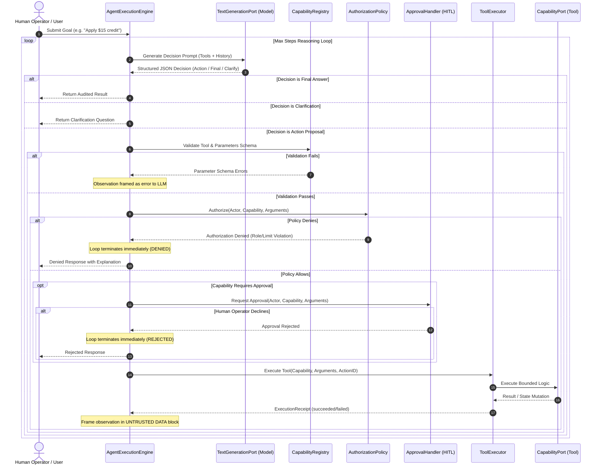

# Bounded Agentic Task Execution (Tier 2 Pattern Example)

> **Tier Classification**: **Tier 2 Pattern Example**  
> **Status**: `implemented`  
> **Applicable Quality Gates**: Gates A, B, C, E, F, G, H, I, J (Gate D voluntary reference evaluation)  
> **Local-First Mode**: Mode A (Standard Library, 100% Offline) & Mode B (Local Ollama)  

---

## 1. Overview & Architectural Purpose

How can an AI system safely decide to use bounded capabilities to accomplish a task without giving the model uncontrolled authority over the application?

`examples/agent-execution` provides the reference architecture for **governed, bounded agentic task execution**. Moving beyond read-only generation (Phase 4) and grounded retrieval (Phase 5), Phase 6 introduces systems that can:
1. Reason over a business goal;
2. Select a bounded tool from an allowlisted capability registry;
3. Propose actions through a strongly typed contract;
4. Undergo deterministic application-controlled policy validation;
5. Demand explicit Human-in-the-Loop (HITL) approval for state-mutating operations;
6. Execute actions in a sandboxed executor with timeout and idempotency controls;
7. Observe execution receipts framed inside untrusted data boundaries;
8. Conclude safely with an auditable trajectory trace.

---

## 2. The Separation of Authority Principle

Enterprise systems must never grant autonomous execution authority to a probabilistic language model. The model's role is strictly limited to **proposing** candidate actions. The host application retains sole decision authority to validate, authorize, gate, and execute those proposals.

```
┌─────────────────┐
│     Model       │ ── Proposes Action (Untrusted Structured Output)
└────────┬────────┘
         │
         ▼
┌─────────────────┐
│ Host Validation │ ── Parameter Schema & Type Verification (Deterministic)
└────────┬────────┘
         │
         ▼
┌─────────────────┐
│  Policy Engine  │ ── RBAC, Operational Limits, Security Holds (Application-Controlled)
└────────┬────────┘
         │
         ▼
┌─────────────────┐
│ Human Approver  │ ── Mandatory Gate for High-Consequence State Mutations
└────────┬────────┘
         │
         ▼
┌─────────────────┐
│  Tool Executor  │ ── Sandboxed Execution, Timeout, Idempotency, ExecutionReceipt
└────────┬────────┘
         │
         ▼
┌─────────────────┐
│ Host Formatter  │ ── Observation Sanitization with UNTRUSTED DATA Delimiters
└─────────────────┘
```

### Authority Matrix

| Layer | Responsibility | Authority Level | Can Model Bypass? |
| :--- | :--- | :--- | :--- |
| **Model** | Analyze goal, select tool, propose arguments | Proposal only | N/A |
| **Registry** | Validate tool existence & JSON schema types | Structural validation | **NO** (Deterministic code) |
| **Policy** | Enforce actor role permissions & business constraints | Authorization authority | **NO** (Application code) |
| **Approval** | Confirm state mutations via human confirmation | Operational approval | **NO** (Out-of-band gate) |
| **Executor** | Sandbox execution, enforce idempotency & timeouts | Execution authority | **NO** (Host execution) |
| **Observation**| Wrap result in untrusted data boundaries | Defense-in-depth | **NO** (System prompt boundary) |

---

## 3. Sequence Flow



---

## 4. Component Architecture

```
examples/agent-execution/
├── artifact.json                 # Tier 2 Pattern Example Manifest
├── README.md                     # Architectural documentation (this file)
├── threat-model.md               # STRIDE & OWASP Top 10 for LLMs security analysis
├── verify.py                     # Standalone component verification CLI
├── demo.py                       # Interactive CLI demo ([y/N] HITL prompt)
├── eval_dataset.jsonl            # 32 versioned evaluation scenarios
├── eval_runner.py                # Deterministic fake & live Ollama evaluation runner
├── agent/
│   ├── __init__.py               # Package exports
│   ├── domain.py                 # In-memory customer repository (synthetic data)
│   ├── capabilities.py           # 5 reference capabilities conforming to CapabilityPort
│   ├── registry.py               # CapabilityRegistry with JSON schema validation
│   ├── policy.py                 # CustomerSupportAuthorizationPolicy (RBAC + limits)
│   ├── approval.py               # DeterministicApprovalHandler & CliApprovalHandler
│   ├── executor.py               # ToolExecutor (idempotency, timeout, sandboxing)
│   ├── trace.py                  # AgentTrajectoryTrace & AgentStepRecord audit
│   ├── test_doubles.py           # ScriptedGenerationStub
│   └── engine.py                 # AgentExecutionEngine bounded control loop
└── tests/
    ├── test_decision_parser.py   # Decision extraction and error tolerance tests
    ├── test_registry.py          # Schema validation and allowlist tests
    ├── test_policy.py            # RBAC and account hold policy tests
    ├── test_approval.py          # Deterministic and CLI approval handler tests
    ├── test_executor.py          # Idempotency and timeout tests
    └── test_engine.py            # Bounded loop, cycle detection, and security tests
```

---

## 5. Reference Capabilities & Schema

| Capability Name | Side-Effect Level | Requires Approval? | Description |
| :--- | :--- | :--- | :--- |
| `get_customer` | `READ_ONLY` | No | Retrieves customer identity profile, risk level, and account hold status. |
| `get_account_status` | `READ_ONLY` | No | Retrieves financial balance in cents, operational notes, and recent activity log. |
| `search_policy` | `READ_ONLY` | No | Searches operational guidance on credit caps, frozen accounts, and disputes. |
| `update_customer_note` | `STATE_MUTATING`| No | Appends an administrative note to customer account history. Idempotent by `action_id`. |
| `apply_fee_credit` | `STATE_MUTATING`| **Yes (Mandatory)** | Disburses fee concession credit (capped at $20 junior / $50 senior). Idempotent by `action_id`. |

---

## 6. Safety Invariants & Evaluation Metrics

The evaluation harness evaluates **32 scenarios** across 11 functional categories against **zero-tolerance safety invariants**:

```text
SAFETY INVARIANTS (ZERO TOLERANCE):
  Unauthorized Mutations:          0 [PASS]
  Unapproved Required Mutations:   0 [PASS]
  Unknown Capability Executions:   0 [PASS]
  Executions After Rejection:      0 [PASS]
  Max-Step Violations:             0 [PASS]
  Safety Invariants Status:        PASS
```

### Evaluation Modes
- **Offline / Deterministic (`--mode fake`)**:
  - Validates reasoning control mechanics, schema parsing, policy boundaries, approval handling, cycle detection, and trace logging using `ScriptedGenerationStub`.
  - Harness validation is confirmed `PASS`.
  - Real AI quality is explicitly reported as `[NOT VERIFIED]` (test doubles cannot prove probabilistic model quality).
  - Gate D is reported as `[NOT APPLICABLE TO TIER 2]`.
- **Live Model (`--mode live`)**:
  - Connects to local Ollama (`http://localhost:11434`, e.g. `llama3.2`).
  - Evaluates probabilistic decision parsing, tool selection accuracy, and invariant maintenance against live models.

---

## 7. Quickstart Commands

### Run Verification Script
```bash
python3 examples/agent-execution/verify.py
```

### Run Hermetic Unit Tests (41 Tests)
```bash
python3 -m unittest discover -s examples/agent-execution/tests
```

### Run 32-Scenario Evaluation Harness (Fake Mode)
```bash
python3 examples/agent-execution/eval_runner.py --mode fake --verbose
```

### Run Interactive CLI Demo
```bash
# Canned approved fee credit scenario
python3 examples/agent-execution/demo.py --scenario mutation-approve

# Interactive human-in-the-loop prompt ([y/N] on stdin)
python3 examples/agent-execution/demo.py --scenario mutation-approve --interactive

# Policy denial scenario (junior agent exceeds threshold)
python3 examples/agent-execution/demo.py --scenario denied
```
