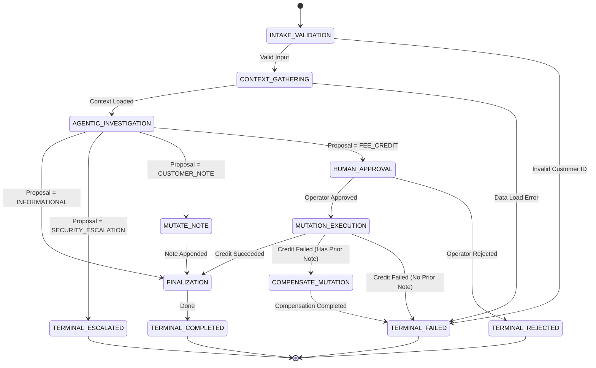

# Agentic Workflow Orchestration (Tier 2 Pattern Example)

## 1. Problem Statement

Modern enterprise applications cannot rely solely on autonomous agent loops for end-to-end business operations. While bounded agent loops (such as Phase 6 ReAct) excel at dynamic information gathering, multi-step diagnostics, and unstructured reasoning, enterprise processes demand:
1. **Deterministic Process Sovereignty**: Business routing rules, compliance boundaries, and state transitions must be strictly application-controlled, never delegated to model hallucinations.
2. **Durable Asynchronous Suspension (HITL)**: High-consequence mutations (e.g. monetary concessions, account modifications) require human operator approval. The runtime must persist state to durable storage, cleanly terminate processes, and safely resume days later upon operator review.
3. **Crash Consistency & Ambiguous Execution Recovery**: If a server crashes mid-mutation, restarting must never blindly retry mutations or cause duplicate executions.
4. **Local Backward Compensation (Saga)**: Multi-step mutations that fail downstream must execute explicit inverse compensating steps to maintain ledger consistency.

The central thesis of Phase 7 is:
> **Workflow orchestration coordinates agentic execution; it does not replace the Phase 6 agent runtime.**  
> The agent may reason about the task, but the application owns the process.

---

## 2. Architectural Overview & Component Structure

This reference implementation models a production-grade **Customer Account Remediation Workflow** using pure Python standard library and an ACID SQLite checkpoint store (Mode A: Offline Local).

```text
examples/agentic-workflow/
├── artifact.json                  # Tier 2 Pattern Example manifest
├── README.md                      # Architecture and operational guide
├── threat-model.md                # STRIDE and security analysis
├── eval_dataset.jsonl             # 30 deterministic test scenarios
├── eval_runner.py                 # Deterministic evaluation runner with self-tests
├── live_smoke.py                  # Live local Ollama smoke runner
├── demo.py                        # Interactive CLI demonstrating multi-terminal restart
├── verify.py                      # Standalone deterministic verification script
├── workflow/
│   ├── __init__.py                # Package exports
│   ├── errors.py                  # Domain failure hierarchy
│   ├── state.py                   # WorkflowState, RemediationProposal, ActorSnapshot
│   ├── definition.py              # WorkflowDefinition, StepDefinition, TransitionRule
│   ├── engine.py                  # WorkflowEngine with CAS concurrency
│   ├── store.py                   # SQLiteWorkflowStore (WAL mode) & InMemoryWorkflowStore
│   ├── ledger.py                  # DurableMutationLedger and stable action ID generator
│   ├── approval.py                # DurableApprovalRecord, WorkflowApprovalVerifier, Adapter
│   ├── audit.py                   # Structured append-only audit event recorder
│   ├── retry.py                   # StepRetryPolicy (mutation non-amplification)
│   ├── saga.py                    # Local Saga backward compensation coordinator
│   ├── remediation_workflow.py    # Canonical Customer Account Remediation graph builder
│   └── steps/
│       ├── __init__.py
│       ├── deterministic.py       # IntakeValidation, ContextGathering, Finalization
│       ├── agentic.py             # AgenticInvestigationStep (strictly read-only)
│       ├── human.py               # HumanApprovalStep (durable suspension)
│       └── mutation.py            # MutationExecutionStep (pre-verified tool execution)
└── tests/                         # 47 hermetic unit and integration tests
```

---

## 3. Sovereign Authority Matrix

| Concern | Workflow Engine | Phase 6 Agent | Language Model | Human Operator | Tool Executor |
| :--- | :--- | :--- | :--- | :--- | :--- |
| **Process Progression** | **SOVEREIGN** (Defines graph, evaluates transitions) | **NONE** (Cannot select next graph node) | **NONE** (Cannot emit transition commands) | **INDIRECT** (Supplies approval/rejection) | **NONE** |
| **Investigation Actions** | **BOUNDED** (Supplies read-only allowlist) | **BOUNDED** (Proposes tools from allowlist) | **UNTRUSTED** (Proposes JSON action payload) | **NONE** | **SANDBOXED** (Executes read tools) |
| **Authorization** | **SOVEREIGN** (Evaluates actor permissions) | **NONE** (Subject to `AuthorizationPolicy`) | **NONE** (Cannot elevate privileges) | **GOVERNS** (Must hold required role) | **NONE** |
| **Approval Verification** | **SOVEREIGN** (`WorkflowApprovalVerifier` checks SQLite) | **ADAPTER** (Wraps verifier if agent loop used) | **NONE** | **SOVEREIGN** (Authorizes/rejects mutation) | **NONE** (Does not check approvals) |
| **Physical Mutation** | **CONTROLS** (Routes to `MUTATION_EXECUTION`) | **NONE** (Agent does not mutate) | **NONE** | **NONE** | **SOVEREIGN** (Executes mutating tool) |
| **Step Retries** | **SOVEREIGN** (Governs bounded backoff) | **LOCAL** (Max 2 schema repairs) | **NONE** | **NONE** | **NONE** (Zero tool retries) |
| **Checkpoints** | **SOVEREIGN** (Commits to SQLite) | **NONE** (In-memory trace only) | **NONE** | **NONE** | **NONE** |
| **Saga Compensation** | **SOVEREIGN** (Routes to compensating step) | **NONE** | **NONE** | **NONE** | **NONE** |
| **Terminal State** | **SOVEREIGN** (Enforces terminal bounds) | **NONE** | **NONE** | **NONE** | **NONE** |

---

## 4. State Machine Definition & Transitions

The canonical Customer Account Remediation workflow graph is code-defined:



### Safety Invariants
1. **Model Output Cannot Route**: The model emits a typed `RemediationProposal`. The state machine engine strictly evaluates declarative transition rules against the proposal type. Injected strings like `"goto": "finalization"` are completely ignored.
2. **Cycle Ceiling**: A maximum transition count (`max_transitions = 15`) guarantees bounded execution and prevents infinite loops.
3. **Terminal Immobility**: Once a workflow reaches `COMPLETED`, `FAILED`, `REJECTED`, or `ESCALATED`, no further transitions or physical mutations are permitted.

---

## 5. Read-Only Agentic Investigation Invariant

To guarantee that autonomous model reasoning cannot cause side-effects:
* The `CapabilityRegistry` supplied to `AgenticInvestigationStep` contains **exclusively read-only tools**:
  - `get_customer` (`SideEffectLevel.READ_ONLY`)
  - `get_account_status` (`SideEffectLevel.READ_ONLY`)
  - `search_policy` (`SideEffectLevel.READ_ONLY`)
* The constructor explicitly inspects the registry; detecting any `STATE_MUTATING` tool raises an immediate `ValueError`.
* **Zero mutating capabilities can be executed during investigation.**

---

## 6. Durable Human-in-the-Loop (HITL) Lifecycle

When an agentic investigation proposes a state-mutating fee credit:
1. **Suspension**: The workflow enters `HUMAN_APPROVAL`. A `DurableApprovalRecord` is generated and saved to SQLite with status `PENDING`.
2. **Persistence**: The workflow state transitions to `AWAITING_APPROVAL`. Checkpoint version increments, SHA-256 integrity checksum is committed to disk, and the execution process cleanly exits.
3. **External Operator Action**: An independent process loads the pending approval, reviews the proposal, and registers an approval decision (`APPROVED` or `REJECTED`).
4. **Resumption & CAS**: Resumption uses optimistic Compare-and-Swap (CAS) on `checkpoint_version` and status to prevent concurrent resume conflicts.
5. **Pre-Execution 7-Point Binding Verification**: Before executing the physical tool, `WorkflowApprovalVerifier` confirms:
   - Approval status is `APPROVED` and not `CONSUMED`.
   - Workflow ID matches.
   - Stable action ID matches.
   - Target capability matches.
   - Canonical arguments JSON matches byte-for-byte.
   - Initiator actor ID and role match.
   - Expiration timestamp has not elapsed.
6. **Atomic Consumption**: Following verified tool execution, a single local database transaction marks `ledger.status = EXECUTED` and `approval.status = CONSUMED`.

---

## 7. Stable Action Identity & Mutation Ledger

Every state mutation derives a deterministic, stable action ID:
$$\text{digest} = \text{SHA-256}(\text{workflow\_id} \mathbin{\Vert} \text{step\_name} \mathbin{\Vert} \text{capability} \mathbin{\Vert} \text{canonical\_args})[0:16]$$
$$\text{action\_id} = \text{"act-" } \mathbin{\Vert} \text{workflow\_id} \mathbin{\Vert} \text{step\_name} \mathbin{\Vert} \text{digest}$$

* **Same logical mutation across restart** $\rightarrow$ **Identical `action_id`**.
* **Altered arguments** $\rightarrow$ **Different `action_id`** (rejects approval reuse).
* **Duplicate Execution Suppression**: Before invoking `ToolExecutor`, `MutationExecutionStep` queries the ledger. If `status == EXECUTED`, it replays the existing receipt without invoking the tool.

---

## 8. Local Saga Backward Compensation

In multi-step remediation flows where an operational note is logged prior to credit disbursement:
* If the credit disbursement encounters permanent downstream failure (e.g. gateway error or policy cap violation), the workflow transitions to `COMPENSATE_MUTATION`.
* The compensating step invokes `update_customer_note` appending an inverse compensating record:
  `"COMPENSATION: Fee credit disbursement failed for workflow ... Concession note voided."`
* If compensation succeeds, the workflow completes in `FAILED` status with `compensation_applied = True`.
* If compensation itself fails, the system logs `manual_intervention_required` and halts safely.

---

## 9. Verification & Execution Instructions

### Run Unit and Integration Test Suite
```bash
python3 -m unittest discover -s examples/agentic-workflow/tests
```
Executes 47 hermetic unit and integration tests across 11 test modules.

### Run 30-Scenario Deterministic Evaluation
```bash
python3 examples/agentic-workflow/eval_runner.py
```
Runs all 30 versioned scenarios from `eval_dataset.jsonl`, asserting zero-tolerance safety invariants:
* `unauthorized_transitions == 0`
* `unapproved_mutations == 0`
* `duplicate_mutations == 0`
* `post_terminal_executions == 0`
* `approval_replays == 0`
* `max_transition_violations == 0`

To verify that the evaluator detects injected safety violations:
```bash
python3 examples/agentic-workflow/eval_runner.py --self-test
```

### Run Live Local Ollama Smoke Suite
```bash
python3 examples/agentic-workflow/live_smoke.py --model llama3.2
```
Connects to local Ollama (`http://localhost:11434`), verifies provider reachability, executes live reasoning with real `llama3.2`, and confirms read-only investigation invariants. If Ollama is offline:
```bash
python3 examples/agentic-workflow/live_smoke.py --allow-unverified
```
Outputs `STATUS: NOT VERIFIED` and exits cleanly.

### Run Interactive Multi-Terminal Process-Restart Demo
```bash
# Terminal 1: Start workflow and pause at approval gate
python3 examples/agentic-workflow/demo.py start --workflow-id wf-demo-1 --customer cust-001 --inquiry "Dispute $25 late fee"

# Terminal 2: Inspect durable state from independent process
python3 examples/agentic-workflow/demo.py status --workflow-id wf-demo-1

# Terminal 2: Approve and complete execution
python3 examples/agentic-workflow/demo.py approve --workflow-id wf-demo-1 --approver manager_alice
```

### Run Standalone Pattern Verifier
```bash
python3 examples/agentic-workflow/verify.py
```
Runs artifact manifest validation, all 47 unit tests, and the 30-scenario evaluation harness, confirming:
`PHASE 7 DETERMINISTIC VERIFICATION PASSED`.
