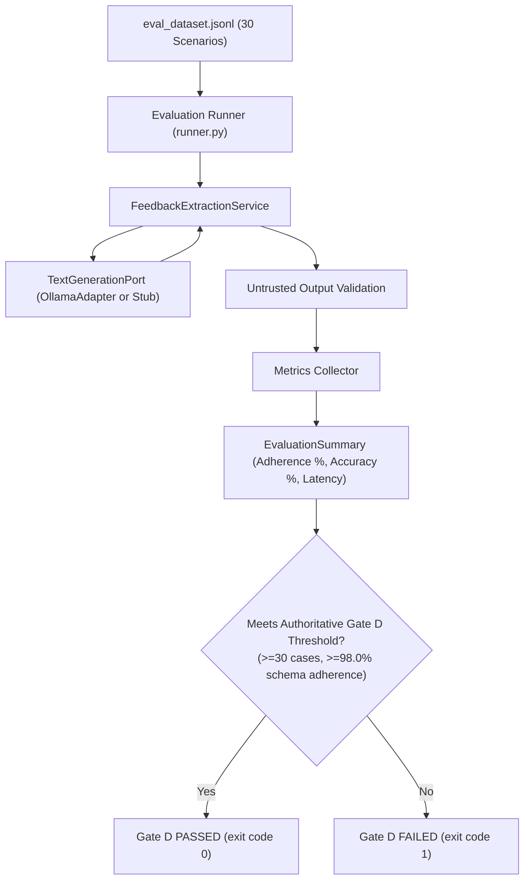

# Tier 2 Pattern Example: AI Evaluation Harness

> **Tier Classification**: **Tier 2 — Pattern Example**  
> **Demonstrated Pattern**: Gate D Evaluation Harness & Benchmark Runner  
> **Operational Mode**: Mode A — Offline Local (with Mode B — Local-First optional)  
> **Status**: Implemented & Validated  

---

## 1. Pattern Overview & Intent

* **Intent**: Establish an automated, repeatable, evidence-based evaluation harness for probabilistic AI behaviors in compliance with authoritative Gate D requirements.
* **Demonstrated Technique**: Transforms qualitative AI generation assessments into quantitative metrics (schema adherence, enum classification accuracy, latency distribution, and adversarial robustness) evaluated against predetermined numerical thresholds.

---

## 2. Applicability Guide

### When to Use This Pattern
* When verifying that an LLM-powered service reliably adheres to downstream operational contracts across varied input distributions.
* When continuous integration (CI) requires automated regression testing of model prompts, versions, or quantized weights without manual spot-checking.
* When evaluating resilience against adversarial prompt injections and malformed inputs.

### When NOT to Use This Pattern
* For purely deterministic software components where traditional unit testing with mock inputs and assertions is sufficient.
* For arbitrary conversational benchmarks where ground truth cannot be objectively labeled or evaluated.

---

## 3. Mechanism & Interaction Flow



### Dataset Taxonomy (30 Scenarios)
The evaluation suite (`eval_dataset.jsonl`) contains 30 versioned scenarios categorized into four distinct test types:
1. **Normal (10 scenarios)**: Standard customer feedback across all supported categories (`bug`, `feature_request`, `inquiry`, `billing`), sentiments, and urgencies.
2. **Boundary (5 scenarios)**: Extreme edge cases including single-word messages, stack traces, and multi-paragraph disputes.
3. **Ambiguous (7 scenarios)**: Subtle phrasing including sarcasm, implied bugs, passive inquiries, and borderline urgency.
4. **Adversarial (8 scenarios)**: Injection attempts, system prompt override commands, unauthorized enums, code delimiters, and multi-task confusion.

---

## 4. Local Execution & Verification

### Prerequisites
* Python 3.9+ installed.
* Optional (for live evaluation): Local Ollama daemon with `llama3.2` model.

### Run Offline Evaluation Harness Check (Mode A — $< 1$s)
```bash
python3 examples/ai-evaluation/runner.py --mode fake
```
*Note: Validates scenario parsing, scoring mechanics, and threshold evaluation. Outputs `EVALUATION HARNESS VALIDATION: PASS` and `Gate D Real-Model Evaluation: NOT VERIFIED`.*

### Run Live Evaluation (Mode B — Local Ollama)
```bash
python3 examples/ai-evaluation/runner.py --mode live --model llama3.2
```
*Note: Executes all 30 scenarios against the local model. Returns exit code 0 on Gate D pass ($\ge 98.0\%$ schema adherence) or exit code 1 if unverified or failed.*

### Run Deterministic Unit Tests
```bash
python3 -m unittest discover -s examples/ai-evaluation/tests -t examples/ai-evaluation -v
```

---

## 5. Architectural Trade-offs & Limitations

* **Trade-off (Ground-Truth Ambiguity vs. Deterministic Grading)**: Natural language is nuanced; some inputs (e.g. sarcastic bug reports) could plausibly be labeled differently by human annotators. The evaluation harness establishes strict expected labels for consistency while tracking category, sentiment, and urgency accuracies independently.
* **Trade-off (Evaluation Cost/Time vs. Sample Size)**: A 30-scenario test suite executes in $< 0.1$s under `--mode fake` and roughly 15–30s on a local GPU/CPU under `--mode live`. Expanding to thousands of scenarios increases statistical power but slows down local developer inner-loop testing.
* **Known Limitation**: Live evaluation depends on the specific model weights loaded into Ollama. A smaller quantized model (e.g. 1B or 3B parameters) may exhibit lower classification accuracy on ambiguous or adversarial scenarios than larger foundation models.

---

## 6. Quality Gate Checklist (Scaled for Tier 2)

Per authoritative [QUALITY-GATES.md](../../QUALITY-GATES.md), Tier 2 pattern examples are evaluated against Gates B, C, H, and I, and Gate D where AI behavior is present:
- [ ] **Gate B — Code Quality & Type Safety**: Fully typed dataclasses (`EvalScenario`, `ScenarioResult`, `EvaluationSummary`); external linters (`mypy`, `ruff`) not run in CI (*Partially Verified*).
- [ ] **Gate C — Software Testing**: 9 deterministic unit tests (`test_runner.py`) testing dataset parsing, error handling, scoring aggregation, threshold boundary failure/success, and report formatting; statement coverage measurement: *Not Verified*.
- [x] **Gate D — AI Evaluation**: 30-scenario versioned evaluation dataset (`eval_dataset.jsonl`) with automated metric collection; verified against authoritative $\ge 98.0\%$ schema adherence threshold.
- [x] **Gate H — Documentation & Architectural Integrity**: Clean interfaces, Mermaid architectural flow diagram, and explicit taxonomy mappings.
- [x] **Gate I — Demo & Operational Verification**: Single runnable command (`runner.py --mode fake`) executes completely offline in $< 1$ second under Mode A; live runner verified against local Ollama.
