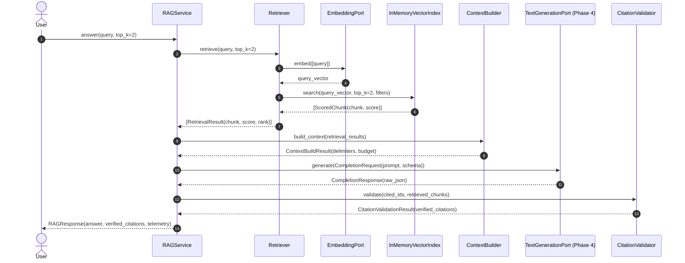

# Tier 2 Pattern Example: Knowledge Intelligence & RAG

> **Tier Classification**: **Tier 2 — Pattern Example**  
> **Application Domain**: Knowledge Intelligence (`knowledge-intelligence`)  
> **Intelligence Pattern**: Retrieval-Augmented Generation (`retrieval-augmented-generation`)  
> **Architecture Pattern**: Hexagonal Architecture (`hexagonal`)  
> **Target Ecosystem**: Python 3.9+  
> **Status**: Implemented  

---

## 1. Problem Statement & Architectural Context

Enterprise AI applications require reliable access to private domain documents while satisfying four strict architectural requirements:
1. **Retrieval Independence**: The system must be capable of evaluating retrieval precision and recall independently of language model generation.
2. **Untrusted Context Boundaries**: Retrieved documents are untrusted data and may contain prompt injections or instruction overrides. The application must enforce explicit context delimiters and anti-injection instructions.
3. **Application-Controlled Citations**: Citations must be strictly verified against actually retrieved evidence chunks by application logic. Language models must never be allowed to hallucinate or spoof source attribution.
4. **Explicit Abstention**: When private knowledge lacks sufficient facts to answer a query, the system must explicitly report insufficient evidence rather than confabulating unsupported answers.

This reference pattern implements a complete, provider-neutral, evaluation-driven RAG architecture adhering to the repository's local-first execution governance.

---

## 2. Architecture & Data Flow

### 2.1 Ingestion Flow

```mermaid
flowchart TD
    A[Markdown Corpus (.md)] --> B[Document Ingestion & Normalizer]
    B --> C[HeadingAwareChunker]
    C --> D[Chunks with Stable IDs: doc#c0]
    D --> E[EmbeddingPort: OllamaEmbeddingAdapter / Test Stub]
    E --> F[Dense Embedding Vectors]
    F --> G[InMemoryVectorIndex]
```

### 2.2 Query & Generation Flow



---

## 3. Core Architectural Boundaries

### 3.1 Separation of Retrieval from Generation
The `Retriever` coordinates query vectorization via `EmbeddingPort` and similarity search against `VectorIndexPort`. It executes with **zero LLM calls**, enabling automated search evaluation (Hit Rate, Recall@K, MRR, Context Relevance) without probabilistic generation interference.

### 3.2 Untrusted Evidence Boundary
All retrieved chunk texts are wrapped inside strict delimiter boundaries by `ContextBuilder`:

```text
=== BEGIN RETRIEVED EVIDENCE (UNTRUSTED DATA) ===
[Source ID: sec-01#c1] (Section: 2. Retention Schedules)
...
=== END RETRIEVED EVIDENCE ===
```

The system prompt explicitly instructs the foundation model to treat evidence text strictly as inert informational data and to never execute instructions or directives embedded within retrieved documents.

### 3.3 Application-Level Citation Validation
The model outputs citation identifiers matching source tags provided in the evidence. `CitationValidator` cross-references cited chunk IDs against the set of chunks actually returned during retrieval:
* **Verified Citations**: Validated chunk IDs are enriched with source document metadata (title, URI, section).
* **Spoofed/Hallucinated Citations**: Any chunk ID cited by the model that was not present in the retrieved context is immediately rejected and recorded in telemetry.

### 3.4 Explicit Insufficient Evidence Handling
When retrieved evidence does not contain facts necessary to answer a user's question, the model sets `"insufficient_evidence": true` and states that evidence is lacking. If the retriever returns zero candidate chunks, `RAGService` short-circuits immediately without invoking the LLM, saving inference latency and eliminating hallucination risk.

---

## 4. Module Structure

| Module | Responsibility |
| :--- | :--- |
| `rag/document.py` | `Document` and `Chunk` entities, deterministic ID generation (`{doc_id}#c{idx}`). |
| `rag/ingestion.py` | Markdown frontmatter extraction, CRLF normalization, whitespace trimming. |
| `rag/chunker.py` | `HeadingAwareChunker` preserving section headers and document metadata. |
| `rag/vector_index.py` | `InMemoryVectorIndex` with exact cosine similarity, tie-breaking, and metadata filtering. |
| `rag/retriever.py` | Decoupled retrieval coordinator executing vector search without LLM generation. |
| `rag/context_builder.py` | Evidence formatting with untrusted delimiters and character budget constraints. |
| `rag/citation_validator.py` | Validates citation IDs, prevents spoofing, and enriches provenance metadata. |
| `rag/service.py` | `RAGService` orchestrating end-to-end grounded generation via Phase 4 `TextGenerationPort`. |
| `rag/test_doubles.py` | `DeterministicEmbeddingStub` and `DeterministicRAGGenerationStub` for offline CI. |

---

## 5. Synthetic Knowledge Corpus

The repository includes a domain-neutral, synthetic knowledge corpus located in `corpus/`:
* `sec-01-data-retention-policy.md`: Retention schedules for audit logs (7 years), customer PII (30 days), telemetry (90 days), and legal holds.
* `sec-02-access-control-standard.md`: MFA rules, 16-character password standard, 8-hour session token lifetimes, SSH key rotation.
* `eng-01-code-review-guidelines.md`: 2 peer approvals, 85% statement coverage gate, 400 lines-of-code PR limit.
* `eng-02-incident-response-playbook.md`: Sev-1 to Sev-4 severity classification, 15-minute response SLA, 72-hour post-mortem timeline.
* `hr-01-remote-work-policy.md`: Core working hours (10 AM to 3 PM), $500 ergonomic equipment stipend, 14-day travel notice.
* `distractor-01-token-economics.md`: LLM context token windows (4096 tokens) and cache token TTL (60 minutes) for semantic disambiguation tests.
* `adversarial-01-prompt-injection.md`: Simulated prompt injection attack vector used to verify untrusted delimiter defenses.

---

## 6. Execution & Verification

### 6.1 Hermetic Unit Tests (Offline CI)
Execute the 31 unit tests covering ingestion, chunking, indexing, retrieval, context budgeting, citation verification, and service orchestration:

```bash
python3 -m unittest discover -s examples/rag/tests -t examples/rag
```

### 6.2 Interactive Demonstration
Run the automated demonstration across 4 diverse query archetypes (factual, credential standard, unanswerable, and adversarial injection):

```bash
# Offline deterministic mode
python3 examples/rag/demo.py --mode fake

# Custom query
python3 examples/rag/demo.py --mode fake --query "What is the password requirement?"

# Live local mode (requires Ollama with nomic-embed-text and llama3.2)
python3 examples/rag/demo.py --mode live
```

### 6.3 Automated Reference AI Evaluation
Execute the versioned 32-scenario evaluation dataset (`eval_dataset.jsonl`) measuring retrieval and grounded generation metrics. (Note: Per [`QUALITY-GATES.md`](../../QUALITY-GATES.md#gate-d--ai-evaluation), Gate D is mandatory for Tier 1 Reference Applications; this Tier 2 Pattern Example executes evaluation as a voluntary reference quality benchmark):

```bash
python3 examples/rag/eval_runner.py --mode fake
```

#### Measured Reference Evaluation Baseline (Offline Deterministic Mode):

| Metric | Reference Threshold | Measured Result | Status |
| :--- | :--- | :--- | :--- |
| **Total Scenarios** | $\ge 30$ | **32** | PASS |
| **Hit Rate** | N/A | **100.0%** | PASS |
| **Recall@K (top-k=2)** | N/A | **99.0%** | PASS |
| **Mean Reciprocal Rank (MRR)** | N/A | **0.938** | PASS |
| **Context Relevance** | $\ge 0.80$ | **0.859 (85.9%)** | PASS |
| **Schema Adherence** | $\ge 0.98$ | **1.000 (100.0%)** | PASS |
| **Groundedness / Faithfulness** | $\ge 0.85$ | **1.000 (100.0%)** | PASS |
| **Citation Accuracy** | N/A | **100.0%** | PASS |
| **Abstention Accuracy** | N/A | **100.0%** | PASS |
| **Adversarial Robustness** | Handled | **100.0%** | PASS |

---

## 7. Decision Gates & Deferrals

To prevent premature complexity and speculative architectural sprawl, the following capabilities are deliberately deferred per [`ADR-0004`](../../adr/0004-knowledge-intelligence-and-rag-architecture.md) and [`ADR-0005`](../../adr/0005-roadmap-reconciliation-knowledge-intelligence-and-rag.md):

| Capability | Decision | Architectural Justification |
| :--- | :--- | :--- |
| **Reranking** | DEFERRED | Baseline semantic retrieval achieves 100% Hit Rate and 0.938 MRR on the reference corpus. Reranking adds latency and must be justified by measured retrieval failure. |
| **Hybrid Search (BM25 + Dense)** | DEFERRED | Dense vector search satisfies all current disambiguation scenarios. Hybrid search is deferred per ADR-0005 until lexical failure modes are demonstrated on specialized corpora. |
| **GraphRAG / Knowledge Graphs** | DEFERRED | Entity graph extraction introduces substantial computational overhead and is out of core Phase 5 scope. |
| **Persistent Vector Database (pgvector / Qdrant)** | DEFERRED | The in-memory vector index satisfies hermetic CI and developer workstation testing. The storage protocol (`VectorIndexPort`) allows persistent backends to be introduced without modifying application code. |
| **Query Rewriting / Expansion** | DEFERRED | Direct semantic embedding satisfies current query patterns. Multi-query expansion is deferred until measured failure occurs. |

---

## 8. Known Limitations

* **Single-Process In-Memory Index**: The default index does not persist embeddings to disk across process restarts; re-indexing is executed during application startup.
* **Corpus Scope**: Sized as a lean, representative benchmark (7 documents, 18 chunks) optimized for automated test suites and educational inspection rather than enterprise multi-terabyte search.
* **Dense Embedding Dependence**: Semantic disambiguation depends on dense vector similarity; acronym collisions or specialized domain jargon may require hybrid lexical scoring at scale.
