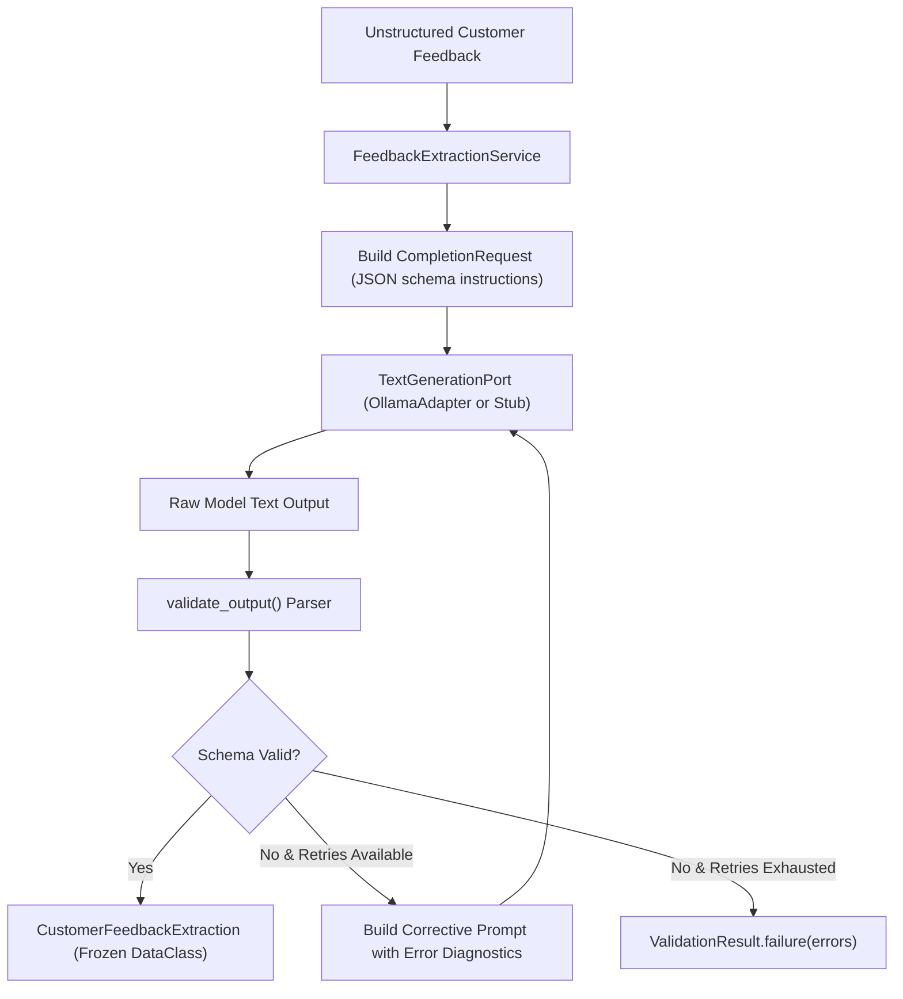

# Tier 2 Pattern Example: Structured Generation

> **Tier Classification**: **Tier 2 — Pattern Example**  
> **Demonstrated Pattern**: Structured Generation & Untrusted Output Validation  
> **Operational Mode**: Mode A — Offline Local (with Mode B — Local-First optional)  
> **Status**: Implemented & Validated  

---

## 1. Pattern Overview & Intent

* **Intent**: Demonstrates how an application safely consumes probabilistic, non-deterministic text generation from language models and converts it into strongly typed domain entities with deterministic schema guarantees.
* **Demonstrated Technique**: Implements the *Untrusted Model Output Principle*. Model completions are never trusted as valid structured entities (JSON, schema instances, or business objects) without multi-stage validation, enum verification, range boundaries, and bounded corrective retries.

---

## 2. Applicability Guide

### When to Use This Pattern
* When extracting structured data (entities, classifications, sentiment, metadata) from unstructured human natural language.
* When integrating AI completions into downstream transactional workflows, databases, or API integrations where schema corruption would cause fatal runtime exceptions.
* When provider models do not natively support JSON schema enforcement or when provider-neutral portability across local and cloud engines is required.

### When NOT to Use This Pattern
* When extracting information that can be reliably parsed with regular expressions, deterministic tokenizers, or rule-based parsers.
* Anti-pattern: When complex multi-turn agency or external tool calling is required; in such cases, full agentic loops and tool protocols (Phase 6) are needed.

---

## 3. Mechanism & Interaction Flow



### Execution Steps
1. **Request Formulation**: `FeedbackExtractionService` constructs a `CompletionRequest` requesting strict JSON conforming to the `CustomerFeedbackExtraction` schema.
2. **Provider-Neutral Invocation**: The request is dispatched through `TextGenerationPort`. The service is completely decoupled from whether Ollama, OpenAI, Anthropic, or an in-memory test stub executes the generation.
3. **Parsing & Markdown Fence Stripping**: The validator strips any markdown formatting (````json ... ````) and parses the string via standard `json.loads`.
4. **Domain Schema & Range Validation**:
   - `category`: Validated against `FeedbackCategory` enum (`bug`, `feature_request`, `inquiry`, `billing`).
   - `sentiment`: Validated against `FeedbackSentiment` enum (`positive`, `neutral`, `negative`).
   - `urgency`: Validated against `FeedbackUrgency` enum (`low`, `medium`, `high`, `critical`).
   - `summary`: Enforced non-empty string.
   - `confidence`: Enforced float bounded strictly in $[0.0, 1.0]$.
5. **Bounded Corrective Retry**: If validation fails, a diagnostic prompt detailing the exact syntax or schema errors is sent back to the model for one corrective attempt.

---

## 4. Local Execution & Verification

### Prerequisites
* Python 3.9+ installed.
* Optional (for live execution): Local Ollama daemon running with `llama3.2` installed (`ollama pull llama3.2`).

### Run Demonstration (Offline Mode A — $< 1$s)
```bash
python3 examples/structured-generation/demo.py --mode fake
```

### Run Demonstration (Live Mode B — Local Ollama)
```bash
python3 examples/structured-generation/demo.py --mode live
```
*Note: If the Ollama daemon is offline, the script outputs a clear diagnostic status (`NOT VERIFIED`) without throwing unhandled exceptions.*

### Run Unit Tests
```bash
python3 -m unittest discover -s examples/structured-generation/tests -t examples/structured-generation -v
```

---

## 5. Architectural Trade-offs & Limitations

* **Trade-off (Reliability vs. Latency)**: Adding schema validation and corrective retries guarantees type safety downstream, but a corrective retry incurs a second inference latency round-trip ($2\times$ model generation time).
* **Trade-off (Prompt-based Schema vs Provider-native Constrained Decoding)**: Relying on prompt instructions and application-layer parsing ensures 100% provider neutrality across any LLM, but may yield slightly lower single-pass validity rates than engine-level grammar-constrained decoding (e.g., GBNF grammars or JSON mode).
* **Known Limitation**: Single corrective retry limit prevents infinite retry storms and cost runaway, but will return a `ValidationResult.failure` if the model repeatedly hallucinates invalid enums. Downstream callers must handle failure cases gracefully.

---

## 6. Quality Gate Checklist (Scaled for Tier 2)

Per authoritative [QUALITY-GATES.md](../../QUALITY-GATES.md), Tier 2 pattern examples are evaluated against Gates B, C, H, and I:
- [ ] **Gate B — Code Quality & Type Safety**: Source code is strictly typed with dataclasses, enums, and comprehensive type annotations; external linters (`mypy`, `ruff`) not run in CI (*Partially Verified*).
- [ ] **Gate C — Software Testing**: 10 hermetic unit tests (`test_service.py`) testing clean extraction, malformed JSON, invalid enum values, confidence range violations, markdown code fence extraction, boolean confidence rejection, unexpected-field rejection, and corrective retry recovery using test doubles; statement coverage measurement: *Not Verified*.
- [x] **Gate H — Documentation & Architectural Integrity**: Clean interfaces, strongly typed outputs (`CustomerFeedbackExtraction`), renderable Mermaid interaction diagram, and validated cross-references.
- [x] **Gate I — Demo & Operational Verification**: Runnable CLI (`demo.py --mode fake`) executes hermetically in $< 1$ second under Mode A; live mode (`demo.py --mode live`) verifies live execution against local Ollama.
- [x] *Gate D — AI Evaluation (Scaled)*: Validated through dedicated AI evaluation harness in `examples/ai-evaluation/`.
