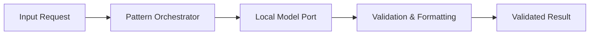

# Tier 2 Pattern Example: [Pattern Name]

> **Tier Classification**: **Tier 2 — Pattern Example**  
> **Demonstrated Pattern**: [e.g. Structured Generation / Cross-Encoder Reranking / Context-Aware Retry]  
> **Operational Mode**: Mode B — Local-First (or Mode A — Offline Local)  
> **Status**: Planned / Implemented / Validated  

---

## 1. Pattern Overview & Intent

* **Intent**: Provide a concise summary of what specific intelligence or architectural mechanism this pattern proves.
* **Demonstrated Technique**: Explain how this pattern addresses a focused engineering problem without requiring a full multi-tier enterprise application.

---

## 2. Applicability Guide

### When to Use This Pattern
* [Scenario 1 where this pattern is the optimal architectural choice].
* [Scenario 2 where standard approaches lead to failure or inefficiency].

### When NOT to Use This Pattern
* [Scenario where simpler deterministic logic suffices without AI overhead].
* [Anti-pattern: Using this pattern when full agentic or multi-step workflow orchestration is required].

---

## 3. Mechanism & Interaction Flow



Explain the step-by-step mechanism and how edge cases or malformed responses are handled.

---

## 4. Local Execution & Verification

### Prerequisites
* Local runtime: (e.g. Python 3.11+, .NET 8, or Node 20+).
* Local model engine: (e.g. Ollama with local model configured).

### Run Example
```bash
# Execute pattern demonstration
[pattern-execution-command]
```

### Run Unit Tests
```bash
# Execute focused deterministic tests
[test-execution-command]
```

---

## 5. Architectural Trade-offs & Limitations

* **Trade-off**: [Describe the design compromise; e.g. latency vs. validation strictness].
* **Known Limitation**: [Describe scale or context window boundaries].

---

## 6. Quality Gate Checklist (Scaled for Tier 2)

Per authoritative [QUALITY-GATES.md](../../QUALITY-GATES.md), Tier 2 pattern examples are evaluated against Gates B, C, H, and I:
- [ ] **Gate B — Code Quality & Type Safety**: Source code is strictly typed and passes linters without errors or warnings.
- [ ] **Gate C — Software Testing**: Hermetic unit tests cover normal, boundary, and error cases using test doubles.
- [ ] **Gate H — Documentation & Architectural Integrity**: Clean interfaces, structured inputs/outputs, renderable diagrams, and zero broken links.
- [ ] **Gate I — Demo & Operational Verification**: Single runnable command bootstraps locally under Mode A or Mode B without paid external API keys in $< 1$ minute.
- [ ] *Gate D — AI Evaluation (Scaled)*: Applicable if probabilistic AI behavior is demonstrated; otherwise Not Applicable.
