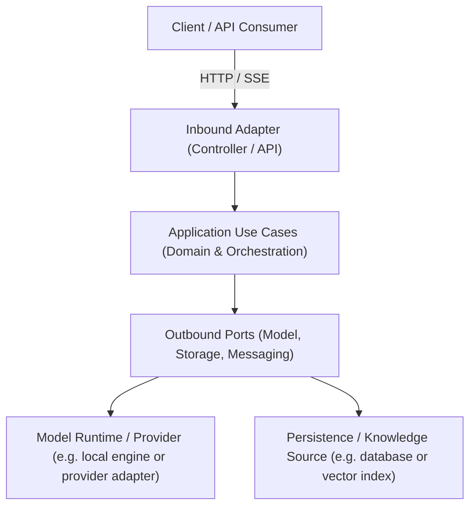

# Tier 1 Reference Application: [Application Name]

> **Tier Classification**: **Tier 1 — Reference Application**  
> **Operational Mode**: Mode B — Local-First (or Mode A — Offline Local)  
> **Status**: Planned / Implemented / Validated  

---

## 1. Executive Summary & Business Problem

Describe the core enterprise challenge addressed by this reference application:
* **Business Context**: The organizational process, customer touchpoint, or workflow being transformed.
* **Core Problem**: Why conventional deterministic software or unvalidated LLM scripts fail to address this problem.
* **Architectural Value**: What enterprise patterns and architectural disciplines this implementation benchmarks.

---

## 2. Requirements & Capabilities

This application is engineered against explicit functional requirements (FRs) and measurable non-functional requirements (NFRs):
* Consult the authoritative [Requirements Specification](docs/requirements.md) for actor models, functional scopes, performance targets, and acceptance criteria.

---

## 3. Architecture Overview



Key architectural tenets:
* **Hexagonal Architecture**: Strict separation between core domain logic and external infrastructure adapters.
* **Model Agnosticism**: Upstream model interactions are mediated via capability ports; zero vendor lock-in.
* **Detailed Architecture**: Consult the authoritative [Architecture Specification](docs/architecture.md) for component boundaries, data flows, trust boundaries, and ADR index.

---

## 4. Quick Start & Local Execution

### Prerequisites
* Operating System: macOS, Linux, or Windows (WSL2).
* Local Runtime: Language baseline (e.g. Python 3.11+, .NET 8, Node 20+, or Java 21).
* Model Runtime / Provider: (e.g. local engine such as Ollama running target open-weight model, or configured provider adapter).

### Setup & Execution
```bash
# 1. Clone repository and navigate to application directory
cd apps/[application-name]

# 2. Copy environment configuration template
cp .env.example .env

# 3. Install dependencies
[dependency-install-command]

# 4. Start local application
[application-start-command]
```

### Reproducible Demonstration
Execute the automated end-to-end demonstration scenario ($< 5$ minutes):
```bash
[demo-run-command]
```

---

## 5. Architectural Trade-offs & Known Limitations

Document objective constraints and design trade-offs:
* **Trade-off 1**: [Describe architectural choice, alternatives rejected, and rationale].
* **Known Limitation 1**: [Describe scenario or workload limit; e.g. single-turn extraction, concurrency thresholds].
* **Local-First Boundary**: [Identify which components run fully offline vs. which require external connectivity].

---

## 6. Quality & Verification Evidence

This Tier 1 Reference Application is evaluated against [QUALITY-GATES.md](../../QUALITY-GATES.md) (Gates A through J):
* Consult the [Quality & Verification Record](docs/quality.md) for deterministic test outputs, AI evaluation scores, security threat assessments, and verification logs.
