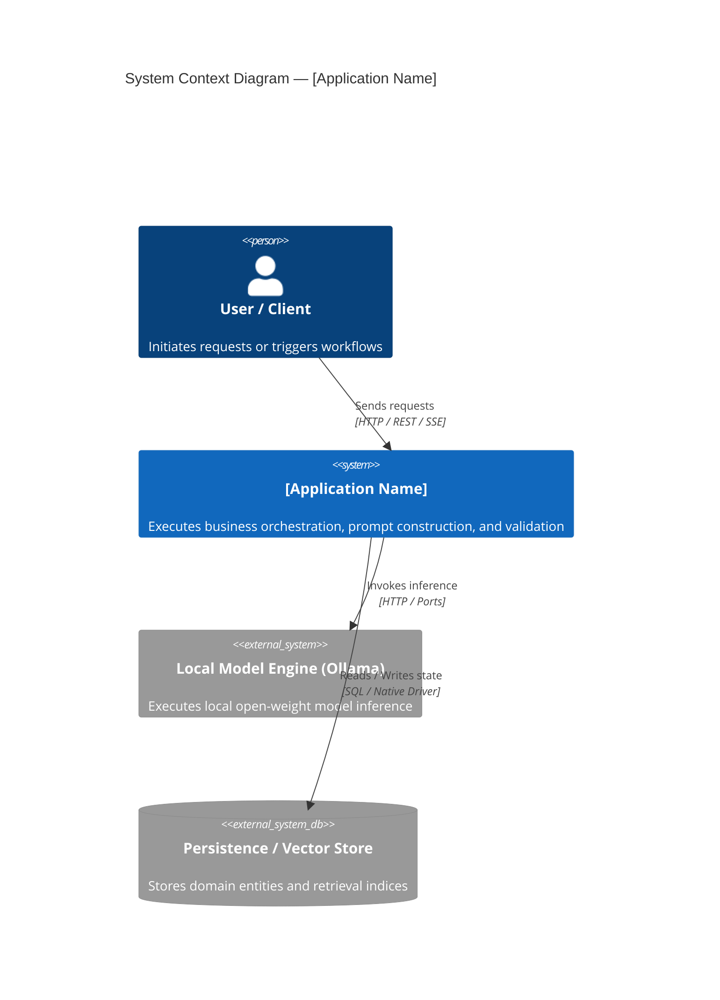
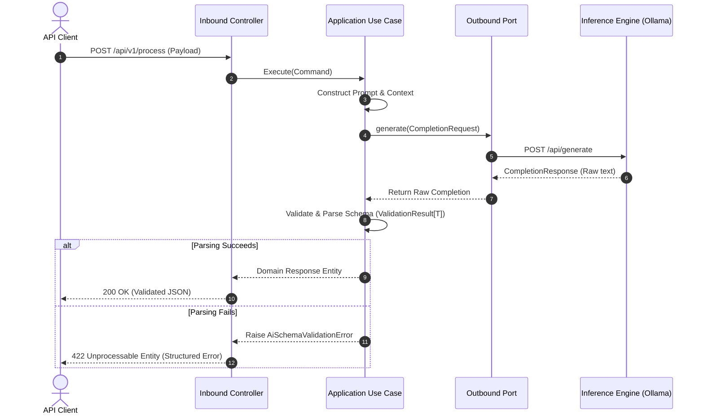

# Architecture Specification: [Application Name]

> **Tier**: Tier 1 Reference Application  
> **Authoritative Standards**: Maps to [QUALITY-GATES.md](../../../QUALITY-GATES.md) Gate A, Gate E, Gate F, Gate H  

---

## 1. System Context & Component Boundaries



---

## 2. Hexagonal Component Structure

This application adheres to Hexagonal / Ports & Adapters architecture:

```text
src/[package_name]/
├── domain/                  # Pure enterprise logic, value objects, domain entities, exceptions
│   ├── models.py            # Strongly typed domain objects
│   └── exceptions.py        # Domain-specific exceptions
├── application/             # Use cases, workflow orchestrators, ports (interfaces)
│   ├── ports/               # Outbound ports (e.g. TextGenerationPort, StoragePort)
│   └── use_cases/           # Inbound business workflow orchestration
└── infrastructure/          # Concrete adapters implementing ports
    ├── adapters/            # Ollama client adapter, DB repository, HTTP clients
    └── web/                 # Inbound controllers, API routers, middleware
```

---

## 3. Interaction & Data Flow



---

## 4. AI Architecture & Inference Pipeline

* **Model & Provider Boundary**: Application interacts strictly via standard ports (`TextGenerationPort` / `ILlmClient`). Zero hardcoded provider SDK imports in domain or application layers.
* **Prompt Construction**: Prompts are versioned, parameterized templates; user input is cleanly separated from system instructions.
* **Structured Output Validation**: Raw model text is parsed into strongly typed schemas using `ValidationResult[T]` envelopes.
* **Failure Modes & Retries**:
  * Transient errors (timeouts, rate limits): Automatic bounded retry with exponential backoff and jitter.
  * Schema errors: Single retry with corrective prompt instruction; graceful degradation on subsequent failure.

---

## 5. Security & Trust Boundaries

* **Trust Boundary 1: External Client Input**: Untrusted. All inputs validated against strict schemas before prompt injection into LLM contexts.
* **Trust Boundary 2: Model Output**: Untrusted. Model outputs are never treated as trusted code, shell commands, or unescaped SQL.
* **OWASP Top 10 for LLMs Mitigations**:
  * *Prompt Injection (LLM01)*: Clear delimiter separation, system prompt prioritization, output schema enforcement.
  * *Insecure Output Handling (LLM02)*: Type-safe deserialization, escaping all outputs before presentation.
  * *Sensitive Information Disclosure (LLM06)*: PII masking on prompt inputs, zero secret leakage in logs.
* **Secrets Management**: Loaded exclusively via environment variables (`.env`). Zero committed secrets.

---

## 6. Observability & Telemetry

* **Tracing**: Distributed tracing adhering to OpenTelemetry GenAI semantic conventions (`gen_ai.system`, `gen_ai.request.model`, `gen_ai.usage.input_tokens`).
* **Correlation**: Unique `trace_id` and `span_id` propagated across all inference calls and logged with structured events.
* **Metrics**: P95 latency, token usage, and error rates exported to local metrics endpoints.

---

## 7. Application Architecture Decision Records (ADRs)

List significant application-specific architectural decisions:
* [ADR-0001: [Title]](docs/adr/0001-[title].md) — [Brief rationale].
